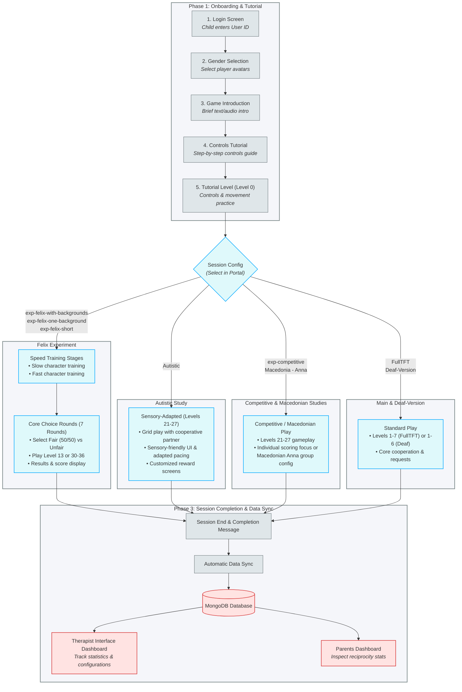

# CO-OP World: Unified Study Design & Grant Proposal Visual Catalog

This document provides a unified overview of the CO-OP system’s study designs across all active research versions (Main, Autistic, Competitive, and Felix) and catalogs the corresponding visual assets to be used as graphic attachments in the grant proposal.

---

## 1. Unified Study Design Schematic (All Versions)

This flowchart illustrates how a researcher configures, registers, runs, and evaluates studies using the CO-OP platform. It shows the unified participant pipeline, branching out into specific experimental conditions depending on the study version.

---

## 2. Database Session Profiles & Configuration Selector

To deploy a specific study or level flow for a participant, the researcher must choose the appropriate session name from the dropdown menu when creating a user in the **User Management Portal**.

Below is a detailed breakdown of all 10 session configurations defined in the database (`sessions.json`):

### A. exp-competitive
*   **Select Name in Portal**: `exp-competitive`
*   **Levels Included**: Level 0 (Tutorial) + Levels 21–27 (8 levels total)
*   **Description**: The standard competitive version of the game. Designed to analyze children's cooperative decision-making under competitive pressure.
*   **Gameplay Flow**: Login $\rightarrow$ Gender Selection $\rightarrow$ Audio/Text Intro $\rightarrow$ Competitive controls onboarding $\rightarrow$ Tutorial Level 0 $\rightarrow$ Gameplay levels 21–27 (emphasizing individual score rewards and coin competition).

### B. exp-felix-with-backgrounds
*   **Select Name in Portal**: `exp-felix-with-backgrounds`
*   **Levels Included**: Level 0 (Tutorial) + Levels 30–36 (8 levels total)
*   **Description**: Felix experiment session with varying visual themes. Used in pediatric choice preference studies.
*   **Gameplay Flow**: Login $\rightarrow$ Gender Selection $\rightarrow$ Audio/Text Intro $\rightarrow$ Speed controls onboarding $\rightarrow$ Tutorial Level 0 $\rightarrow$ Speed training rounds (Slow & Fast character trials) $\rightarrow$ Choice Rounds (Levels 30–36, choosing between Fair 50/50 and Unfair 70/30 partner characters in different background environments).

### C. exp-felix-one-background
*   **Select Name in Portal**: `exp-felix-one-background`
*   **Levels Included**: Level 0 (Tutorial) + Level 13 repeated 7 times (8 levels total)
*   **Description**: Felix choice experiment conducted in a single background environment to isolate variables.
*   **Gameplay Flow**: Login $\rightarrow$ Gender Selection $\rightarrow$ Audio/Text Intro $\rightarrow$ Tutorial Level 0 $\rightarrow$ 7 identical rounds of Level 13 where participants choose between Fair and Unfair virtual characters.

### D. exp-felix-short
*   **Select Name in Portal**: `exp-felix-short`
*   **Levels Included**: Level 0 (Tutorial) + Level 13 repeated 2 times (3 levels total)
*   **Description**: Shortened version of the Felix choice experiment. Used for quick diagnostic evaluations or practice blocks.
*   **Gameplay Flow**: Login $\rightarrow$ Gender Selection $\rightarrow$ Audio/Text Intro $\rightarrow$ Tutorial Level 0 $\rightarrow$ 2 rounds of Level 13 character choice gameplay.

### E. ָAutistic (Sensory-Adapted)
*   **Select Name in Portal**: `ָAutistic` *(Note: Under the hood, this name starts with a Hebrew vowel point kamatz character `ָ`)*
*   **Levels Included**: Level 0 (Tutorial) + Levels 21–27 (8 levels total)
*   **Description**: Study version optimized with sensory and pacing adjustments for autistic pediatric cohorts.
*   **Gameplay Flow**: Login $\rightarrow$ Gender Selection $\rightarrow$ Audio/Text Intro $\rightarrow$ Adapted controls onboarding $\rightarrow$ Tutorial Level 0 (Sensory-friendly) $\rightarrow$ Gameplay levels 21–27 (featuring soft color schemes, adjusted pacing, and tailored feedback screens).

### F. Macedonia - Anna
*   **Select Name in Portal**: `Macedonia - Anna`
*   **Levels Included**: Level 0 (Tutorial) + Levels 21–27 (8 levels total)
*   **Description**: Dedicated session template prepared for the Macedonian research group led by Anna.
*   **Gameplay Flow**: Login $\rightarrow$ Gender Selection $\rightarrow$ Audio/Text Intro $\rightarrow$ Controls onboarding $\rightarrow$ Tutorial Level 0 $\rightarrow$ Gameplay levels 21–27.

### G. Deaf-Version
*   **Select Name in Portal**: `Deaf-Version`
*   **Levels Included**: Level 0 (Tutorial) + Levels 1–6 (7 levels total)
*   **Description**: Accessible study session designed for Deaf or hard-of-hearing pediatric cohorts. Uses standard Tit-for-Tat (TFT) strategy profiles for the virtual partner.
*   **Gameplay Flow**: Login $\rightarrow$ Gender Selection $\rightarrow$ Sign-language adapted intro/briefing $\rightarrow$ Tutorial Level 0 $\rightarrow$ Gameplay levels 1–6 (running TFT strategy).

### H. FullTFT
*   **Select Name in Portal**: `FullTFT`
*   **Levels Included**: Level 0 (Tutorial) + Levels 1–7 (8 levels total)
*   **Description**: Main baseline game session where the virtual player is hardcoded to follow a Tit-for-Tat cooperation strategy.
*   **Gameplay Flow**: Login $\rightarrow$ Gender Selection $\rightarrow$ Onboarding $\rightarrow$ Tutorial Level 0 $\rightarrow$ Core cooperation levels 1–7.

### I. test
*   **Select Name in Portal**: `test`
*   **Levels Included**: Level 0 (Tutorial) + Levels 1–2 (3 levels total)
*   **Description**: QA configuration to test basic game execution and database synchronization.
*   **Gameplay Flow**: Login $\rightarrow$ Level 0 $\rightarrow$ Gameplay levels 1–2.

### J. custom
*   **Select Name in Portal**: `custom`
*   **Levels Included**: Level 0 (Tutorial) + Level 1 (2 levels total)
*   **Description**: Minimal custom layout template.
*   **Gameplay Flow**: Login $\rightarrow$ Level 0 $\rightarrow$ Level 1.

---

## 3. Visual Assets Catalog (Curated)

These files are located in your documentation repository asset directory (`assets/`). They have been prepared and packed into the grant ZIP attachment.

### Game Client & Onboarding Visuals
| File Name | Section in Grant | Proposal Description |
| :--- | :--- | :--- |
| **`login_screen.png`** | Participant Interface | **Onboarding Portal:** The clean User ID login screen designed for pediatric participants. |
| **`intro_meet_virtual_player.png`** | Participant Interface | **Character Introduction Screen:** In-game screen introducing players to the virtual characters and their behavior options. |
| **`mechanics_explanation_screen.png`** | Participant Interface | **Interactive Tutorial Screen:** Controls training screen introducing key mechanics, movement, and cooperation rules. |
| **`gameplay_showcase.png`** | Participant Interface | **Gameplay Showcase:** Grid-based game interface demonstrating cooperation between a participant and a virtual character. |

### Researcher & Therapist Dashboards
| File Name | Section in Grant | Proposal Description |
| :--- | :--- | :--- |
| **`live_therapist_login.png`** | Analyst Interface | **Therapist Dashboard Entrance:** Secure login landing page for study managers and clinicians. |
| **`therapist_interface_stats.png`** | Analyst Interface | **Therapist Analytics Dashboard:** Live analytics dashboard displaying aggregate patient completion rates, reciprocity statistics, and performance charts. |
| **`qa_analysis.png`** | Analyst Interface | **QA Automated Testing System:** Live researcher dashboard that runs automated tests on the users inputted and makes sure their runs went smoothly. |

### Configuration & Onboarding Control
| File Name | Setup Phase | Proposal Description |
| :--- | :--- | :--- |
| **`new_user_form.png`** | Administrative Interface | **User Creation Form:** Onboarding setup screen to configure batch user generation parameters, grades, and randomization settings. |
| **`edit_user_form.png`** | Administrative Interface | **User Property Updater:** Batch editor screen for master user flags and session configuration edits. |
| **`user_info_form.png`** | Administrative Interface | **Participant Query Panel:** Screen to inspect session files, completion status, and active configurations for any User ID. |
| **`live_felix_config.png`** | Setup Controls | **Felix Parameters Dashboard:** Control panel to modify virtual player movement velocity and coin release delays. |

### System & Database Architecture
| File Name | Section in Grant | Proposal Description |
| :--- | :--- | :--- |
| **`Co-Op data transfer.png`** | System Architecture | **Information Transfer Diagram:** Detailed secure data flow map from client interactions to database persistence. |
