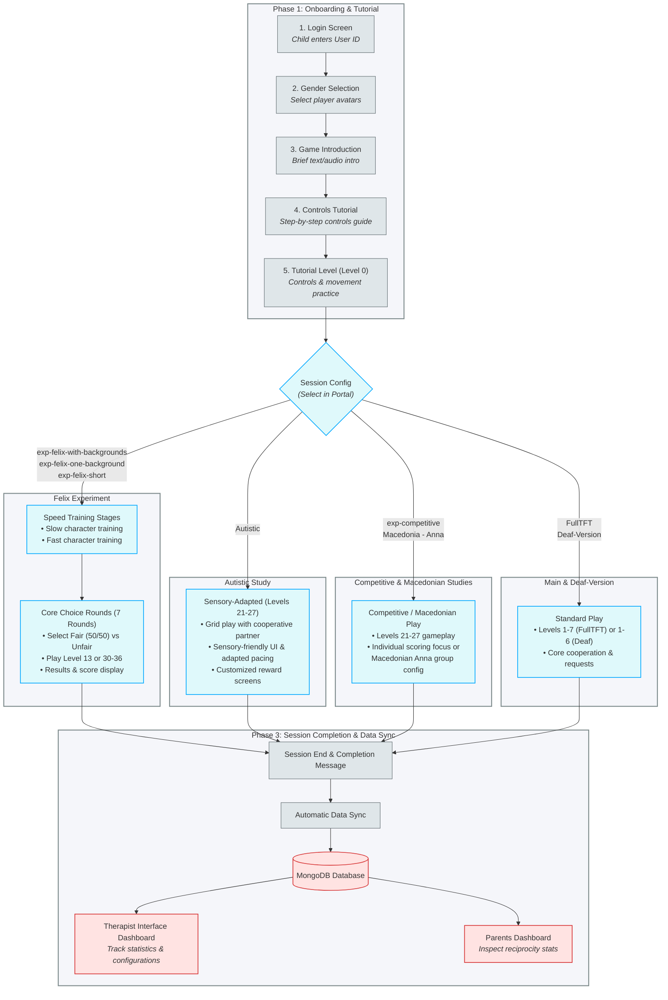
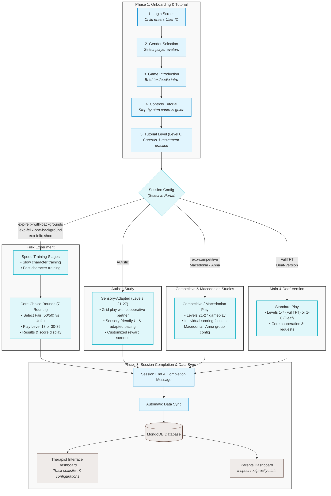

# ==========================================
# Source File: ./Coop_Schematics.md
# ==========================================

# CO-OP World: Unified Study Design & Grant Proposal Visual Catalog

This document provides a unified overview of the CO-OP system’s study designs across all active research versions (Main, Autistic, Competitive, and Felix) and catalogs the corresponding visual assets to be used as graphic attachments in the grant proposal.

---

## 1. Unified Study Design Schematic (All Versions)

This flowchart illustrates how a researcher configures, registers, runs, and evaluates studies using the CO-OP platform. It shows the unified participant pipeline, branching out into specific experimental conditions depending on the study version.



---

## 2. Database Session Profiles & Configuration Selector

To deploy a specific study or level flow for a participant, the researcher must choose the appropriate session name from the dropdown menu when creating a user in the **User Management Portal**.

Below is a detailed breakdown of all 10 session configurations defined in the database (`sessions.json`):

### A. exp-competitive
*   **Select Name in Portal**: `exp-competitive`
*   **Levels Included**: Level 0 (Tutorial) + Levels 21–27 (8 levels total)
*   **Description**: The standard competitive version of the game. Designed to analyze children's cooperative decision-making under competitive pressure.
*   **Gameplay Flow**: Login $\rightarrow$ Gender Selection $\rightarrow$ Audio/Text Intro $\rightarrow$ Competitive controls onboarding $\rightarrow$ Tutorial Level 0 $\rightarrow$ Gameplay levels 21–27 (emphasizing individual score rewards and coin competition).

### B. exp-felix-with-backgrounds
*   **Select Name in Portal**: `exp-felix-with-backgrounds`
*   **Levels Included**: Level 0 (Tutorial) + Levels 30–36 (8 levels total)
*   **Description**: Felix experiment session with varying visual themes. Used in pediatric choice preference studies.
*   **Gameplay Flow**: Login $\rightarrow$ Gender Selection $\rightarrow$ Audio/Text Intro $\rightarrow$ Speed controls onboarding $\rightarrow$ Tutorial Level 0 $\rightarrow$ Speed training rounds (Slow & Fast character trials) $\rightarrow$ Choice Rounds (Levels 30–36, choosing between Fair 50/50 and Unfair 70/30 partner characters in different background environments).

### C. exp-felix-one-background
*   **Select Name in Portal**: `exp-felix-one-background`
*   **Levels Included**: Level 0 (Tutorial) + Level 13 repeated 7 times (8 levels total)
*   **Description**: Felix choice experiment conducted in a single background environment to isolate variables.
*   **Gameplay Flow**: Login $\rightarrow$ Gender Selection $\rightarrow$ Audio/Text Intro $\rightarrow$ Tutorial Level 0 $\rightarrow$ 7 identical rounds of Level 13 where participants choose between Fair and Unfair virtual characters.

### D. exp-felix-short
*   **Select Name in Portal**: `exp-felix-short`
*   **Levels Included**: Level 0 (Tutorial) + Level 13 repeated 2 times (3 levels total)
*   **Description**: Shortened version of the Felix choice experiment. Used for quick diagnostic evaluations or practice blocks.
*   **Gameplay Flow**: Login $\rightarrow$ Gender Selection $\rightarrow$ Audio/Text Intro $\rightarrow$ Tutorial Level 0 $\rightarrow$ 2 rounds of Level 13 character choice gameplay.

### E. ָAutistic (Sensory-Adapted)
*   **Select Name in Portal**: `ָAutistic` *(Note: Under the hood, this name starts with a Hebrew vowel point kamatz character `ָ`)*
*   **Levels Included**: Level 0 (Tutorial) + Levels 21–27 (8 levels total)
*   **Description**: Study version optimized with sensory and pacing adjustments for autistic pediatric cohorts.
*   **Gameplay Flow**: Login $\rightarrow$ Gender Selection $\rightarrow$ Audio/Text Intro $\rightarrow$ Adapted controls onboarding $\rightarrow$ Tutorial Level 0 (Sensory-friendly) $\rightarrow$ Gameplay levels 21–27 (featuring soft color schemes, adjusted pacing, and tailored feedback screens).

### F. Macedonia - Anna
*   **Select Name in Portal**: `Macedonia - Anna`
*   **Levels Included**: Level 0 (Tutorial) + Levels 21–27 (8 levels total)
*   **Description**: Dedicated session template prepared for the Macedonian research group led by Anna.
*   **Gameplay Flow**: Login $\rightarrow$ Gender Selection $\rightarrow$ Audio/Text Intro $\rightarrow$ Controls onboarding $\rightarrow$ Tutorial Level 0 $\rightarrow$ Gameplay levels 21–27.

### G. Deaf-Version
*   **Select Name in Portal**: `Deaf-Version`
*   **Levels Included**: Level 0 (Tutorial) + Levels 1–6 (7 levels total)
*   **Description**: Accessible study session designed for Deaf or hard-of-hearing pediatric cohorts. Uses standard Tit-for-Tat (TFT) strategy profiles for the virtual partner.
*   **Gameplay Flow**: Login $\rightarrow$ Gender Selection $\rightarrow$ Sign-language adapted intro/briefing $\rightarrow$ Tutorial Level 0 $\rightarrow$ Gameplay levels 1–6 (running TFT strategy).

### H. FullTFT
*   **Select Name in Portal**: `FullTFT`
*   **Levels Included**: Level 0 (Tutorial) + Levels 1–7 (8 levels total)
*   **Description**: Main baseline game session where the virtual player is hardcoded to follow a Tit-for-Tat cooperation strategy.
*   **Gameplay Flow**: Login $\rightarrow$ Gender Selection $\rightarrow$ Onboarding $\rightarrow$ Tutorial Level 0 $\rightarrow$ Core cooperation levels 1–7.

### I. test
*   **Select Name in Portal**: `test`
*   **Levels Included**: Level 0 (Tutorial) + Levels 1–2 (3 levels total)
*   **Description**: QA configuration to test basic game execution and database synchronization.
*   **Gameplay Flow**: Login $\rightarrow$ Level 0 $\rightarrow$ Gameplay levels 1–2.

### J. custom
*   **Select Name in Portal**: `custom`
*   **Levels Included**: Level 0 (Tutorial) + Level 1 (2 levels total)
*   **Description**: Minimal custom layout template.
*   **Gameplay Flow**: Login $\rightarrow$ Level 0 $\rightarrow$ Level 1.

---

## 3. Visual Assets Catalog (Curated)

These files are located in your documentation repository asset directory (`assets/`). They have been prepared and packed into the grant ZIP attachment.

### Game Client & Onboarding Visuals
| File Name | Section in Grant | Proposal Description |
| :--- | :--- | :--- |
| **`login_screen.png`** | Participant Interface | **Onboarding Portal:** The clean User ID login screen designed for pediatric participants. |
| **`intro_meet_virtual_player.png`** | Participant Interface | **Character Introduction Screen:** In-game screen introducing players to the virtual characters and their behavior options. |
| **`mechanics_explanation_screen.png`** | Participant Interface | **Interactive Tutorial Screen:** Controls training screen introducing key mechanics, movement, and cooperation rules. |
| **`gameplay_showcase.png`** | Participant Interface | **Gameplay Showcase:** Grid-based game interface demonstrating cooperation between a participant and a virtual character. |

### Researcher & Therapist Dashboards
| File Name | Section in Grant | Proposal Description |
| :--- | :--- | :--- |
| **`live_therapist_login.png`** | Analyst Interface | **Therapist Dashboard Entrance:** Secure login landing page for study managers and clinicians. |
| **`therapist_interface_stats.png`** | Analyst Interface | **Therapist Analytics Dashboard:** Live analytics dashboard displaying aggregate patient completion rates, reciprocity statistics, and performance charts. |
| **`qa_analysis.png`** | Analyst Interface | **QA Automated Testing System:** Live researcher dashboard that runs automated tests on the users inputted and makes sure their runs went smoothly. |

### Configuration & Onboarding Control
| File Name | Setup Phase | Proposal Description |
| :--- | :--- | :--- |
| **`new_user_form.png`** | Administrative Interface | **User Creation Form:** Onboarding setup screen to configure batch user generation parameters, grades, and randomization settings. |
| **`edit_user_form.png`** | Administrative Interface | **User Property Updater:** Batch editor screen for master user flags and session configuration edits. |
| **`user_info_form.png`** | Administrative Interface | **Participant Query Panel:** Screen to inspect session files, completion status, and active configurations for any User ID. |
| **`live_felix_config.png`** | Setup Controls | **Felix Parameters Dashboard:** Control panel to modify virtual player movement velocity and coin release delays. |

### System & Database Architecture
| File Name | Section in Grant | Proposal Description |
| :--- | :--- | :--- |
| **`Co-Op data transfer.png`** | System Architecture | **Information Transfer Diagram:** Detailed secure data flow map from client interactions to database persistence. |


# ==========================================
# Source File: ./.agents/AGENTS.md
# ==========================================

# AI Agent Instructions & Workspace Guidelines

This document contains rules, constraints, and instructions for AI agents modifying the CO-OP World documentation repository.

---

## 1. Documentation Consistency Rules

Whenever you modify any study design profile, level progression, or session config, you **MUST** apply the edits consistently across all relevant subfiles in the documentation suite:

1.  **Check `sessions.json` first**: This is the source of truth for all level configurations and session names.
2.  **Update `Coop_Schematics.md`**: Update both the unified Mermaid flowchart and the detailed session selector profiles in Section 2.
3.  **Update `diagram.md`**: Synchronize the standalone Mermaid code block.
4.  **Update Summary Tables**: Make matching edits to the tables in:
    *   [docs/Game/Versions/Summary.md](file:///Users/yonitrach/Developer/CoOp/coop-docs/docs/Game/Versions/Summary.md)
    *   [docs/Game/Summary.md](file:///Users/yonitrach/Developer/CoOp/coop-docs/docs/Game/Summary.md)
5.  **Update Individual Version Files**: Make corresponding updates in the specific version file under `docs/Game/Versions/` (e.g., `Felix.md`, `Autistic.md`, `Competitive.md`).
6.  **Compile the Documentation**: Run the compilation script `./conbine.sh` to update `combined_documentation.md` (remember to ask the user for command execution approval first).

---

## 2. Mermaid Flowchart Layout Constraints

To prevent rendering errors and layout bugs in Visual Studio Code and other Markdown/Mermaid viewers:

*   **Avoid Subgraph Grouping Bugs**: Never define branching connections (e.g., `F --> G1`) inside a `subgraph` definition block. Always declare the branching decision node and all connections leaving it **outside** of the subgraphs. If you write connections inside subgraphs, the Mermaid layout engine will drag the decision node inside the first subgraph block, breaking the visual flow.
*   **Box Width & Text Wrapping**: Keep node labels readable. Use HTML line breaks (`<br/>`) inside double-quoted node label strings (e.g., `A["1. Login Screen<br/><i>Child enters User ID</i>"]`) to wrap text and prevent label overflow or clipping.

---

## 3. Database Conventions & Key Gotchas

*   **Deprecation of User IDs**: Do not reference specific historical User IDs (e.g., `6224`, `1913`) for version assignments. All accounts are configured dynamically in the portal by selecting a database-validated session configuration.
*   **The Kamatz in Autistic**: In the database `sessions.json` (and raw queries), the autistic session configuration is named `"ָAutistic"`, which starts with a Hebrew vowel point kamatz character (`ָ`). In user-facing documentation tables, the clean ASCII string `"Autistic"` may be used, but database-facing instructions must retain the vowel point.


# ==========================================
# Source File: ./docs/AI & LLM Integration/Overview.md
# ==========================================

---
layout: default
title: Overview
nav_order: 1
parent: AI & LLM Integration
---

# Overview

This page overviews how AI & LLMs are integrated in the system, briefing through their usage in the system. The other
pages in this section expand on that in detail.

**If you make any changes regarding AI/LLM integration, please update the pages in this section accordingly.**

## Introduction

Previously, the virtual player (NPC) responded to help requests using static, pre-recorded audio and
text (e.g., "I agree to help" or "Sorry, I cannot help").

Using LLMs, we upgraded these static responses with dynamically generated text and audio, currently powered by Gemini
API. This allows the NPC to have specific, customizable responses using custom "personas", opening up new experimental
avenues.

It allows testing how a child's cooperative behavior changes depending on whether the NPC sounds scared, impatient,
cheerful, selfish, etc. Personas allow not only setting the tone of the NPC's responses, but also how it reacts to
different situations (e.g., we can tell it that if it helped the child more than the child helped itself, it will
mention it if it refuses to help).

The use of LLM-generated responses is dynamic, meaning we can control when we want LLM responses and when we want the
static responses. It's done by providing an LLM configuration file when creating custom session orders in
the [User Management website](). There are thorough explanations about
the [LLM Config]() and the
[Runtime Flow]() in the appropriate pages.

---

## Core Architecture

The integration touches several systems:

* **User Management Website:** The starting point. You can upload an
  [LLM Configuration]() (YAML) file when creating a custom
  "Session Order". The website parses this file and saves it in MongoDB alongside the user data. You can also test
  LLM personas in the
  [Prompt Playground tab](#-prompt-playground).
* **Game Client (Phaser Frontend):** When the user logs in, the game loads the LLM configuration that is saved in the
  user's data. It is responsible for checking if an AI response should be triggered for a specific level or request (the
  LLM config dictates that), playing the resulting audio, and rendering the text.
* **Context Storage (Firestore):** A dedicated database (`decision-contexts`) that holds the live state of the game. The
  game client continuously commits events (like past help requests, the strategy in use, and genders) to this database,
  so the backend has the context needed to prompt the AI.
* **GCP Backend Functions:** Cloud Functions (specifically `generate-decision-explanation`) act as the bridge. They
  receive a trigger from the game client, pull the level's context from Firestore, apply the correct persona from the
  LLM config, and communicate with the Gemini Text and Audio APIs to generate the final response.

  Another cloud function, `mock-decision-explanation`, is used in the "Prompt Playground" tab in the User Management
  website. It uses the same underlying logic and Gemini models as `generate-decision-explanation`. However, instead of
  pulling live game context from the database, it accepts manually entered mock game data. This allows you to
  **simulate** mid-game calls and refine how a persona will behave before using it in an actual game.

---

## Maintenance (Important)

Currently, the generated responses are powered by Gemini text and TTS models. The models are updated periodically,
and as a result, old models are getting deprecated (for example, with the launch of Gemini 3 series, series 2.5 is
getting deprecated a few months afterward). That's why we need to keep an eye on the models and update them in the
appropriate Cloud Functions. Currently, the relevant functions are `generate-decision-explanation` and
`mock-decision-explanation`. The models they use are defined as ENV variables in `config.json`.

**Model updates need to be done with care**, it's not just changing version numbers.
More details and insights about updating the models can be found in the relevant section in the
[Insights Page](#update-and-maintain-models).


# ==========================================
# Source File: ./docs/AI & LLM Integration/Insights.md
# ==========================================

---
layout: default
title: Insights & Maintenance
nav_order: 5
parent: AI & LLM Integration
---

# Insights & Maintenance
{: .no_toc }

## Table of Contents
{: .no_toc .text-delta }

1. TOC
{:toc}

---

This page centralizes knowledge and insights regarding AI & LLM integration in the system. It documents the reasoning
behind key architectural decisions, the hurdles encountered during development, and the maintenance workflows required
to keep AI-related components running smoothly.

If you are a future developer taking over this project, read this page before altering the LLM logic or updating models.
You might save time and headaches. Keep in mind that things written here are correct as of the time of writing, so they
might not be the most up to date. You are also welcome to expand this and the other pages with ideas and insights you
got when working.

## The Switch from GPT to Gemini

Initially, the system used GPT models for generating the text explanations. However, a strategic decision
was made to migrate entirely to Gemini, as we wanted to use its TTS models too.

Why we made the switch:

* **Ecosystem Unification:** We needed high-quality Text-to-Speech (TTS) alongside text generation. Keeping both the
  text and
  audio models within the same LLM type (Gemini) made it easier.
* **Performance:** We noticed that some lightweight GPT models answered fast, but their answers were pretty repetitive
  and not diverse enough. Gemini appeared to be pretty good at creative and diverse responses. The caviate was that
  for some reason Gemini took a long time to respond compared to GPT (that's where the preloading mechanism came in).
* **Future-Proofing for Multimodal:** Gemini appears to plan having models that can output text and audio in a single
  API call. By migrating now, the infrastructure is prepped to adopt a single-call text/audio model as soon as one
  becomes available, which will cut latency even further. Note that currently we do have to make two separate API calls
  to get the text and audio, but thanks to preloading, it managed to return in time so the user experience feels
  instant.

## Working with Gemini and LLMs

* **Context Window & Cost:** Both GPT and Gemini have caching mechanisms. It means that if the system instructions
  remain the same across multiple calls, the API caches the instructions tokens. This reduces the cost and latency of
  the API calls. However, currently our instructions are not cached, mainly because they are too short (each model has
  its own min token limit for caching). More info about caching in
  Gemini [here](https://ai.google.dev/gemini-api/docs/caching).

* **Upgrade Backend Infrastructure:** The `generate-decision-explanation` Cloud Function wasn't structured very well
  when GPT was used. Transitioning to Gemini required restructuring many parts of the code to switch to the new API.
  We took the opportunity to refactor the entire function's infrastructure to be more modular and maintainable.
  Most of the code was transferred to the `decision_explanation` [Shared Module]().
  In addition, text and audio generation logic was extracted to abstract classes `LLMTextProvider` and
  `LLMAudioProvider` respectively. That way, switching a text or audio model is as simple as creating a new class
  that implements `LLMTextProvider` or `LLMAudioProvider`. Many helpers and helper services were also extracted to
  make the code more modular. Becuse both `generate-decision-explanation` and `mock-decision-explanation` use the same
  LLM logic, they just call methods from the Shared Module, and the main file is kept clean and short.

## Prompt Engineering & Tone Adjustments

Getting an LLM to sound like a natural and human requires extensive trial and error. The prompts where re-written and
revised multiple times. Below is a summary of what worked and what didn't, but you are encouraged to look in the prompts
themselves in the `decision_explanation` Shared Module in the Cloud Functions repo
(`CloudFUnctions/shared/decision_explanation/prompts/`).

### What Worked
{: .no_toc }

* Explain the game rules, context, and the AI's role clearly and concisely. It's good to start the instructions with
  a sentence that sets the role of the AI, like "You are the voice of a virtual player ...".
* Define clear DO and DON'T rules. It's important to define what the AI CAN do and not just give restrictions. Strict
  rules you may use are limit the AI to one short sentence, natural language, simple language, etc.
* Instruct it precisely how to treat the persona and how it affects its responses.
* Changing the structure of the prompt or the order of its components can help change the LLM responses. For example,
  we started with a regular structured prompt and later moved to an XML-style one because it seemed to help it
  distinguish between instructions, game context, persona instructions, etc. Again, it sometimes needs a few iterations
  to work as expected.
* When you change a model or your prompt template, try to perform many tests and give it many different inputs and
  personas before deploying.

### What Didn't Work
{: .no_toc }

* Sometimes it was "too creative" and deviated from the intended language. For example, it once used nicknames like
  "buddy" and "pal" to refer to the child, which we didn't want. Sometimes rephrasing the instructions helped.
  but sometimes you may need to prohibit this explicitly in the instructions.
* Sometimes its responses weren't diverse enough. The reason for that may be too many restrictions in the instructions.
  It's important to not restrict it too much and give it some room for creativity; it can cause it to give repetitive
  responses. In addition, the instructions shouldn't dictate too much HOW it should respond; this is the role of the
  persona and the LLM itself.

### Model Parameters
{: .no_toc }

Every LLM has parameters like `temperature`, `top_p`, and `top_k` that can be adjusted to control the responses. They
are not recommended to be changed and the default values are usually good, but sometimes it may be worth playing with
them a little to see if it helps. The temperature is a one you could play with. It controls the "creativity" and
determinism of the responses. Higher values mean more creative and random responses, while lower values mean more
deterministic and predictable responses. See official documentation to learn what each one does.

**Note:** You are encouraged to look for additional ways of prompt engineering in the web. The things written here
are from personal experience. For example, you may refer to Google's
[Prompt Design Strategies](https://ai.google.dev/gemini-api/docs/prompting-strategies) article.

## Update and Maintain Models

As new LLM models gets released and updated, the old ones eventually get deprecated in the API (this is true for every
LLM, not just Gemini). You may get an email notification from the company itself, notifying you of the deprecation, but
you need to keep an eye on the official documentation to make sure you are not caught off guard.

When upgrading to a new model, do not just blindly increment the version number in `config.json`. Updating models, at
least in Vertex AI (what is used now for Gemini), requires verifying regional availability and SDK compatibility.

When a new Gemini model is released (e.g., moving from `gemini-3.5-flash` to a newer version), follow these steps:

1. **Check Regional Availability:** Not all models are available in all regions immediately upon release. Check the
   [official model availability documentation](https://docs.cloud.google.com/gemini-enterprise-agent-platform/resources/locations)
   to ensure the target model is available in our deployed region. It's preferred that the region will be the same or as
   close as possible to the region of the cloud function (`europe-central2`). Sometimes models are first launched in
   "multi region" regions, like `eu` instead of specific regions in Europe. Multi regions have different API endpoints
   that require some minor modifications to the Vertex AI Client initialization.

   If a new model is only available in a specific region, you must update the `location` parameter in the `Client()`
   initialization inside `main.py`, and potentially the `http_options={"base_url": ...}` if routing through a specific
   regional endpoint.

   If you get stuck or if a model isn't working (e.g., the API call returns 404) you can google it or ask help from your
   favorite LLM. Just keep region availability in mind.

2. **Verify Recommended Upgrade Paths:** As said before, Google and other companies occasionally deprecate older
   models. Always check official documentation to see if there are any recommended models to upgrade to from your
   current model. For example, from `gemini-2.5-flash` it is recommended to upgrade to `gemini-3.5-flash` or
   `gemini-3.5-flash-lite` according to Google's documentation. So check what is the recommended model to upgrade to
   from your current model.

   In addition, check official documentation to see if there are specific migration guides or parameter
   changes required for the new model (like a new way to configure thinking level).

3. **Test Before Deploying:** When upgrading a model, test its performance - responses and response times, to make sure
   it's working as expected and similar to the old model so the game's experience won't change significantly. Only
   when you're sure that the new model is working as expected, you can deploy it.

## Supporting New Languages

If you want to support more languages in the game and in LLM responses in particular, the system must be updated to
support that. Languages are saved on user creation when you create users in the User Management website. When a user
enters the game, the game client loads the user data along with the user's language, and that is used to display
language-specific sprites and voice recordings in the game, but also used in the backend to generate LLM responses in
that language.

### 1. Update Cloud Functions
{: .no_toc }

In the `CloudFunctions` repo, in `shared/decision_explanation/providers/llm_audio_provider/gemini_audio_provider.py`,
under the `GeminiAudioProvider` class you'll see two maps related to languages: `VoiceMap` and `LanguageToCodeMap`.
* `LanguageToCodeMap` maps between language name (what is used in the User Management website and what is saved in the
  DB) and the language code. For example, "English" → "en-us". Add an entry with the new language and its code.

  The language must be supported by the Gemini TTS model that the backend uses (model names are in the cloud function's
  `config.json` file). You may visit [this website](https://docs.cloud.google.com/text-to-speech/docs/gemini-tts)
  for the list of supported languages by model. Check the language code of the language you want to support.
* `VoiceMap` maps between language code and voice names to be used in Gemini TTS. It allows us to have different voices
  for each language and gender.
  Add an entry with the new language code and two male and female voice names. Gemini's voice names can be found
  [here](https://ai.google.dev/gemini-api/docs/speech-generation#voices).
  You can also listen to each voice before deciding,
  [here](https://docs.cloud.google.com/text-to-speech/docs/gemini-tts#voice_options).

  Note that the language and gender are resolved dynamically at runtime. When creating users, you set their language
  via the dropdown. When a new user enters the game, they are prompted to choose their gender and virtual gender
  (NPC's gender). Those are saved as strings "male" or "female" and the _virtual gender_ is used here to resolve the
  voice name that we give to Gemini TTS.

It is important that the language name and code you define in those maps will match the ones defined in the User
Management website and the language codes that Gemini supports. The code passes the language **code** to the Gemini TTS
API, and the prompts we give to the text model instruct it to answer in the desired language (it gives it the language
**name** saved in the DB), so any mismatch will cause an error or an unexpected response.

### 2. Update User Management website
{: .no_toc }

In the User Management website, in the main tab `Create Users`, there is a `Language` dropdown that contains all the
supported languages for creating users. Add the new language to the list in the code.

It is also recommended to add the language to the `Prompt Playground` tab (there is a `Language` dropdown there too),
so you can also test the LLM responses in that language.

As said, the language name you put here must match the one you put in the `LanguageToCodeMap` map in the cloud function.
The language name is also what the code passes, as it is, to Gemini when instructing it in what language to answer.

### 3. Game Client (optional)
{: .no_toc }

The game client displays sprites and voice recordings in multiple languages. It's important to know that the game
automatically detects the language based on location (and not from the user's saved language). Thus, when adding a new
language for LLM responses, the game shouldn't break as it uses its own auto-resolved **display language** for
displaying sprites and messages. However, if you want to support a new **display language** in the game, it involves
messing with the `i18next` library and adding new sprites and recordings in the appropriate language. There is some
work there and it has to be done carefully.

### 4. Testing in Prompt Playground (optional)
{: .no_toc }

When updating languages or making any change to the LLM infrastructure, it is important to test them before pushing them
to the main game. The two recommended ways to test are either running/debugging locally, or testing in the Prompt
Playground on the User Management website.

An extended guide about using the Prompt Playground can be found
[here](#-prompt-playground).

## Known Limitations & Future Upgrades

### Two-Step Latency
{: .no_toc }

As mentioned, we are currently bound by the latency of sequential calls (Text -> Audio). The game client handles this
by preloading the server call, so it has plenty of time to respond, and the user sees it instantly.

Keep an eye on Gemini release notes for unified text and audio endpoints to resolve this. It should significantly
improve latency and cost.

### Game Expansion
{: .no_toc }

If more events are added to the game, you might want to let the LLM that responds in behalf of the NPC to know about
them. It will allow the AI to have more reasons and explanations to generate, but you will need to update the code
(and maybe prompts) to make it work.

Maybe the LLM-related code can be upgraded so events will be modularized so it will be easy to feed the LLM with
different kinds of game events.

### "Voice Personas"
{: .no_toc }

Currently, the "persona" are instructions that are given only for the text generation model. Gemini TTS allows giving
instructions to TTS models as well. They make it very easy to control various things like tone and voice when requesting
audio synthesizing. This means that we can have "voice personas" (in addition to the existing personas for text) that
controls the way it speaks the generated explanations.

Note that we currently do use voice instructions in the code, but they are very basic and only instruct Gemini to speak
the text grammatically correctly. For example, some words in Hebrew are pronounced differently for males and females,
even when written identically.


# ==========================================
# Source File: ./docs/AI & LLM Integration/index.md
# ==========================================

---
layout: default
title: AI & LLM Integration
nav_order: 7
has_children: true
---

# AI & LLM Integration

This section explains how LLM and AI-generated content are integrated in the system.


# ==========================================
# Source File: ./docs/AI & LLM Integration/RuntimeFlow.md
# ==========================================

---
layout: default
title: Runtime Flow
nav_order: 4
parent: AI & LLM Integration
---

# Runtime Flow

This document traces the step-by-step lifecycle of an AI-generated NPC response during live gameplay. It outlines how
the LLM integration touches the Game Client, Firestore, and GCP Backend interact from the moment the game loads to the
moment the child hears the NPC speak.

**If you make any changes regarding AI/LLM integration, please update the pages in this section accordingly.**

---

## Phase 1: Initialization and Config Loading

When a child logs into the game using their user code, the Game Client (Phaser) retrieves the user's data from the
backend. If their user was created with a Session Order that includes
[LLM Config]() (originally uploaded as a YAML file), it is included in
the user data and loaded as well as. The client holds this configuration in memory to evaluate future interactions.

## Phase 2: Context Committing

For the AI to generate a logical explanation, it needs to know what is happening in the game. At the start of, and
during each level, the Game Client commits game events to a dedicated GCP function (`storeDecisionContext`). This
function saves the state into the `decision-contexts` Firestore database. The Firestore DB can be inspected in the GCP
Console.

Data saved includes:

* Static level data:
  * User ID
  * Level Number
  * Session Number
  * The current NPC strategy (e.g., TFT)
  * Language and genders of the child and the NPC
* History of previous help requests and decisions (the `decisions` field). This is updated during the level on every
  request.

## Phase 3: The Help Request evaluation

At each request that the child makes to the NPC (each locked special coin), we want to evaluate the NPC's decision and
decide whether to use the AI or not. However, each call to the server (`generate-decision-explanation`) takes some time
because the LLM API (currently Gemini) takes a few seconds to respond. To minimize latency and improve the user
experience, we've introduced a preloading mechanism in the game client to fire the heavy server call in advance (a few
seconds before the locked coin appears and the child clicks the help button).
Then, when the coin appears, the NPC's generated response is ready to be displayed.

### Generated Explanation Preloading

The preloading mechanism happens in the game client (Phaser), specifically in `Level.js`. We introduced the
`PromiseHolder` class to hold the server call's Promise. Because requests in the game alternate between the NPC and the
child, and there is a fixed delay between each request (15 seconds), we have that much time to preload the response.

After a child request (NPC asks the child), we call the `preloadNPCExplanation` function. It calls the `shouldUseLLM`
function that uses the in-memory LLM configuration to determine whether the AI should be used. If the function returns
`true`, we fire a call to the `generate-decision-explanation` Cloud Function, and save its Promise in a `PromiseHolder`
object. If the function returns `false` we don't fire the request.

When the special coin appears and the child clicks the help button, we call the `humanAskForHelp` in the `VirtualPlayer`
class. It calls the `shouldUseLLM` function again. If it returns `false`, it displays the static response and audio.
Otherwise, it checks the `PromiseHolder` object to see if it has resolved already, or awaits it if not (although 15
seconds is almost always enough for the server to respond). Once it gets the response, it displays the text and audio
it got from the server (which the LLM generated). Note that upon any error, it falls back to the static response
(because it's preferred over crashing or not showing any response at all).

With that mechanism in place, the AI response is displayed instantly (in most cases) after the child clicks the help
button.

## Phase 4: Backend Processing (GCP & Gemini)

The `generate-decision-explanation` function receives the request payload containing the `user_id`, `level_num`,
`session_id`, the calculated `decision` and the `request_num` (request number 1 for the first request the NPC gets,
2 for the second, etc.).

1. **Context Retrieval:** The function queries the `decision-contexts` Firestore database to retrieve the live game
   state saved during Phase 2.
2. **Persona Extraction:** The function identifies the correct `persona` string based on the provided LLM config and the
   current request/level parameters.
3. **Prompt Construction:** The retrieved context (past events, strategy, genders) and the extracted persona are
   injected into the pre-defined system instruction templates (`INSTRUCTIONS_FILE` and `PROMPT_FILE`).
4. **LLM Generation:** The function calls the `GeminiTextProvider` to generate the textual response.
5. **TTS Generation:** The generated text is passed to the `GeminiAudioProvider` model to synthesize the spoken audio
   file.

_(More details about `generate-decision-explanation` can be found in its
[documentation]())_

## Phase 5: Rendering and Playback

The Cloud Function returns a JSON payload to the Game Client containing the generated text string and a base64-encoded
string of the MP3 audio file. The Game Client decodes the audio and plays it through Phaser's audio engine.
The generated text is simultaneously rendered in a dialog box.


# ==========================================
# Source File: ./docs/AI & LLM Integration/PersonaGuide.md
# ==========================================

---
layout: default
title: Persona Guide
nav_order: 3
parent: AI & LLM Integration
---

# Persona Guide

## Introduction

The `persona` field in your LLM Configuration acts as the "director" for the AI. It dictates not only what the NPC says,
but how it sounds, its personality, and its underlying behavioral rules.

Because the backend passes this persona to the LLM, writing a clear, accurate persona is the most important step in
generating high-quality NPC responses that match your intention.

## Best Practices for Writing Personas

To ensure the AI strictly follows your intent while maintaining enough flexibility to sound natural, follow these core
principles:

* **Be descriptive yet concise:** You may use strong to describe the vibe, age, and energy level. Short, descriptive
  sentences work best.
* **Tone and sound:** Explicitly describe the acoustic qualities you want. Use phrases like "Your voice feels bouncy",
  "Speak in short, punchy sentences", or "You sound annoyed".
* **Set behavioral rules:** You can instruct the AI to react to specific game states. If you want to enforce
  reciprocity, explicitly state it. For example if you want it to focus on who helped more, write:
  "If you helped the child more than they helped you, mention that when rejecting".
  If you want it to verbally say that it mimics the last child's response, you can write: "Refer to the last child's 
  response - mention that you help/reject because, or despite the child helped/rejected you last time."
* **Leave Room for Creativity:** Give the AI the rules and the tone, but let it choose the exact words. Avoid forcing it
  to say one specific, hardcoded sentence every time.
* **Try Different Phrasings:** If a persona doesn't work as you expect, try slightly different variations and phrasings.
  Sometimes it takes a few iterations to get to the expected result.
  
  Use the "Prompt Playground" tab in the User Management website to test your personas.

**Note:** The LLM is familiar with the game, so you shouldn't explain the game or include technical details in the
persona. Your persona is not sent as-is to the LLM, but rather wrapped with a prompt that explains the game rules and
provides all the necessary context. You should focus on the personality and the behavioral rules that the LLM should
follow when it answers.

## Entity Naming Convention

To prevent the LLM from inaccurately referring to items in the game, use the exact game terminology in your persona
instructions. The LLM is instructed to understand these entities:

* **The Players:** "child" (the human player) and "NPC" or "virtual player".
* **Regular Collectibles:** "coin" (for the child) and "ice cube" (for the NPC). So don't write "item" or "thing", use
  the exact terms.
* **Special Locked Items:** "special coin" (child's locked item) and "special ice cube" (NPC's locked item).
* **Actions:** A player **request** the other player for help, the player being asked can **help** or **reject**.

---

## Examples of Good Personas

Below are examples of well-written personas and the specific experimental intent behind them. Notice that personas can
be even shorter than the ones below. Even one or two sentences can be enough.

You may test those or your own personas in the "Prompt Playground" tab in the User Management website.

### Example 1: Encourages Reciprocity
The LLM is instructed to respond according to past events. It mentions if the child helped back or helped less than the
virtual player.

**Intent:** Emphasize the importance of reciprocity and cooperation.

> You care about reciprocity and equality. If the child helped you recently, mention that and gladly help back. If you
> reject and they ask for help but have not been helping you equally, explicitly state that it is because they did not
> help you before.

### Example 2: Cheerful and Overly Positive
The LLM is instructed to be overly positive and excited, even when rejecting.

**Intent:** To test if an overwhelmingly positive and gentle tone encourages the child to cooperate more often.

> You are super cheerful, zippy, and excited. You sound like a playful child and use bright, lively, excited words.
> Your voice feels bouncy and enthusiastic. You are always seeing the bright side of things, and gently encourage
> cooperation and helping, even when you reject the child's requests.

### Example 3: Direct and Confident
The LLM is instructed to be very clear and direct, and with short and direct sentences.

**Intent:** To test if a firm, no-nonsense approach drives higher reciprocity from the child.

> You are bold, confident, and very clear. You sound like a strong child who talks in simple, punchy, very short
> sentences. You speak straight to the point, serious and not showing excitement. Your voice feels sure of itself, but
> never mean. You strongly encourage reciprocity and cooperation, even when you reject the child's requests.

### Example 4: Anxious About Ice Cubes
The LLM is instructed to be very anxious and "selfish" about its ice cubes. Even when it helps, it complains about
having to lose their ice cubes.

**Intent:** To test how the child deals with a selfish player that doesn't feel so happy to let go of their ice cubes
and be reciprocal, even when willing to help.

> You are selfish and highly anxious about losing your ice cubes. When you reject, explain how hard it is for you to
> give out your ice cubes. When you agree to help because the child helped you previously, acknowledge their past help,
> but complain about having to give up your ice cubes to do it.


# ==========================================
# Source File: ./docs/AI & LLM Integration/LLMConfig.md
# ==========================================

---
layout: default
title: LLM Configuration
nav_order: 2
parent: AI & LLM Integration
---

# LLM Configuration

## Introduction

The LLM Configuration is a YAML file that controls exactly **when** the game should use AI-generated response for the
NPC, and **what persona** to use. It is uploaded via the User Management website when creating a custom Session Order.

This configuration is written in the **YAML** file format, a highly readable data format even for non-programmers.
This page aims to explain the structure of the config file even for non-programmers.

A template config file can be downloaded in the User Management website: tick the "Use Custom Sessions?" checkbox,
then tick "Use LLM-generated explanations", then press "Download template".

### YAML Basic Rules (for non-programmers)

YAML has formatting rules you must follow for the code to understand it.
It essentially uses indentation (spaces) to define categories and subcategories. In our context, we have a hierarchy
of sessions, levels, and requests. The indentations tell the code which levels are under which session, and what
requests are under which level.

1. **Indentation:** YAML uses indentation to understand the hierarchy (what belongs inside what).
   Every indentation is **2 spaces**. For example, if `levels:` is indented under a session, it will be 2 spaces more;
   that way the code knows those levels belong to that specific session.
2. **Comments (`#`):** Any line that starts with a hashtag (`#`) is a **comment**. The code completely ignores these
   lines. They are purely notes for you or others to explain what a section does. The template file contains many
   comments, for better explanation.
3. **Multi-line Text (`|`):** When writing a `persona`, you usually want to write multiple sentences. Use the pipe
   symbol (`|`) after `persona:` and press Enter. Then, indent the next lines to write your paragraph. The template
   file contains examples of this.

---

## Structure and UI Alignment

The structure of the YAML file perfectly mirrors the user interface of the User Management website used to build Session
Orders.

* **Sessions:** Represent the different sessions/meetings with the child. In the YAML, `session_number` corresponds
  directly to the session block in the UI.
* **Levels:** Belong to a specific session. The `level_number` in the YAML corresponds strictly to the **"Level Index In
  Session"** field in the UI (which dictates the order the levels are played), not the "Level Identifier" (which map is
  loaded).
* **Requests:** Each request within a level corresponds to a request that the NPC gets in that level. The
  `request_number` in the YAML is the request number of a request that the NPC gets (e.g., request 1 is the first time
  the child asks for help, request 2 is the second time).

## The Fallback Hierarchy

No field in the YAML file is strictly mandatory. The system uses a "fallback" mechanism. If a specific behavior is not
defined for a given moment, the system looks up the chain to find the nearest definition. Despite that, it is highly
recommended to define all fields to prevent unexpected game behavior (for example, you might forget to define a
`persona` field for a level and another unintended persona will be used instead according to the fallback hierarchy).

The hierarchy flows from specific to broad:

**Request** -> **Level** -> **Session** -> **Global Defaults** -> **Hardcoded Server Defaults**

For example, if you define a certain persona at the Session level, all levels within that session will use that persona
unless a specific level overrides it with something else.

---

## How to Build a Config File: A Step-by-Step Example

Let's say you built a Session Order in the UI with two sessions.
* **Session 1:** Has 2 levels. You want the first level to use standard static responses (without LLM). You want the
  second level to use AI with a single "friendly" persona.
* **Session 2:** Has 1 level. You want the AI to change its mood every time the child asks for help (different persona
  per request).

Here is how you would structure a config file for this. Notice the comment lines starting with `#` and the indentations.

**Note:** The personas used here are just examples and are not written well. A guide on how to write a good persona can
be found on the [Persona Guide]() page.

```yaml
# Global defaults
use_llm: true
persona: |
   You are a standard, friendly NPC.
   You speak clearly and simply.

sessions:
  # Session 1
  - session_number: 1
    levels:
      # Level 1: the first level in session 1
      - level_number: 1
        # We want static responses here, so we turn LLM off
        use_llm: false
      
      # Level 2: the second level in session 1
      - level_number: 2
        # We turn LLM on and give it a specific persona for the whole level
        use_llm: true
        persona: |
          You are a very friendly and encouraging peer. 
          You always sound happy to be playing.

  # Session 2
  - session_number: 2
    levels:
      # Level 1: the first level in session 2
      - level_number: 1
        use_llm: true
        # Instead of one persona for the level, we define them per request.
        requests:
          - request_number: 1
            persona: |
              You are suspicious and hesitant to help.
          
          - request_number: 2
            persona: |
              You are getting annoyed because they keep asking for help.
              Speak in short, frustrated sentences.
```

---

## The Config Lifecycle
1. You upload the `.yaml` file to the User Management website and create a Session Order with it.
2. When creating the Session Order, the website parses the YAML into a JSON format and attaches it to the Session Order
   in MongoDB.
3. When a user is created under that Session Order, the config is also attached to the user.
4. The Game Client loads this JSON configuration (along with the other user data) upon user login and uses it to
   determine min-game when to use AI-generated responses and when to use static responses. The game client knows what
   session and level the user is on, and it knows the number of requests that the NPC got so far. It uses that
   information in addition to the `use_llm` field in the LLM config, and determines at each NPC request if to send a
   call to the server for an LLM response (the `generate-decision-explanation` function) or to display the static
   recording.


# ==========================================
# Source File: ./docs/Access/GitHub Connectivity.md
# ==========================================

---
layout: default
title: GitHub Connectivity
nav_order: 3
parent: Access
---

# GitHub Connectivity

To connect to GitHub repo in GCP, you need to have the following permissions:

- Cloud Functions Admin
- Service Usage Admin
- Viewer

To add the permissions, follow the same steps as for granting access to Cloud Functions.

## Add GitHub Actions Deployer

To deploy from GitHub Actions to GCP (e.g., Cloud Run or Cloud Functions), create a dedicated service account and configure your GitHub repository to use it:

### ✅ Step 1: Create the Service Account

1. Go to [IAM & Admin > Service Accounts](https://console.cloud.google.com/iam-admin/serviceaccounts){:target="\_blank"}
   - Ensure you are in the correct project.
2. Click **"Create Service Account"**
   - **Name**: `gh-actions-deployer`
   - **ID**: `gh-actions-deployer`
3. Click **"Create and continue"**

### ✅ Step 2: Grant Required Roles

Assign the following roles:

- `Cloud Run Admin`
- `Cloud Functions Developer`
- `Storage Admin` _(for uploading source archives)_
- `Artifact Registry Reader` _(for accessing container images)_
- `Service Account User` _(to deploy with other service accounts)_

These roles can be assigned during creation or later via the IAM panel.

### ✅ Step 3: Create a JSON Key

1. Go to the **“Keys”** tab for the service account.
2. Click **“Add Key” → “Create new key” → JSON**
3. Download and securely store the JSON key file.

### ✅ Step 4: Add the Key to GitHub

1. Go to your **GitHub repository → Settings → Secrets → Actions**
2. Add a new secret:
   - **Name**: `GCP_SA_KEY`
   - **Value**: Paste the entire JSON content from the key file


# ==========================================
# Source File: ./docs/Access/Manager.md
# ==========================================

---
layout: default
title: Manager
nav_order: 4
parent: Access
---

# Manager

To create a manager, you need the following permissions:

- Owner

To add the permissions you need to do the same as for the cloud functions.

Manager can add other users to the project and give them permissions or remove them from the project.


# ==========================================
# Source File: ./docs/Access/Cloud Functions.md
# ==========================================

---
layout: default
title: Cloud Functions
nav_order: 1
parent: Access
---

# Cloud Functions

To create a cloud function, you need the following permissions:

- Artifact Registry Administrator
- Cloud Build Editor
- Cloud Run Admin
- Service Account User
- Service Usage Consumer
- Storage Admin
- Viewer

To add the permissions to a service account, you need to add the service account to the project and then add the permissions to the service account from the IAM page.

In the IAM page, you can add the service account to the project and then add the permissions to the service account.


To add permissions to a new service account, you need to click on the service account and then click on the "Grant Access" button.


Then you need to add the service account to the project and then add the permissions to the service account as shown in the top.


# ==========================================
# Source File: ./docs/Access/index.md
# ==========================================

---
layout: default
title: Access
nav_order: 3
has_children: true
---

# Access


# ==========================================
# Source File: ./docs/Access/API Gateway.md
# ==========================================

---
layout: default
title: API Gateway
nav_order: 2
parent: Access
---

# API Gateway

To create an API Gateway, you need the following permissions:

- ApiGateway Admin

To add the permissions you need to do the same as for the cloud functions.


# ==========================================
# Source File: ./docs/Addons/Check Speed & Gap.md
# ==========================================

---
layout: default
title: Check Speed & Gap
nav_order: 5
parent: Addons
---

# Check Speed & Gap

This site created for Felix expiriment to check which speed of the virtual player and which gap between the coin collection to the creation of the next coin they want for the slow player and for the fast player. The site is changing the 16 level and to check the speed you can connect to the site using 1369 userid.

The site is built with React and Tailwind CSS.

The site repository is in this link:

[Check Speed & Gap Repo](https://github.com/CoOp-World/CheckDiffrentSpeed){:target="\_blank"}

The site is deployed in the following link:
[Check Speed & Gap](https://co-op-change-speed-and-gap-791222378113.us-central1.run.app){:target="\_blank"}

Basic preview of the site:


## Relevant Settings for Felix Version

The interface contains multiple form fields, but **only two are relevant for Felix's experimental version**:

### Slow Speed
- **Field Purpose**: Controls the movement speed of the slow virtual player option
- **Default Value**: ~300 velocity units
- **Usage**: When players choose the "slow" virtual partner in level 16, this speed setting is applied

### Fast Speed  
- **Field Purpose**: Controls the movement speed of the fast virtual player option
- **Default Value**: ~600 velocity units
- **Usage**: When players choose the "fast" virtual partner in level 16, this speed setting is applied

## Important Note

**All other fields and settings in the interface are not used by Felix's version** and can be ignored. Only the slow speed and fast speed controls affect the Felix experiment.

## How It Works

1. Configure the slow and fast speed values in the interface
2. The configured speeds determine how fast the chosen virtual player moves
3. This allows testing of cooperation dynamics with different virtual player speeds

# ==========================================
# Source File: ./docs/Addons/User Management.md
# ==========================================

---
layout: default
title: User Management
nav_order: 2
parent: Addons
---

# 🧑‍💼 User Management Guide (Co-Op Platform)
{: .no_toc }

## Table of Contents
{: .no_toc .text-delta }

1. TOC
{:toc}

---

This guide explains how to use the user management interface in the Co-Op platform, allowing therapists or admins to **create**, **edit**, **view**, and **manage** users effectively.

---

## 🚀 Overview

The user management interface includes forms and lists for creating, editing, viewing, and selecting users for gameplay sessions.

The repo link:
[Co-Op Platform User Management Repo](https://github.com/CoOp-World/Co-op-user-management){:target="\_blank"}

The user management system link:
[Co-Op Platform User Management](https://co-op-user-management-791222378113.europe-central2.run.app){:target="\_blank"}

---

## ➕ Creating a New User


First, you need to write the name of the experimenter (therapist) in the form and the language you speak in.
Then, you need to choose whether you want to randomize the 2 first levels or the 2 demo levels (Felix exp).

Finally, you need to choose user entry, each user entry have the same properties (Grade, is he will have request, is he master user that can do a level more than one time) and you can choose the number of users to create.


Now you can choose the sessions and levels you want to create for the user, you can choose the number of sessions and levels you want to create.
Or you can choose to choose a specific sessions and levels order that was saved before.


If you use custom sessions and levels, you need to add the session and then you can add the levels.


If you want the session order to include AI-generated responses instead of static recordings for the virtual player,
you must attach an LLM Configuration to your custom session order.
1. Check the "Use LLM-generated explanations" box below the session name. This enables the file upload zone. (Leaving it unchecked disables AI for the entire session order).
2. Drag and drop your YAML configuration file into the designated area, or click the "Choose File" button.
3. If you need a starting point, click **"Download Template"** to get a base YAML file containing helpful comments.

* For detailed instructions on how to structure and write this YAML config file, please refer to the [LLM Configuration Guide]().

Next, in each level you choose the level identifier, the index in session, and if you want to change the level's default virtual player strategy.

After you finish creating the custom sessions and levels, you can save this order with a name for future use.


Finally, you can click on **"Create Users"** to submit the form.

Then the users will be created and you will see them in the user list. There you can copy them or download them to a file.

---

## 🎮 Prompt Playground

The Prompt Playground tab is a testing environment powered by the backend's `mock-decision-explanation` cloud function.
It allows you to simulate a mid-game request and test how the LLM will respond to a specific persona, saving you from
having to play through the actual game to verify your prompts. It is a good way of testing personas when constructing
a LLM config file.


To simulate a LLM response, fill your persona and then fill out the mock game data, as described below.
Leave the persona empty to test the default persona.

_Instructions on how to write a good persona can be found
[here]()_

* **Mock Game Data:** Defines the game state you want to simulate.
    * **Recent Events (left panel):** Build a chronological list of previous requests by clicking "+ NPC request" or
      "+ Child request". Those are **previous** events, meaning excluding the request you are simulating now.
      You can also delete events or drag to reorder them.
      Leaving this empty means you are simulating the first request of the level.
    * **Right panel:** Select the NPC Strategy, Language you want the answer to be in, and the Genders of both players.
      The virtual gender determines the voice used for text-to-speech, and both genders are used for grammatically
      correct text generation in languages like Hebrew.
* **Current Decision:** Select whether the NPC has decided to accept✅ or reject❌ the child's current request for help.
* **Include Audio:** Check this box if you want the system to generate the text-to-speech voice output alongside the
  text. Note that this would take a little longer to generate.

Finally, click **"Test Prompt"** to simulate the request. The AI's generated response will appear in the **Output** box
at the bottom. If you check the "Include Audio" box, a "Play" button will appear below the output box.

---

## 📝 Editing an Existing User

In the edit user tab, you can edit the user properties if the user has requests or is a master user.
In the List of User IDs (one per line), you can enter the user IDs you want to edit each one in a different line.
You can choose for the users the master to don't change, yes or no.
Also you can choose the user requests to don't change, yes or no.
Then you need to click on **"Update Users"** to submit the form.


---

## 📋 Viewing Users

In the user info tab, you can view the users you created.You need to enter the user ID you want to view in the User ID field. And when you click on **"Get Info"**, you will see the user info.


# ==========================================
# Source File: ./docs/Addons/QA.md
# ==========================================

---
layout: default
title: QA Analysis
nav_order: 7
parent: Addons
---

# Co-Op QA

The Co-Op QA website runs automatic validation tests on saved game sessions **after the fact** to ensure all session data is correct, complete, and meets experiment-specific expectations.

## How It Works

1. **Select a test suite** corresponding to the experiment or study the user participated in (e.g., Macedonian Study, Felix Version).
2. **Choose user IDs** or a range of users to validate.
3. **Run the tests** — the system fetches their session data and runs all checks for that suite.
4. **View feedback** — results display per-level, showing which tests passed (green), passed with warnings (yellow), or failed (red).

**Understanding Results:**
- **Green (Pass)**: Test passed all checks.
- **Yellow (Warning)**: Test passed but with a minor issue detected (e.g., low FPS duration, timing just below threshold). Session is still usable.
- **Red (Fail)**: Test failed a critical check (e.g., level too short, FPS below minimum, data corruption). Session may need to be excluded from analysis.


## Why Use It

- Verify session data integrity after gameplay (no missing events, corrupted saves, or anomalies).
- Validate that session outcomes match expected behavior for the study.
- Quickly spot outliers and problematic sessions before analysis.

## Access Information

- **Repository**: [Co-Op QA](https://github.com/CoOp-World/Co-Op-QA){:target="_blank"}
- **Dashboard URL**: [https://co-op-qa-791222378113.europe-west1.run.app/](https://co-op-qa-791222378113.europe-west1.run.app/){:target="_blank"}

## Test Suites — Summary of which tests are run on each test suite

## Macedonian Study

- **Description:** Intro + 7 levels; checks help-request counts, TFT behavior, timing, FPS, and level consistency.
- **Tests run:**
  - **Help Requests:** verifies `help_requests` array exists, total count, human vs virtual counts (expects 8 total; 4 human, 4 virtual).
  - **TFT (Tit For Tat):** for each virtual help request, records the human's response; compares the next human request’s acceptance to that prior human response (counts matches and reports %). Should be fluctuating and not 100% always.
  - **Timestamps & Timing:** parses asking/answer/start/end timestamps, ensures `answer >= asking`, `asking >= level start`, `answer <= level end`, computes level duration and average response time.
    - If `end_time` is before `start_time`, it shows a warning and uses `0s` duration instead of falling back silently.
    - If the level duration is under 2 minutes, the test fails.
    - If the level duration is under 2.5 minutes, it shows a warning.
  - **Performance / FPS:** asserts `fps_info.avg_fps >= 30` (fail if below), and scans `fps_info.arr` for sustained low-FPS runs (shows warnings for long runs below threshold).
  - **Level Consistency:** basic validation that `level_key`, `level_num`, and `map_name` are present; if frontend level configs are available, validates they match the expected background/level number.

## Autistic Study

- **Description:** Identical to the Macedonian suite.
- **Tests run:**
  - **Help Requests:** verifies `help_requests` array exists, total count, human vs virtual counts (expects 8 total; 4 human, 4 virtual). (same as Macedonian)
  - **TFT (Tit For Tat):** for each virtual help request, records the human's response; compares the next human request's acceptance to that prior human response (counts matches and reports %). Should be fluctuating and not 100% always. (same as Macedonian)
  - **Timestamps & Timing:** parses asking/answer/start/end timestamps, ensures `answer >= asking`, `asking >= level start`, `answer <= level end`, computes level duration and average response time.
    - If `end_time` is before `start_time`, it shows a warning and uses `0s` duration instead of falling back silently.
    - If the level duration is under 2 minutes, the test fails.
    - If the level duration is under 2.5 minutes, it shows a warning.
    (same as Macedonian)
  - **Performance / FPS:** asserts `fps_info.avg_fps >= 30` (fail if below), and scans `fps_info.arr` for sustained low-FPS runs (shows warnings for long runs below threshold). (same as Macedonian)
  - **Level Consistency:** basic validation that `level_key`, `level_num`, and `map_name` are present; if frontend level configs are available, validates they match the expected background/level number. (same as Macedonian)

## Full TFT

- **Description:** Same checks as Macedonian but enforces 100% TFT.
- **Tests run:**
  - **Help Requests:** verifies `help_requests` array exists, total count, human vs virtual counts (expects 8 total; 4 human, 4 virtual). (same as Macedonian)
  - **TFT (100%)**: requires all comparable virtual→human comparisons to match (100% matches expected).
  - **Timestamps & Timing:** parses asking/answer/start/end timestamps, ensures `answer >= asking`, `asking >= level start`, `answer <= level end`, computes level duration and average response time.
    - If `end_time` is before `start_time`, it shows a warning and uses `0s` duration instead of falling back silently.
    - If the level duration is under 2 minutes, the test fails.
    - If the level duration is under 2.5 minutes, it shows a warning.
    (same as Macedonian)
  - **Performance / FPS:** asserts `fps_info.avg_fps >= 30` (fail if below), and scans `fps_info.arr` for sustained low-FPS runs (shows warnings for long runs below threshold). (same as Macedonian)
  - **Level Consistency:** basic validation that `level_key`, `level_num`, and `map_name` are present; if frontend level configs are available, validates they match the expected background/level number. (same as Macedonian)

## Deaf Study

- **Description:** Same checks as Full TFT, but with intro + 6 levels total.
- **Tests run:**
  - **Help Requests:** verifies `help_requests` array exists, total count, human vs virtual counts (expects 8 total; 4 human, 4 virtual). (same as Macedonian)
  - **TFT (100%)**: requires all comparable virtual→human comparisons to match (100% matches expected). (same as Full TFT)
  - **Timestamps & Timing:** parses asking/answer/start/end timestamps, ensures `answer >= asking`, `asking >= level start`, `answer <= level end`, computes level duration and average response time.
    - If `end_time` is before `start_time`, it shows a warning and uses `0s` duration instead of falling back silently.
    - If the level duration is under 2 minutes, the test fails.
    - If the level duration is under 2.5 minutes, it shows a warning.
    (same as Macedonian)
  - **Performance / FPS:** asserts `fps_info.avg_fps >= 30` (fail if below), and scans `fps_info.arr` for sustained low-FPS runs (shows warnings for long runs below threshold). (same as Macedonian)
  - **Level Consistency:** basic validation that `level_key`, `level_num`, and `map_name` are present; if frontend level configs are available, validates they match the expected background/level number. (same as Macedonian)
- **Suite-level expectations:** `expectedLevelCount: 7` (intro + 6 levels).

## Felix Version

- **Description:** Felix-specific checks — expects 10 levels including intro, no help requests, and decision timing/choice fields.
- **Tests run:**
  - **No Help Requests:** asserts `help_requests` is empty.
  - **Decision Choice & Timing:** checks `decision_start_time` and `decision_end_time` parse to valid timestamps, ensures `decision_end_time >= decision_start_time`, and validates `choice` is `slow` or `fast`.
  - **Performance / FPS:** asserts `fps_info.avg_fps >= 30` (fail if below), and scans `fps_info.arr` for sustained low-FPS runs (shows warnings for long runs below threshold). (same as other suites)
  - **Level Consistency:** basic validation that `level_key`, `level_num`, and `map_name` are present; if frontend level configs are available, validates they match the expected background/level number. (same as other suites)
- **Suite-level expectations:** `expectedLevelCount: 10`; derives whether intro exists and skips intro-level tests.


# ==========================================
# Source File: ./docs/Addons/Cloud Functions.md
# ==========================================

---
layout: default
title: Cloud Functions
nav_order: 9
parent: Addons
---

# CloudFunctions

The CloudFunctions repository contains the central backend services for the Co-Op platform.

It is the main home for serverless backend logic and is deployed to GCP using GitHub Actions. Each backend function lives in its own subfolder, which keeps the codebase modular and makes it easier to deploy and maintain individual services. See [Backend]({$ link docs/Backend/index.md %}) for more info about the function.

## What It Does

- Hosts the backend APIs and utility functions used by the platform.
- Provides the server-side logic for data creation, updates, validation, and reporting.
- Supports automatic deployment to Cloud Run Gen 2.

## Access Information

- **Repository**: [CloudFunctions](https://github.com/CoOp-World/CloudFunctions){:target="_blank"}
- **Google Cloud Platform**: [Cloud Services](https://console.cloud.google.com/run/services?project=co-op-world-game)

## Key Components

- Individual function folders.
- `main.py` for function logic.
- `requirements.txt` for Python dependencies.
- `Dockerfile` for container packaging.
- `config.json` for deployment metadata.
- GitHub Actions workflow for automated deployment.

## How It Works

When a function is added or updated, the code is committed to the repository. GitHub Actions builds the container image and deploys it to GCP. Each function runs independently, which makes the backend easier to scale and reduces coupling between services.


# ==========================================
# Source File: ./docs/Addons/Parents Dashboard.md
# ==========================================

---
layout: default
title: Parents Dashboard
nav_order: 3
parent: Addons
---

# Parents Dashboard

This site is created for the parents of the players to see the statistics of their children in the game. The site is built with React and Tailwind CSS.
The site repository is in this link:
[Parents Dashboard Repo](https://github.com/CoOp-World/Co-Op-Parents-Dashboard){:target="\_blank"}
The site is deployed in the following link:
[Parents Dashboard](https://co-op-parents-dashboard-791222378113.europe-central2.run.app/){:target="\_blank"}

Basic preview of the site:

The site allows parents to view their children's progress, achievements, and other relevant statistics in a user-friendly interface. It is designed to help parents stay informed about their children's gaming activities and performance in the Co-Op World game.
The dashboard includes features such as:

- **Positive Reciprocity and its complements**: The number of times that the kid said yes after the virtual player said yes / the number of times that the virtual player said yes.
- **Negative Reciprocity and its complements**: The number of times that the kid said no after the virtual player said no / the number of times that the virtual player said no.
- The number of turns it took the kid to return yes after the virtual player said no
- The full view of the game regarding the requests and responses of the kid and the virtual player.

### **Currently, the site is not working in the serverless function only, when the data comes properly from the server it will show it visually**


# ==========================================
# Source File: ./docs/Addons/Admin-Panel.md
# ==========================================

---
layout: default
title: Admin Panel
nav_order: 8
parent: Addons
---

# Coop Admin Panel

The Coop Admin Panel repository contains the admin dashboard used to inspect analytical data and user information.

It is primarily a researcher-facing tool for monitoring platform data and supporting administrative tasks.

## What It Does

- Shows analytical data about users and gameplay.
- Supports administrative review workflows.
- Provides a login-protected management interface.

## Access Information

- **Repository**: [Coop Admin Panel](https://github.com/Etelis/Coop-Admin-Panel){:target="_blank"}
- **Dashboard URL**: [Admin Panel Platform](https://prolific-survey-xpdmwwgl7a-lm.a.run.app/login){:target="_blank"}

## Key Components

- Admin dashboard UI.
- Authentication and access controls.
- User analytics and reporting views.

## How It Works

The admin panel gathers the relevant platform data and organizes it into an operational dashboard. That gives the research team a central place to inspect usage, review player data, and support day-to-day management.


# ==========================================
# Source File: ./docs/Addons/index.md
# ==========================================

---
layout: default
title: Addons
nav_order: 8
has_children: true
---

# Addons

This section collects the project tools, helper websites, and repository-backed interfaces used across the Co-Op platform.


# ==========================================
# Source File: ./docs/Addons/Therapist Dashboard.md
# ==========================================

---
layout: default
title: Therapist Dashboard
nav_order: 4
parent: Addons
---

# CO-OP Therapist Interface

The CO-OP Therapist Interface repository contains the therapist dashboard used to monitor all users in a study, review statistics, and manage patient strategy data.

It is the operational interface for therapists and researchers who need a quick overview of participant progress, activity, and study-level metrics.

The attached screenshot shows the main dashboard layout: a patient list, search, and sidebar navigation for patients, statistics, strategies, and settings.

## System Overview

This application is built as a full-stack dashboard:

- **Backend**: Node.js + Express.js + MongoDB (Mongoose)
- **Frontend**: React + Vite + Tailwind CSS + Radix UI
- **Authentication**: JWT tokens
- **State Management**: React Query (TanStack Query)
- **Deployment**: Google Cloud Run containers

## What It Does

- Displays all users in a study.
- Shows statistics and progress summaries.
- Lets therapists review strategies and patient-level configuration.
- Provides a login-protected dashboard for study monitoring.

## Main Screens

- **Patients**: Main landing page with searchable patient cards and progress summaries.
- **Statistics**: Global analytics for study-level metrics and strategy comparisons.
- **Strategies**: Strategy configuration and review for each patient and level.
- **Settings**: Dashboard and application settings.

## How It Works

The dashboard loads participant data for the current study and presents it in a therapist-friendly interface. It helps the research team track completion, compare users, and inspect study statistics without opening the underlying data sources directly.

The flow is roughly:

1. The therapist logs in through the protected `/login` route.
2. The frontend stores the JWT token and the therapist ID in local storage.
3. The dashboard fetches patient records from the backend.
4. For each patient, the UI combines backend data with external game APIs to calculate progress and level completion.
5. The dashboard renders the cards, charts, and patient details used during the study.

## Access Information

- **Dashboard URL**: [Dashboard Link](https://co-op-therapist-interface-791222378113.europe-central2.run.app/login){:target="_blank"}
- **Repository**: [CO-OP-therapist-interface](https://github.com/CoOp-World/CO-OP-therapist-interface){:target="_blank"}

## Key Components

- **Patient Management**: Add, edit, and track patients.
- **Strategy Configuration**: Multiple behavioral strategies for virtual players.
- **Progress Tracking**: Monitor completed levels and game statistics.
- **Global Analytics**: Aggregate statistics across all patients.
- **Level Management**: Configure strategies per game level.
- **Sidebar Navigation**: Patients, statistics, strategies, and settings.

## Architecture Notes

### Backend

The backend is organized with Express routes and MongoDB models.

- `GET /api/patients` lists patients for the therapist.
- `POST /api/patients` creates a new patient.
- `PATCH /api/patients/:id` updates patient information.
- `DELETE /api/patients/:id` removes a patient.
- `GET /api/game/:patientId` provides game data for external systems.

The server uses CORS restrictions so only the expected dashboard and game client origins can call it.

### Frontend

The React app handles authentication and route protection.

- The `/login` route redirects authenticated users to the dashboard.
- The main dashboard route is protected so unauthenticated users cannot open it.
- API calls use a shared service layer with JWT attached to each request.

### External Integrations

The dashboard pulls data from the main game ecosystem, including:

- the co-op client APIs for level and game data,
- the parent dashboard API for response and completion summaries,
- local patient and strategy records for therapist review.

## Security

- JWT-based login protection for dashboard routes.
- Protected API requests through the shared axios service.
- CORS checks that allow only trusted origins.
- Session cleanup on logout.

## Development Notes

- The dashboard is containerized for Cloud Run deployment.
- Environment variables should be managed through production secrets, not committed files.
- The interface is designed for therapists and researchers rather than general players.


# ==========================================
# Source File: ./docs/Addons/Co-Op Website.md
# ==========================================

---
layout: default
title: Co-Op Website
nav_order: 1
parent: Addons
---

# Co-Op Website

This site is a website that shows the posabilities of the co-op world game.

The site is built with React and Tailwind CSS.

The site repo is in the following link:

[Co-Op Website Repo](https://github.com/CoOp-World/Co-Op-Website){:target="\_blank"}

The site is deployed in the following link:

[Co-Op Website](https://www.coopworld.net){:target="\_blank"}

In the site you can see the following pages:

- Home: The home page of the site to explain in short what the game is about.
- Reciprocity: The page to explain the reciprocity of the game.
- Information about the game: Including about the game summary, game screenshots and mongo schema.
- Articles & Conferences: The page to show the articles and conferences about the game.
- Team: The page to show the team of the game.
- Collaborations: The page to show the collaborations with the game.


# ==========================================
# Source File: ./docs/Backend/GCP Backend Connect.md
# ==========================================

---
layout: default
title: GCP Backend Connect
nav_order: 1
parent: Backend
---

# GCP Backend Connect

To access GCP, go directly to the Google Cloud Console:

**URL**: [https://console.cloud.google.com](https://console.cloud.google.com)

## Step 1: Login

Log in with your Google account. You will see the GCP console home page.


## Step 2: Open the Console

Click the **Console** button in the top right corner to access the main dashboard.


## Step 3: Select Your Project

In the top left corner, select the project you want to work with.


## Step 4: Find the co-op-world-game Project

Click the **All** tab and search for "co-op-world-game". If you don't see this project, contact an admin to be added to it.


## Step 5: Confirm Connection

You are now connected to the project.


# ==========================================
# Source File: ./docs/Backend/GCP Recovery.md
# ==========================================

---
layout: default
title: GCP Recovery
nav_order: 5
parent: Backend
---

# GCP Recovery

## Overview

This document outlines the steps to recover a GCP (Google Cloud Platform) environment in the event of a failure or disaster. The recovery process is designed to restore services and data with minimal downtime and data loss.

## Recovery Steps

1. **Fix IAM Permissions**:

   - Ensure that the necessary IAM (Identity and Access Management) permissions are restored. This is crucial for accessing resources and performing recovery operations.
   - Add all required IAM roles to the service accounts and users involved in the recovery process.
   - You can see the list of roles in the [IAM documentation](../Access/).

2. **Restore GitHub-Connected Cloud Functions and Cloud Run Services**:

   - If your GitHub Actions are already configured, recovery is as simple as pushing the relevant code back to the GitHub repo.
   - Ensure that the `config.json`, `deploy.yml`, and `Dockerfile` (if used) are up to date in each function's folder.
   - GitHub Actions will automatically deploy each function or service upon commit.

3. **Restore Secrets and Environment Variables**:

   - Go to **Secret Manager** and ensure all required secrets exist (e.g., database credentials, API keys).
   - Reconnect them to services via environment variables or IAM bindings.

4. **Reconfigure GitHub Actions Deployer**:

   - Ensure the GitHub Actions deployer service account (`gh-actions-deployer@...`) has the following roles:
     - Cloud Run Admin
     - Service Account User
     - Storage Admin (for source uploads)
     - Cloud Build Editor
   - If needed, re-add this service account to your GitHub repository secrets as `GCP_SA_KEY`.

5. **Rebuild Cloud Run Services (if needed manually)**:

   - Use `gcloud run deploy` or rely on the `deploy.yml` GitHub workflow to handle this automatically.
   - Confirm the runtime, function entry point, environment variables, and region are set correctly.

6. **Reconfigure API Gateway (if used)**:

   - Redeploy your API Gateway config using:
     ```bash
     gcloud api-gateway gateways create ...
     ```
   - Make sure to include all paths and methods from your OpenAPI spec.

7. **Restore Databases**:

   - Import backups for Firestore, MongoDB, or Cloud SQL as applicable.
   - Validate connections post-restoration.

8. **Validate System Health**:
   - Run smoke tests on all endpoints and services.
   - Check logs for startup errors or HTTP 500 responses in [Cloud Logging](https://console.cloud.google.com/logs/).
   - Confirm monitoring and alerts are active and accurate.

## Additional Tips

- Maintain up-to-date backups of `config.json`, `deploy.yml`, `.env` or secrets, and Dockerfiles.
- Store service account keys securely and encrypted in GitHub secrets.
- Regularly test recovery steps in a staging environment.
- Consider using GitHub repository tags or branches to organize stable production snapshots.


# ==========================================
# Source File: ./docs/Backend/Create Container.md
# ==========================================

---
layout: default
title: Create Container
nav_order: 4
parent: Backend
---

# Create Container

## Prerequisites

Ensure your repository contains the following files:

- `Dockerfile`
- `cloudbuild.yaml`
- `nginx.conf`

## Deployment Steps

### 1. Connect Repository to GCP Cloud Run

Go to GCP Cloud Run and click the "Connect repo" button.


### 2. Set Up Cloud Build

Click "Set up with Cloud Build".


### 3. Select Repository

Choose the repository you want to deploy. If you don't see your repository, click "Manage connected repositories" first. Then click "Next".


### 4. Configure Deployment

1. Select the branch to deploy
2. Choose the Dockerfile
3. Click "Save"


### 5. Choose Region and Settings

Select the region where you want to deploy the container and choose "Allow unauthenticated invocations".


### 6. Configure Port (if needed)

If you're using nginx with co-op-client, change the port to 80, then click "Create".


After a few moments, your container will be deployed and accessible via the provided URL.

## Automatic Updates

Every time you push a new commit to your selected branch, the container will automatically update.


# ==========================================
# Source File: ./docs/Backend/SharedModules.md
# ==========================================

---
layout: default
title: Shared Modules System
nav_order: 6
parent: Backend
---

# Shared Modules System

Cloud Functions are isolated deployment units that cannot naturally import code from parent directories. However,
there is shared code that multiple functions may use, like logging, CORS handling, or database connections.
Without a shared mechanism, developers are forced to duplicate that code across every function.

Our **Shared Modules System** solves this via **Deployment-Time Injection**. Shared code is maintained in a central
directory and automatically injected into the required function directories during deployment (and locally via a sync
script).

Right now, not many cloud functions are adapted to use Shared Modules. However, you are encouraged to use them in new
functions you write and (carefully) convert existing functions to use them too (notice many old functions have
duplicated code in them).
In addition, after finish reading this manual, you may look at `generate-decision-explanation` and
`mock-decision-explanation` as an example of functions that already use Shared Modules.

---

## Repository Structure

The top-level `shared/` directory holds the shared modules. Each directory in `shared` is a Shared Module.
The `common` module is a special module that is automatically injected into **every** function (explained below).

```text
CloudFunctions/
├── shared/                 # Shared Modules directory
│   ├── common/             # Copied to EVERY function automatically
│   │   ├── __init__.py
│   │   └── logging.py
│   ├── validation/         # Custom Module
│   │   ├── __init__.py
│   │   └── parameter_validation.py
│   └─ ...
├── functions/
│   ├── func_a/
│   │   ├── main.py
│   │   ├── requirements.txt
│   │   └── config.json     # Shared Modules are requested here
│   └─ ...
└── .gitignore              # Ignores functions/*/shared/
```

## Types of Shared Modules

It is critical to inject to each cloud function only code that it actually uses to prevent deployment bloat.

That's why there are two types of Shared Modules:

* **`common` Module:** A special Shared Module that is automatically copied to all functions. Reserve this for universal
  utilities that nearly every function requires, such as standardized logging formatters, global error handlers, or CORS
  utilities. You may look at what is already in `common` as an example.
* **Custom Modules:** Code that is shared among several functions, but not all. Each directory inside `shared` is a
  module. Functions must explicitly **request** these modules (besides `common` that doesn't need to be requested and
  injected automatically to all functions). It is explained below how a function requests a module and how to use it.

---

## How to Use Shared Modules (Step-by-Step)

### 1. Identify and Create the Module

When you notice duplicated logic across functions, extract it into the `shared/` directory. First, look for a module
that already exists where it may make sense to put it.

If there is no existing module where it makes sense, create a new module:
1. Create a new folder: `shared/your_module_name/`
2. Add your Python files.
3. Ensure the folder contains an `__init__.py` file so Python treats it as a package. In the init file, you may also
   put a short explanation of what the module contains or what the code in it does. See existing modules for examples.

### 2. Declare the Module in config.json

If you want to use a custom module (anything other than `common`), you must explicitly request it in the cloud function
that uses it, in it's `config.json` file. This tells the deployment script (`deploy.yml`) to inject that module into
the function's directory on deployment.

Open the function's `config.json` and add the module name to a `shared_modules` array field:

```json
{
  "name": "my-function",
  "entry_point": "main",
  "runtime": "python311",
  "shared_modules": ["validation", "decorators"],
  ...
}
```
Here we are requesting the `validation` and `decorators` modules, as an example.

_(Note: You do not need to list `common`; it is injected automatically)_

### 3. Import the Module

Inside your Cloud Function, import the code using the `shared.` namespace. The import paths assume the code exists
within the function's own directory.

```python
# Importing from the universal common module
from shared.common.logging import log_details
```

```python
# Importing from a custom module
from shared.validation.parameter_validation import validate_parameters, Parameter
```

---

## Local Development Setup

Because your Python code imports from a local `shared/` directory (`from shared...`), your imports will break during
local development unless that directory actually exists inside your function's folder.

The CI/CD deployment script handles this injection in the cloud, but for local development, you must use the provided
sync script.

### Using `sync_shared_modules.sh`

Whenever you are working on a cloud function that uses a shared module, and that module's code gets updated (e.g.,
pull new changes, or modify code yourself inside the shared module's directory), you must run the sync script.
That keeps those changes in sync, so local testing will contain the updated shared module's code.
This script reads the `config.json` of each function and copies the appropriate modules into their respective
directories, similar to how the deployment script does it.

The script is located at the top-level directory: `CloudFunctions/sync_shared_modules.sh`. It contains its own
documentation, but here is a quick summary:

**To sync all functions:**
```bash
./sync_shared_modules.sh
```

**To sync specific function(s):** provide the function name(s) as arguments.
```bash
./sync_shared_modules.sh func_a func_b
```

**To clean up from all functions (remove injected folders):**
```bash
./sync_shared_modules.sh --clean
```

**To clean up from specific function(s):** provide the function name(s) as arguments in addition to the `--clean` flag.
```bash
./sync_shared_modules.sh --clean func_a func_b
```

### Git Integrity

You do not need to worry about accidentally committing the files generated by the sync script. The root `.gitignore`
contains the rule `functions/*/shared/`. This ensures that all code injected by the local sync script remains strictly
local and is never pushed to the repository.

Ensure dependencies required by your shared modules are added to the function's `requirements.txt`.


# ==========================================
# Source File: ./docs/Backend/index.md
# ==========================================

---
layout: default
title: Backend
nav_order: 5
has_children: true
---

# Backend


# ==========================================
# Source File: ./docs/Backend/API Gateway.md
# ==========================================

---
layout: default
title: API Gateway
nav_order: 2
parent: Backend
---

# API Gateway

In serverless architecture, each function has its own URL. The API Gateway binds multiple functions to a single URL, simplifying client access.

## How to Create a New API Gateway

1. Go to GCP API Gateway and click "Create Gateway".


2. Fill in the gateway form:
   - Select your API specification file
   - Choose the GitHub service account
   


3. Enter the gateway name, select the region, and click "Create gateway".


## How to Update the API Gateway

To update the API Gateway:

1. From the directory containing your updated API specification file, run:

```bash
gcloud api-gateway api-configs create "config-name" --api="api-name" --openapi-spec="openapi-spec-path" --project="project-name"
```

**Example:**

```bash
gcloud api-gateway api-configs create coop-game-config-v8 \
    --api=coopapicopy \
    --openapi-spec=api.yaml \
    --project=co-op-world-game
```

2. In the GCP console, navigate to the API Gateway and select the gateway you want to update.

3. Go to the "API Configs" tab and verify the new configuration appears.

4. In the "Gateway" tab, select your gateway and click "Edit".

5. Choose the new configuration and click "Update".

The gateway will update within a few moments.

## API Specification Example (YAML)

```yaml
swagger: "2.0"
info:
  version: "1.0"
  title: "CoOpAPICopy"

# The Gateway host
host: "co-op-api-copy-a3hddi81.ew.gateway.dev"
schemes:
  - "https"

# Important for Google API Gateway (Required if using CORS in serverless functions)
x-google-endpoints:
  - name: "co-op-api-copy-a3hddi81.ew.gateway.dev"
    allowCors: true

paths:
  /Games:
    post:
      summary: "Add game record"
      operationId: "addGameRecord"
      x-google-backend:
        address: "https://europe-central2-co-op-world-game.cloudfunctions.net/addGameRecord"
      responses:
        "200":
          description: "Game data saved successfully."
    options:
      summary: "CORS preflight for /Games"
      operationId: "corsGames"
      x-google-backend:
        address: "https://europe-central2-co-op-world-game.cloudfunctions.net/addGameRecord"
      responses:
        "200":
          description: "CORS accepted"

  /Levels:
    post:
      summary: "Add level record"
      operationId: "addLevelRecord"
      x-google-backend:
        address: "https://europe-central2-co-op-world-game.cloudfunctions.net/addLevelRecord"
      responses:
        "200":
          description: "Level data saved successfully."
    options:
      summary: "CORS preflight for /Levels"
      operationId: "corsLevels"
      x-google-backend:
        address: "https://europe-central2-co-op-world-game.cloudfunctions.net/addLevelRecord"
      responses:
        "200":
          description: "CORS accepted"
```


# ==========================================
# Source File: ./docs/Backend/Functions/getuserlevels.md
# ==========================================

---
layout: default
title: getuserlevels
parent: Functions
grand_parent: Backend
nav_order: 26
---

# `getuserlevels` Function

## 🔗 Name and URL

- **Function Name:** `getuserlevels`
- **Region:** `europe-central2`
- **URL:** `https://europe-central2-co-op-world-game.cloudfunctions.net/getuserlevels`

## 🛠️ What the Function Is Doing

This function dynamically assembles and returns the full list of game levels that are associated with a specific user.

- Connects to the MongoDB collections for both levels and users.
- For a given `user_id`, the function:
  - Retrieves the user document.
  - If no levels are assigned, returns a default linear set of 7 levels.
  - If custom levels are defined:
    - Iterates through each level and its sessions.
    - Builds a response containing the session number, index in session, and level config.
- Ensures `tasks` field is populated and applies `level_strategy` if defined.
- Automatically updates the `current_session` field in the user’s document if needed.
- Sorts the levels by session and index.

## 📥 Expected Input

This function expects a `GET` request with a query parameter:

```plaintext
val=<user_id>
```

- `val`: The unique identifier of the user whose levels are being requested.

## 🔄 How It’s Used in the System

This function is called when a user connects to the game and needs to retrieve their assigned levels. It provides the necessary data to display the user's level progression and achievements, allowing them to see their performance across different levels.
It is essential for the game interface to dynamically load the correct levels and sessions based on user-specific configurations, ensuring a personalized gaming experience.


# ==========================================
# Source File: ./docs/Backend/Functions/fetch-sessions-order-names.md
# ==========================================

---
layout: default
title: fetch-sessions-order-names
parent: Functions
grand_parent: Backend
nav_order: 18
---

# `fetch-sessions-order-names` Function

## 🔗 Name and URL

- **Function Name:** `fetch-sessions-order-names`
- **Region:** `europe-central2`
- **URL:** `https://fetch-sessions-order-names-791222378113.europe-central2.run.app`

## 🛠️ What the Function Is Doing

This Cloud Function fetches all documents from a MongoDB collection containing session orders.

- It establishes a connection to MongoDB using environment variables.
- It queries the collection for all documents, excluding `_id`.
- It returns the result as a JSON array of session records. As you can see in [here](../../MongoDB/Collections/coop__sessions.html).
- It also supports CORS for frontend usage.

## 📥 Expected Input

This function expects a `GET` request.

No request body is required.

## 🔄 How It’s Used in the System

This function is used to fetch the order names of sessions in the user creation process. It is called by the frontend when the user selects a session to create a new one. The function retrieves the order names from the database and returns them in a JSON format.
It is used in the user creation process to ensure that the user can select a valid session order name when creating a new session.


# ==========================================
# Source File: ./docs/Backend/Functions/addlevelstart.md
# ==========================================

---
layout: default
title: addlevelstart
parent: Functions
grand_parent: Backend
nav_order: 3
---

# `addlevelstart` Function

## 🔗 Name and URL

- **Function Name:** `addlevelstart`
- **Region:** `europe-central2`
- **URL:** `https://europe-central2-co-op-world-game.cloudfunctions.net/addLevelStart`

## 🛠️ What the Function Is Doing

This function is responsible for recording the start of a level in the game. It processes incoming requests that contain information about the level start event, validates the input, and then updates the user's game record in the database.

## 📥 Expected Input

You need to send a POST request to the function with the following JSON structure in the body including every field mentioned in
[Level Start Record](../../MongoDB/Collections/coop__levels_start.html)

## 🔄 How It’s Used in the System

When a user starts a level, the game client sends a request to this function to log the start of the level. The function processes the request, validates the data, and updates the user's game record in the database, ensuring that the level start event is recorded accurately.


# ==========================================
# Source File: ./docs/Backend/Functions/co-op-therapist-interface-server.md
# ==========================================

---
layout: default
title: co-op-therapist-interface-server
parent: Functions
grand_parent: Backend
nav_order: 8
---

# `co-op-therapist-interface-server` Container

## 🔗 Name and URL

- **Function Name:** `co-op-therapist-interface-server`
- **Region:** `europe-central2`
- **URL:** `https://co-op-therapist-interface-server-791222378113.europe-central2.run.app`

## 🛠️ What the Function Is Doing

This container serves as the backend for the Co-op Therapist Interface, providing a web interface for therapists to manage and monitor co-op therapy sessions. It handles user authentication, session management, and data storage.
It is built using Node.js and Express, and it connects to a MongoDB database to store session data and user information. The container is deployed on Google Cloud Run, allowing it to scale automatically based on demand.

## 📥 Expected Input

The container expects HTTP requests with JSON payloads for various operations, such as creating a new therapy session, updating session details, and retrieving session data. The requests should include authentication tokens to ensure secure access.

## 🔄 How It’s Used in the System

The Co-op Therapist Interface is used by therapists to manage therapy sessions for co-op players. It allows therapists to create and monitor sessions, track player progress, and provide feedback. The interface is designed to be user-friendly, enabling therapists to easily navigate through different sessions and access relevant data.
The co-op therapist interface is available here:
[Co-op Therapist Interface](https://co-op-therapist-interface-791222378113.europe-central2.run.app){:target="\_blank"}.


# ==========================================
# Source File: ./docs/Backend/Functions/bug-reports.md
# ==========================================

---
layout: default
title: bug-reports
parent: Functions
grand_parent: Backend
nav_order: 6
---

# `bug-reports` Function

## 🔗 Name and URL

- **Function Name:** `bug-reports`
- **Region:** `europe-central2`
- **URL:** `https://europe-central2-co-op-world-game.cloudfunctions.net/bug_reports`

## 🛠️ What the Function Is Doing

This function is designed to handle bug reports submitted by users. It processes incoming HTTP requests that contain details about the bug, such as the description, steps to reproduce, and any relevant screenshots or logs. The function validates the input data and stores the bug report in a designated database collection for further review and action and save the screenshot to a Google Cloud Storage bucket.

## 📥 Expected Input

You need to send a POST request to the function with the screenshot in the request.files and the bug details in the request.form. The expected structure is stored in the `coop/bug_reports` collection in the database. The request should include the fields mentioned in the collection schema
[here](../../MongoDB/Collections/coop__bug_reports.html).

## 🔄 How It’s Used in the System

In every screen of the game, there is a "Report Bug" button that opens a modal where users can fill out the bug report form. When the user submits the form, the game client sends a request to this function with the bug details and any attached screenshot. The function processes the request, validates the data, and stores the bug report in the database for further review by the development team.


# ==========================================
# Source File: ./docs/Backend/Functions/resetuser.md
# ==========================================

---
layout: default
title: resetuser
parent: Functions
grand_parent: Backend
nav_order: 40
---

# `resetuser` Function

## 🔗 Name and URL

- **Function Name:** `resetuser`
- **Region:** `europe-central2`
- **URL:** `https://europe-central2-co-op-world-game.cloudfunctions.net/resetUser`

## 🛠️ What the Function Is Doing

This function resets a user's registration and gameplay progress in the Co-Op World game. It locates the user by their `user_id` in the MongoDB database and sets the following fields to their default states:

- `levels_played`: reset to 0
- `high_score`: reset to 0
- `human_gender` and `virtual_gender`: cleared (set to `None`)
- `registration_time`: cleared
- `was_activated`: set to `"No"`
- `was_registered`: set to `"No"`

If the user is not found, it returns a 404 response with `status: "Unidentified"`. Errors are logged and pushed to Pub/Sub for retry handling.

## 📥 Expected Input

### Method

- `POST`

### Query Parameters

| Parameter | Required | Description            |
| --------- | -------- | ---------------------- |
| `val`     | ✅       | The `user_id` to reset |

### Headers

- `Content-Type: application/json`

## 🔄 How It’s Used in the System

This function is used to reset a user's progress in the Co-Op World game, allowing them to start over. It is particularly useful for participants who may want to re-engage with the game from the beginning or for testing purposes. By resetting the user's data, the function ensures that they can experience the game afresh without any previous progress affecting their new gameplay experience.


# ==========================================
# Source File: ./docs/Backend/Functions/adduserrecord.md
# ==========================================

---
layout: default
title: adduserrecord
parent: Functions
grand_parent: Backend
nav_order: 4
---

# `adduserrecord` Function

## 🔗 Name and URL

- **Function Name:** `adduserrecord`
- **Region:** `europe-central2`
- **URL:** `https://europe-central2-co-op-world-game.cloudfunctions.net/addUserRecord`

## 🛠️ What the Function Is Doing

This function is responsible for adding a new user record to the database. It processes incoming requests that contain user information, validates the input, and then creates a new record in the `coop/users` collection.

**THIS FUNCTION IS NOT IN USE WE MOVED TO USING THE `createusers` FUNCTION INSTEAD**

## 📥 Expected Input

You need to send a POST request to the function with the following JSON structure in the body:

```json
{
  "userId": "string",
  "username": "string",
  "email": "string",
  "createdAt": "timestamp"
}
```

This structure includes fields for the user's ID, username, email, and the timestamp of when the user was created. Ensure that all fields are provided as specified.

## 🔄 How It’s Used in the System

**As I mentioned above this function is not in use anymore, we moved to using the `createusers` function instead**


# ==========================================
# Source File: ./docs/Backend/Functions/post-retry-worker.md
# ==========================================

---
layout: default
title: post-retry-worker
parent: Functions
grand_parent: Backend
nav_order: 29
---

# `post-retry-worker` Function

## 🔗 Name and URL

- **Function Name:** `post-retry-worker`
- **Region:** `europe-central2`
- **URL:** `https://post-retry-worker-791222378113.europe-central2.run.app`

## 🛠️ What the Function Is Doing

This function is responsible for retrying failed HTTP POST requests to Cloud Functions. When invoked, it:

- Parses the JSON payload that contains the request to retry.
- Backs up the retry request to a Cloud Storage bucket (`api_gateway_failed_requests`).
- Schedules a retry job using Cloud Scheduler to execute the failed POST request again, typically one minute after the current time.

## 📥 Expected Input

The function expects a POST request with a JSON body formatted as follows:

```json
{
  "cloudFunctionIdentifier": "addGameRecord",
  "request": {
    "url": "https://europe-central2-co-op-world-game.cloudfunctions.net/",
    "headers": {
      "Content-Type": "application/json"
    },
    "body": {
      "player_id": "12345",
      "score": 1000,
      "level": 5,
      "timestamp": "2023-05-27T12:00:00Z"
    }
  }
}
```

- `cloudFunctionIdentifier`: The identifier of the Cloud Function to retry.
- `request`: An object containing:
  - `url`: The URL of the Cloud Function to retry.
  - `headers`: HTTP headers to include in the request.
  - `body`: The JSON body of the request to be retried.

## 🔄 How It’s Used in the System

Whenever a POST request to a Cloud Function fails, this retry function can be triggered (e.g., via a Pub/Sub or error handler). It ensures reliability by backing up the request and scheduling a retry with Cloud Scheduler, helping to guarantee delivery and execution of important requests even in the event of transient failures.


# ==========================================
# Source File: ./docs/Backend/Functions/generate-decision-explanation.md
# ==========================================

---
layout: default
title: generate-decision-explanation
parent: Functions
grand_parent: Backend
nav_order: 22.5
---

# `generate-decision-explanation` Function

## 🔗 Name and URL

- **Function Name:** `generate-decision-explanation`
- **Region:** `europe-central2`
- **URL:** `https://europe-central2-co-op-world-game.cloudfunctions.net/generate-decision-explanation`

## 🛠️ What the Function Is Doing

The function is used in the game itself to get AI-generated responses on behalf of the virtual player (NPC) to the
child's requests for help. The decision of when to use the static messages or the AI-generated explanation is made by
the game itself at frontend (more on that in the LLM section). If it decides to use a generated explanation, it sends a
request to this function with the relevant data.

The function accepts session identifiers, fetches the game context saved in Firestore that corresponds to the caller's
current session, and evaluates LLM configurations (like persona adjustments). It then constructs a prompt to generate a
text explanation via Gemini, subsequently passing that text to a Gemini TTS model to generate a matching audio to the
text response. Both text and audio are returned to the client.

## Shared Modules & Deployment

This function relies on Shared Modules (`decision_explanation` and `validation`) located in the repository's `shared`
folder. More on that in the [Shared Modules section)]().

Note that the Shared Module defines base abstract classes `LLMTextProvider` and `LLMAudioProvider` for text and audio
generation, respectively. This is so switching between different LLM providers will be as simple as creating new
implementations of these abstract classes. Currently, the Gemini API is used for both text and audio generation, with
the `GeminiTextProvider` and `GeminiAudioProvider` classes that inherit from the base provider classes.

## Environment Variables

The function's behavior is configurable via environment variables defined in its config.json:

* `GEMINI_TEXT_MODEL` (e.g., `gemini-3.5-flash`): Specifies the text generation model.
* `GEMINI_AUDIO_MODEL` (e.g., `gemini-2.5-flash-tts`): Specifies the Text-to-Speech generation model.
* `INSTRUCTIONS_FILE` / `PROMPT_FILE`: Paths to the `.txt` templates used to construct the system instructions and user
  prompts dynamically.
* `FIRESTORE_DATABASE` / `FIRESTORE_COLLECTION`: Define where the session contexts are stored and retrieved from.
  Currently points to our `decision-contexts` Firestore database, which is updated mid-game with game events that this
  function is using.

## 📥 Expected Input

### Supported methods:

- `POST`

### JSON body parameters

- `user_id` _string_: The user ID of the player in the current session.
- `level_num` _string_: The number of the current level being played, zero-based (e.g. for level 1 it's 0, level 2 is
  1). Must be non-negative.
- `session_id` _string_: ID of the current session.
- `decision` _boolean_: The NPC's decision regarding the current user request for help (`true` if willing to help,
  `false` if rejected).
- `request_num` _integer_ (optional): The sequential number of the current request. Used to fetch specific persona
  configurations if defined in the level's LLM config.
- `is_debug` _boolean_ (optional, default `false`): Provide this with a `true` value to bypass the Gemini API call and
  receive static dummy messages. Used for debugging connections. Should not be used in production.

### Example request body

```json
{
  "user_id": "1234",
  "level_num": 1,
  "session_id": "1234567890123_67a01bc",
  "decision": true,
  "request_num": 2,
  "is_debug": false
}
```

## 🔄 How It’s Used in the System

Each time the user asks the NPC for help, the game's strategy decides whether to accept or reject the request.
The client then checks in the level's LLM config (if it exists) if it should use a generated explanation for the current
NPC's request. If so, it sends a `POST` request to this function with the decision and session details.

The function operates in the following sequence:

1. Validates the incoming parameters using the injected `shared.validation` module.
2. Queries the `decision_contexts` Firestore database using this document ID: `{user_id}_{level_num}_{session_id}`.
3. Retrieves game context from that document (e.g., past events, strategy, language, genders) and determines the
   appropriate virtual persona.
4. Replaces placeholders in the `INSTRUCTIONS_FILE` and `PROMPT_FILE` templates with the retrieved context.
5. Calls the Gemini Text API (`GeminiTextProvider`) to generate the NPC's text response.
6. Calls the Gemini TTS API (`GeminiAudioProvider`) to generate audio of the response.
7. Returns both the text and audio payload to the client.

### Example Successful Response

Upon success, the payload will contain the generated text and the encoded audio.
The audio file is a MP3, base64-encoded string.

**Note:** If audio generation fails, no error is returned. `audio` will be `null` in the response, and only the text
response will be returned. This is because audio is not as important as the text itself, and to avoid unnecessary
fallback to the default response.

```json
{
  "text": "I need to save my ice cubes since I helped you last time and you didn't help me before.",
  "audio": "<base64_encoded_audio_string>",
  "is_debug": false
}
```

With `is_debug` on:

```json
{
  "text": "I will help you.",
  "audio": null,
  "is_debug": true
}
```


# ==========================================
# Source File: ./docs/Backend/Functions/createusersfromids.md
# ==========================================

---
layout: default
title: createusersfromids
parent: Functions
grand_parent: Backend
nav_order: 11
---

# `createusersfromids` Function

## 🔗 Name and URL

- **Function Name:** `createusersfromids`
- **Region:** `europe-central2`
- **URL:** `https://europe-central2-co-op-world-game.cloudfunctions.net/createUsersFromIDs`

## 🛠️ What the Function Is Doing

The function is responsible for creating new users in the Co-op World game based on a list of user IDs. It initializes user accounts with specific game progressions or uses the default progression if no specific order is provided. This function is particularly useful for creating users in bulk from a predefined list of IDs.

## 📥 Expected Input

The function expects an HTTP POST request with a JSON payload containing the following fields:

- `user_ids`: An array of user IDs that should be created. Each ID is a string representing a unique user identifier.

## 🔄 How It’s Used in the System

**This function is not currently used in the system.** It is designed to facilitate the creation of user accounts based on a predefined list of IDs, which can be useful for testing or bulk user creation scenarios.


# ==========================================
# Source File: ./docs/Backend/Functions/execute-removal.md
# ==========================================

---
layout: default
title: execute-removal
parent: Functions
grand_parent: Backend
nav_order: 15
---

# `execute-removal` Function

## 🔗 Name and URL

- **Function Name:** `execute-removal`
- **Region:** `europe-central2`
- **URL:** `https://execute-removal-791222378113.europe-central2.run.app`

## 🛠️ What the Function Is Doing

This HTTP Cloud Function is responsible for removing an item from a user's `equiped_items` list in MongoDB.

- It reads the `user_id` and `item_id` from the request.
- It validates that the item is currently equipped by the user.
- If valid, it removes the item from `equiped_items` and updates the document in the database.

CORS is enabled for compatibility with web clients.

## 📥 Expected Input

This function expects a `POST` request with the following JSON body:

```json
{
  "id": "user_123",
  "item_id": "hat_green"
}
```

The `id` field represents the user's unique identifier, and `item_id` is the identifier of the item to be removed from the user's equipped items.

## 🔄 How It’s Used in the System

The function is used in the Co-op World game to handle item removal requests. It processes requests to remove items from a user's inventory or game state, ensuring that the removal is valid and updating the database accordingly. This function is essential for maintaining the integrity of the game's inventory system and allowing players to manage their owned items effectively.


# ==========================================
# Source File: ./docs/Backend/Functions/get-parents-dashboard-info.md
# ==========================================

---
layout: default
title: get-parents-dashboard-info
parent: Functions
grand_parent: Backend
nav_order: 23
---

# `get-parents-dashboard-info` Function

## 🔗 Name and URL

- **Function Name:** `get-parents-dashboard-info`
- **Region:** `europe-central2`
- **URL:** `https://get-parents-dashboard-info-791222378113.europe-central2.run.app`

## 🛠️ What the Function Is Doing

This Cloud Function retrieves information for a user's parent dashboard:

- Queries MongoDB for all game level records for a specific `user_id`.
- Sorts levels first by `level_num`, then by `human_player_score` (descending).
- Extracts and returns a list of unique levels, each with:
  - `index` – the level number
  - `help_requests` – list of help request events during that level
- Also includes:
  - `player_gender`
  - `virtual_gender`

This allows parents or therapists to review player progress and interaction history.

## 📥 Expected Input

This function expects a `GET` request with a query parameter:

```plaintext
val=<user_id>
```

- `val`: The unique identifier of the user whose parent dashboard information is being requested.

## 🔄 How It’s Used in the System

This function is called when a parent interface to view their child's game progress and interaction history. It provides a structured overview of the levels played, help requests, and player choices, enabling parents to monitor engagement and support needs.
The data used in [this](../../Addons/Parents%20Dashboard.html) dashboard is fetched from this function.


# ==========================================
# Source File: ./docs/Backend/Functions/fetchallusers.md
# ==========================================

---
layout: default
title: fetchallusers
parent: Functions
grand_parent: Backend
nav_order: 19
---

# `fetchallusers` Function

## 🔗 Name and URL

- **Function Name:** `fetchallusers`
- **Region:** `europe-central2`
- **URL:** `https://europe-central2-co-op-world-game.cloudfunctions.net/fetchAllUsers`

## 🛠️ What the Function Is Doing

This Cloud Function retrieves user data from MongoDB with optional filtering:

- It supports filtering by `experimenters` (list of experimenter names).
- It filters out users who haven't played any levels unless `filter_non_played` is explicitly set to `false`.
- It returns user metadata including `user_id`, `levels_played`, `experimenter`, and `grade`.

CORS headers are applied to support frontend web clients.

## 📥 Expected Input

This function accepts a `POST` request with an optional JSON body:

```json
{
  "experimenters": ["Jax", "Briar"],
  "filter_non_played": true
}
```

- `experimenters`: An array of experimenter names to filter users by.
- `filter_non_played`: A boolean flag to include users who haven't played any levels. Defaults to `true`.

## 🔄 How It’s Used in the System

This function is used to fetch user data for the admin panel. It allows administrators to view all users, filter by experimenters, and decide whether to include users who haven't played any levels. **It currently not used in the frontend**, but it can be integrated into the admin panel to manage and analyze user data effectively.


# ==========================================
# Source File: ./docs/Backend/Functions/getallconfignames.md
# ==========================================

---
layout: default
title: getallconfignames
parent: Functions
grand_parent: Backend
nav_order: 24
---

# `getallconfignames` Function

## 🔗 Name and URL

- **Function Name:** `getallconfignames`
- **Region:** `europe-central2`
- **URL:** `https://europe-central2-co-op-world-game.cloudfunctions.net/getallconfignames`

## 🛠️ What the Function Is Doing

This Cloud Function retrieves a list of all level configuration identifiers from MongoDB.

- Connects to the `levels_config` collection in the database.
- Extracts the `levelNum` field from each document.
- Returns a list of available level numbers (used to identify level configurations).
- Includes CORS support for client-side integration.

## 📥 Expected Input

This function expects a `GET` request.  
No request body or query parameters are required.

## 🔄 How It’s Used in the System

This function is used to fetch all available level configurations in the game. It provides a list of level identifiers that can be used by the user managment interface to choose the order the sessions and levels the user will play.


# ==========================================
# Source File: ./docs/Backend/Functions/pdfgenerator-1.md
# ==========================================

---
layout: default
title: pdfgenerator-1
parent: Functions
grand_parent: Backend
nav_order: 27
---

# `pdfgenerator-1` Function

## 🔗 Name and URL

- **Function Name:** `pdfgenerator-1`
- **Region:** `europe-central2`
- **URL:** `https://europe-central2-co-op-world-game.cloudfunctions.net/PDFGenerator-1`

## 🛠️ What the Function Is Doing

This function generates personalized PDF reports for each user ID provided in the request. Each report visually summarizes help interactions in a game called _Co-Op World_.

- Connects to MongoDB to fetch session data for each user.
- Creates a multi-page PDF using `reportlab`:
  - Includes title, legend, timestamp, and level-by-level breakdown of requests.
  - Displays "V" or "X" images depending on whether help was accepted or denied.
- Aggregates all PDFs into a `.zip` archive.
- Uploads the archive to a Cloud Storage bucket.
- Makes the file public and returns the download URL.

## 📥 Expected Input

### Request Method

- `POST`

### Request Body (JSON)

```json
{
  "user_ids": ["user_1", "user_2", "user_3"]
}
```

- `user_ids`: An array of user IDs for which the PDF reports should be generated.

## 🔄 How It’s Used in the System

This function is used to generate comprehensive reports for users in the _Co-Op World_ game. It allows administrators or therapists to review user interactions and help requests in a structured format, facilitating better understanding of user engagement and support needs.


# ==========================================
# Source File: ./docs/Backend/Functions/getlevelsinfo.md
# ==========================================

---
layout: default
title: getlevelsinfo
parent: Functions
grand_parent: Backend
nav_order: 25
---

# `getlevelsinfo` Function

## 🔗 Name and URL

- **Function Name:** `getlevelsinfo`
- **Region:** `europe-central2`
- **URL:** `https://europe-central2-co-op-world-game.cloudfunctions.net/getlevelsinfo`

## 🛠️ What the Function Is Doing

This Cloud Function retrieves and organizes the level progression information for a specific user based on game history stored in MongoDB in [this](../../MongoDB/Collections/coop__levels.html) collection.

- It pulls all level documents from MongoDB for the specified `user_id`.
- Levels are sorted by:
  - `level_num` (ascending)
  - `human_player_score` (descending) as a tiebreaker
- Each level is represented with:
  - `index`: the level number (0-based)
  - `isLock`: always set to `False`
  - `record`: the user's highest score for that level
  - `stars`: number of stars earned on that level
- An extra “next” level is appended to allow frontends to pre-unlock or prompt for the next play session.

## 📥 Expected Input

This function expects a `GET` request with the following query parameter:

```plaintext
val=<user_id>
```

- `val`: The unique identifier of the user whose level information is being requested.

## 🔄 How It’s Used in the System

This function is used to fetch the level progression data for a user, which is essential for displaying their game history and current status in the user interface. It provides a structured overview of levels played, scores achieved, and stars earned, enabling users to track their progress and plan future gameplay sessions.
This fumction is called in the game when a user connects to the game and see the level select display. It provides the necessary data to display the user's level progression and achievements, allowing them to see their performance across different levels.


# ==========================================
# Source File: ./docs/Backend/Functions/prolific-updatedemodata.md
# ==========================================

---
layout: default
title: prolific-updatedemodata
parent: Functions
grand_parent: Backend
nav_order: 34
---

# `prolific-updatedemodata` Function

## 🔗 Name and URL

- **Function Name:** `prolific-updatedemodata`
- **Region:** `europe-central2`
- **URL:** `https://europe-central2-co-op-world-game.cloudfunctions.net/prolific-updateDemoData`

## 🛠️ What the Function Is Doing

This function is responsible for updating demographic data for a Prolific participant. Specifically, it allows a client to update the `Q_gender`, `Q_country`, and `Q_age` fields within the `answers` object in the participant’s document in MongoDB.

The function:

- Accepts `PUT` requests with a participant’s MongoDB `_id` as a query parameter.
- Reads demographic fields from the request body and updates only those that are present.
- Returns an error if no fields are provided or if the document does not exist.

## 📥 Expected Input

### Request Method

- `PUT`

### Query Parameters

| Parameter | Required | Description                             |
| --------- | -------- | --------------------------------------- |
| `user_id` | ✅       | The MongoDB ObjectId of the participant |

### JSON Body Parameters

| Parameter | Required | Description                              |
| --------- | -------- | ---------------------------------------- |
| `gender`  | ❌       | The participant’s self-identified gender |
| `age`     | ❌       | The participant’s age                    |
| `country` | ❌       | The participant’s country of origin      |

## 🔄 How It’s Used in the System

This function is used to update demographic information for participants in the Prolific study. It allows researchers to collect and maintain accurate demographic data, which is essential for analyzing study results and ensuring diversity among participants. The function ensures that only valid fields are updated, maintaining the integrity of the participant's data in the MongoDB database.


# ==========================================
# Source File: ./docs/Backend/Functions/createusers.md
# ==========================================

---
layout: default
title: createusers
parent: Functions
grand_parent: Backend
nav_order: 10
---

# `createusers` Function

## 🔗 Name and URL

- **Function Name:** `createusers`
- **Region:** `europe-central2`
- **URL:** `https://europe-central2-co-op-world-game.cloudfunctions.net/createUsers`

## 🛠️ What the Function Is Doing

The function is responsible for creating new users in the Co-op World game. It takes a structured order of sessions and levels, which was previously defined using the `create-sessions-order` function, and uses this structure to initialize user accounts with specific game progressions or use the default progression if no specific order is provided.

## 📥 Expected Input

The function expects an HTTP POST request with a JSON payload containing the following fields:

- `levels`: An array of session levels in the order they should be created. Each level is represented by an object with the following properties:
  - `level_num`: The level number (e.g., 0, 1, 2, etc.).
  - `sessions`: The sessions the level contains, represented as an array of session objects. Each session object should have the following properties:
    - `session_num`: The session number (e.g., 1, 2, etc.).
    - `index_in_session`: The index of the session within the level (e.g., 1, 2, etc.).

The function also accepts parameters for the users to be created:

- `language`: The language preference for the user (e.g., "Hebrew", "Arabic", etc.) by default it is set to "Hebrew".
- `grade`: The grade class of the user (e.g., "1", "2", etc.) by default it is set to "N/A".
- `num`: The number of users to create. If not specified, it defaults to 50.
- `master`: A boolean indicating whether the user is a master user (can do levels more than once). Defaults to `false`.
- `req`: A boolean indicating whether the user will get requests through the game. Defaults to `true`.
- `randomize`: A boolean indicating whether the user should have a randomized order of the virual players meeting in the intro (Felix experiment). Defaults to `false`.

## 🔄 How It’s Used in the System

The function is used in the user management process of the Co-op World game. It allows administrators to create multiple user accounts with predefined game progressions or default settings. This is particularly useful for setting up new users in bulk, such as during initial game setup or when onboarding new players.

## Expected Output

The function returns a JSON response containing the following fields:

- `status`: A string indicating the status of the operation (e.g., "success" or "error").
- `users`: An array of user ids that were created.


# ==========================================
# Source File: ./docs/Backend/Functions/execute-wearing.md
# ==========================================

---
layout: default
title: execute-wearing
parent: Functions
grand_parent: Backend
nav_order: 16
---

# `execute-wearing` Function

## 🔗 Name and URL

- **Function Name:** `execute-wearing`
- **Region:** `europe-central2`
- **URL:** `https://execute-wearing-791222378113.europe-central2.run.app`

## 🛠️ What the Function Is Doing

This HTTP Cloud Function equips a user with a virtual item:

- It checks if the user owns the specified `item_id`.
- If the item is owned but not already worn (in `equiped_items`), it adds the item to that list.
- If the item is not owned or already worn, the function returns an error.

The function accesses user data in MongoDB and supports CORS for safe frontend access.

## 📥 Expected Input

This function expects a `POST` request with the following JSON body:

```json
{
  "id": "user_123",
  "item_id": "hat_green"
}
```

The `id` field represents the user's unique identifier, and `item_id` is the identifier of the item to be equipped.

## 🔄 How It’s Used in the System

The function is used in the Co-op World game to handle item wearing requests. It processes requests to equip items from a user's inventory, ensuring that the item is valid and updating the database accordingly. This function is essential for allowing players to wear items and customize their characters within the game.


# ==========================================
# Source File: ./docs/Backend/Functions/prolific-start.md
# ==========================================

---
layout: default
title: prolific-start
parent: Functions
grand_parent: Backend
nav_order: 32
---

# `prolific-start` Function

## 🔗 Name and URL

- **Function Name:** `prolific-start`
- **Region:** `europe-central2`
- **URL:** `https://europe-central2-co-op-world-game.cloudfunctions.net/prolific-start`

## 🛠️ What the Function Is Doing

This function is used to **register a new participant** (from Prolific) into the database. It performs the following actions:

- Parses a JSON POST request containing the participant's Prolific identifiers.
- Checks if a user with the given `prolific_pid` already exists.
- If not, creates a new document in MongoDB with the user's information and an initial status of `"AWAITING_COMPLETION"`.
- Returns the newly created document's MongoDB `_id`.

## 📥 Expected Input

### Request Method

- `POST`

### JSON Body Parameters

| Parameter      | Required | Description                    |
| -------------- | -------- | ------------------------------ |
| `prolific_pid` | ✅       | Unique Prolific participant ID |
| `study_id`     | ❌       | Prolific study ID              |
| `session_id`   | ❌       | Prolific session ID            |

### Example

```json
{
  "prolific_pid": "1234abcd",
  "study_id": "5678efgh",
  "session_id": "9012ijkl"
}
```

## 🔄 How It’s Used in the System

This function is used to register new participants in the Prolific study for the _Co-Op World_ game. It ensures that each participant has a unique identifier in the database, allowing for tracking and management of user data throughout the study. The function is essential for onboarding new users and preparing them for gameplay, ensuring that their progress can be monitored and analyzed effectively.


# ==========================================
# Source File: ./docs/Backend/Functions/prolific-updatefeedback.md
# ==========================================

---
layout: default
title: prolific-updatefeedback
parent: Functions
grand_parent: Backend
nav_order: 35
---

# `prolific-updatefeedback` Function

## 🔗 Name and URL

- **Function Name:** `prolific-updatefeedback`
- **Region:** `europe-central2`
- **URL:** `https://europe-central2-co-op-world-game.cloudfunctions.net/prolific-updateFeedback`

## 🛠️ What the Function Is Doing

This function updates feedback-related responses for a Prolific participant in the MongoDB collection. It expects a `PUT` request with the participant's `_id` and optional feedback fields in the request body. It will update only the provided fields under the `answers` object in the participant document.

## 📥 Expected Input

### Request Method

- `PUT`

### Query Parameters

| Parameter | Required | Description                             |
| --------- | -------- | --------------------------------------- |
| `user_id` | ✅       | The MongoDB ObjectId of the participant |

### JSON Body Parameters

| Parameter               | Required | Description                           |
| ----------------------- | -------- | ------------------------------------- |
| `Q_general_opinion`     | ❌       | General opinion of the study          |
| `Q_bugs`                | ❌       | Reported bugs                         |
| `Q_suggestions`         | ❌       | Suggestions for improvement           |
| `Q_additional_comments` | ❌       | Any additional comments from the user |

## 🔄 How It’s Used in the System

This function is used to update feedback responses from participants in the Prolific study. It allows researchers to collect and maintain accurate feedback data, which is essential for analyzing the study's effectiveness and participant satisfaction. The function ensures that only the specified fields are updated, preserving the integrity of the participant's data in the MongoDB database.


# ==========================================
# Source File: ./docs/Backend/Functions/registeruser.md
# ==========================================

---
layout: default
title: registeruser
parent: Functions
grand_parent: Backend
nav_order: 39
---

# `registeruser` Function

## 🔗 Name and URL

- **Function Name:** `registeruser`
- **Region:** `europe-central2`
- **URL:** `https://europe-central2-co-op-world-game.cloudfunctions.net/registerUser`

## 🛠️ What the Function Is Doing

This function handles user registration for the Co-Op World game. Specifically, it updates a user's MongoDB document with registration data such as gender choices and registration timestamp. It also supports CORS preflight (`OPTIONS`) requests and logs any errors to a Pub/Sub topic for retry logic or monitoring.

If MongoDB is not reachable or the request body is malformed, the function logs the failed request to a Pub/Sub queue for future reprocessing using a designated `post-retry-worker`.

## 📥 Expected Input

### Method

- `POST`

### Headers

- `Content-Type: application/json`

### JSON Body

| Field               | Required | Type   | Description                                                  |
| ------------------- | -------- | ------ | ------------------------------------------------------------ |
| `user_id`           | ✅       | string | The user's game ID (used to look up the document in MongoDB) |
| `human_gender`      | ✅       | string | The gender of the human player                               |
| `virtual_gender`    | ✅       | string | The selected virtual agent gender                            |
| `registration_time` | ✅       | string | Timestamp of when the registration occurred                  |

## 🔄 How It’s Used in the System

This function is called from the game after a user chooses the gender of the character they want to play with. It registers the user in the MongoDB database, allowing them to participate in the game and be tracked throughout the study. The function ensures that all necessary user information is captured and stored correctly, enabling further interactions and data collection as the user engages with the game.


# ==========================================
# Source File: ./docs/Backend/Functions/create-sessions-order.md
# ==========================================

---
layout: default
title: create-sessions-order
parent: Functions
grand_parent: Backend
nav_order: 9
---

# `create-sessions-order` Function

## 🔗 Name and URL

- **Function Name:** `create-sessions-order`
- **Region:** `europe-central2`
- **URL:** `https://create-sessions-order-791222378113.europe-central2.run.app`

## 🛠️ What the Function Is Doing

This function is responsible for creating a new order of sessions and levels in the Co-op World game. It allows users to define the structure of levels and sessions, which can then be used for user creation and game progression.

## 📥 Expected Input

The function expects an HTTP POST request with a JSON payload containing the following fields:

- `levels`: An array of session levels in the order they should be created. Each level is represented by an object with the following properties:
  - `level_num`: The level number (e.g., 0, 1, 2, etc.).
  - `sessions`: The sessions the level contains, represented as an array of session objects. Each session object should have the following properties:
    - `session_num`: The session number (e.g., 1, 2, etc.).
    - `index_in_session`: The index of the session within the level (e.g., 1, 2, etc.).
- `name`: The name of the the order of sessions and levels for future use in the user creation.

## 🔄 How It’s Used in the System

The function is used to create a structured order of sessions and levels in the Co-op World game. This order can be utilized for user creation, allowing players to progress through the game in a defined manner. The function is typically called by administrators or developers who manage the game's content and structure in the user management interface.

## Example Request

```json
{
  "levels": [
    {
      "level_num": 0,
      "sessions": [
        {
          "session_num": 1,
          "index_in_session": 1
        },
        {
          "session_num": 1,
          "index_in_session": 2
        }
      ]
    },
    {
      "level_num": 1,
      "sessions": [
        {
          "session_num": 2,
          "index_in_session": 1
        }
      ]
    }
  ],
  "name": "Example Order"
}
```


# ==========================================
# Source File: ./docs/Backend/Functions/addgamerecord.md
# ==========================================

---
layout: default
title: addgamerecord
parent: Functions
grand_parent: Backend
nav_order: 1
---

# `addgamerecord` Function

## 🔗 Name and URL

- **Function Name:** `addgamerecord`
- **Region:** `europe-central2`
- **URL:** `https://europe-central2-co-op-world-game.cloudfunctions.net/addGameRecord`

## 🛠️ What the Function Is Doing

This function is responsible for adding a new game record to the database. It processes incoming requests that contain game data, validates the input, and then stores the record in the appropriate database collection (coop/games).

## 📥 Expected Input

You need to send a POST request to the function with the following JSON structure in the body including every field mentioned in
[Game Record](../../MongoDB/Collections/coop__games.html)

## 🔄 How It’s Used in the System

After a user enter the userId to the game, the game client sends a request to this function to add a new game record with the user environment data. The function processes the request, validates the data, and stores it in the database.


# ==========================================
# Source File: ./docs/Backend/Functions/prolific-updatetime.md
# ==========================================

---
layout: default
title: prolific-updatetime
parent: Functions
grand_parent: Backend
nav_order: 37
---

# `prolific-updatetime` Function

## 🔗 Name and URL

- **Function Name:** `prolific-updatetime`
- **Region:** `europe-central2`
- **URL:** `https://europe-central2-co-op-world-game.cloudfunctions.net/prolific-updateTime`

## 🛠️ What the Function Is Doing

This function updates the play duration or survey duration for a Prolific participant record in MongoDB. It identifies the participant by `_id` and determines which field (`play_duration` or `survey_duration`) to update based on a `time` query parameter.

## 📥 Expected Input

### Request Method

- `PUT`

### Query Parameters

| Parameter | Required | Description                                           |
| --------- | -------- | ----------------------------------------------------- |
| `user_id` | ✅       | MongoDB `_id` of the document to update (as a string) |
| `time`    | ✅       | Type of time to update: `"gameplay"` or `"survey"`    |

### JSON Body

| Field  | Required | Description                                |
| ------ | -------- | ------------------------------------------ |
| `time` | ✅       | Time duration in minutes (or desired unit) |

## 🔄 How It’s Used in the System

This function is used to update the time spent by a participant in the game or survey. It allows researchers to track how long participants engage with the game, which is crucial for analyzing user behavior and study results. The function ensures that the correct duration field is updated based on the `time` parameter, maintaining accurate records in the MongoDB database.


# ==========================================
# Source File: ./docs/Backend/Functions/execute-purchase.md
# ==========================================

---
layout: default
title: execute-purchase
parent: Functions
grand_parent: Backend
nav_order: 14
---

# `execute-purchase` Function

## 🔗 Name and URL

- **Function Name:** `execute-purchase`
- **Region:** `europe-central2`
- **URL:** `https://execute-purchase-791222378113.europe-central2.run.app`

## 🛠️ What the Function Is Doing

This Cloud Function is triggered via HTTP and is responsible for handling in-game purchases:

- It authenticates the request and extracts the `user_id`, `item_id`, and `price` from the request JSON.
- It checks the user's current balance from MongoDB.
- If the user has enough funds, it deducts the `price` and appends the `item_id` to the user's `owned_items`.
- The updated document is saved back to the MongoDB collection.

It also supports CORS for cross-origin HTTP requests (e.g. from a frontend app).

## 📥 Expected Input

This function expects a `POST` request with a JSON body like the following:

```json
{
  "id": "user_123",
  "item_id": "speed_boost_01",
  "price": 50
}
```

The `id` field represents the user's unique identifier, `item_id` is the identifier of the item being purchased, and `price` is the cost of the item in the game's currency.

## 🔄 How It’s Used in the System

The function is used in the Co-op World game to handle in-game purchases. It processes purchase requests, validates them, and updates the user's inventory or game state accordingly. This function is essential for enabling players to acquire items or benefits within the game through a secure and reliable purchasing mechanism.


# ==========================================
# Source File: ./docs/Backend/Functions/addlevelrecord.md
# ==========================================

---
layout: default
title: addlevelrecord
parent: Functions
grand_parent: Backend
nav_order: 2
---

# `addlevelrecord` Function

## 🔗 Name and URL

- **Function Name:** `addlevelrecord`
- **Region:** `europe-central2`
- **URL:** `https://europe-central2-co-op-world-game.cloudfunctions.net/addLevelRecord`

## 🛠️ What the Function Is Doing

This function is responsible for adding a new level record (logs during the level) to the database and also update the user's record. It processes incoming requests that contain level data, validates the input, and then stores the record in the appropriate database collection (coop/levels).

## 📥 Expected Input

You need to send a POST request to the function with the following JSON structure in the body including every field mentioned in
[Level Record](../../MongoDB/Collections/coop__levels.html)

## 🔄 How It’s Used in the System

After a user finishes a level, the game client sends a request to this function to add a new level record with the user level information of everything that happened during the level. The function processes the request, validates the data, and stores it in the database.


# ==========================================
# Source File: ./docs/Backend/Functions/index.md
# ==========================================

---
layout: default
title: Functions
nav_order: 7
parent: Backend
has_children: true
---

# Functions


# ==========================================
# Source File: ./docs/Backend/Functions/prolific-study-finished.md
# ==========================================

---
layout: default
title: prolific-study-finished
parent: Functions
grand_parent: Backend
nav_order: 33
---

# `prolific-study-finished` Function

## 🔗 Name and URL

- **Function Name:** `prolific-study-finished`
- **Region:** `europe-central2`
- **URL:** `https://europe-central2-co-op-world-game.cloudfunctions.net/prolific_study_finished`

## 🛠️ What the Function Is Doing

This function is triggered when a participant completes a Prolific-based study and submits their feedback.

- It verifies the request includes a `user_id`.
- Fetches the associated user document from MongoDB.
- If the user is valid and not already marked as `COMPLETED` or `BLOCKED`, it updates their status to `COMPLETED` and stores the feedback fields.
- If the user is already marked as completed or blocked, it responds with an appropriate redirect.
- On success, it returns a redirect link to the Prolific study completion page.

## 📥 Expected Input

### Request Method

- `POST`

### JSON Body Parameters

| Parameter               | Required | Description                                |
| ----------------------- | -------- | ------------------------------------------ |
| `user_id`               | ✅       | Unique identifier for the participant      |
| `feedback_time`         | ✅       | Timestamp of when feedback was submitted   |
| `Q_general_opinion`     | ❌       | Open feedback about the game or experience |
| `Q_bugs`                | ❌       | Reported bugs                              |
| `Q_suggestions`         | ❌       | Suggestions for improvement                |
| `Q_additional_comments` | ❌       | Any additional participant comments        |

### Example

```json
{
  "user_id": "1234abcd",
  "feedback_time": "2025-06-08T14:00:00Z",
  "Q_general_opinion": "Great game!",
  "Q_bugs": "None found",
  "Q_suggestions": "Add more levels",
  "Q_additional_comments": "Thanks for the opportunity"
}
```

## 🔄 How It’s Used in the System

This function is used to finalize a participant's involvement in the Prolific study by marking them as `COMPLETED` in the database and collecting their feedback. It ensures that all necessary data is captured for analysis and that participants are properly acknowledged for their contributions. The function also handles cases where users may have already completed the study or been blocked, providing appropriate responses to maintain data integrity and user experience.


# ==========================================
# Source File: ./docs/Backend/Functions/emailsenderfunction.md
# ==========================================

---
layout: default
title: emailsenderfunction
parent: Functions
grand_parent: Backend
nav_order: 13
---

# `emailsenderfunction` Function

## 🔗 Name and URL

- **Function Name:** `emailsenderfunction`
- **Region:** `europe-central2`
- **URL:** `https://europe-central2-co-op-world-game.cloudfunctions.net/EmailSenderFunction`

## 🛠️ What the Function Is Doing

This function listens to a Pub/Sub topic and sends an email using SendGrid when an error log entry is received. It decodes the error message, parses the log details, formats them into a readable message, and emails the configured recipient(s) **specified in the environment variables**. The email includes details such as the service name, request method, request body, status code, and error message.

It is primarily used for **error alerting** and monitoring application failures automatically.

## 📥 Expected Input

The function expects a **Pub/Sub message** with a base64-encoded payload, containing a `textPayload` field with JSON-formatted error log details. Example structure after decoding:

```json
{
  "textPayload": "{\"request_method\": \"POST\", \"request_body\": {...}, \"status_code\": 500, \"error\": \"Something failed\"}",
  "resource": {
    "labels": {
      "service_name": "some-service"
    }
  }
}
```

## 🔄 How It’s Used in the System

The function is used in the Co-op World game backend to monitor for errors and send notifications when issues occur. It helps maintain system reliability by alerting developers or administrators about critical failures that need attention.


# ==========================================
# Source File: ./docs/Backend/Functions/prolific-updateplayerid.md
# ==========================================

---
layout: default
title: prolific-updateplayerid
parent: Functions
grand_parent: Backend
nav_order: 36
---

# `prolific-updateplayerid` Function

## 🔗 Name and URL

- **Function Name:** `prolific-updateplayerid`
- **Region:** `europe-central2`
- **URL:** `https://europe-central2-co-op-world-game.cloudfunctions.net/prolific-updatePlayerID`

## 🛠️ What the Function Is Doing

This function updates the `user_id` field of a participant document in MongoDB based on their `_id`. It is typically used to set or associate the internal player ID after a participant has been created through Prolific.

## 📥 Expected Input

### Request Method

- `PUT`

### Query Parameters

| Parameter | Required | Description                                               |
| --------- | -------- | --------------------------------------------------------- |
| `user_id` | ✅       | The MongoDB `_id` of the document to update (as a string) |

### JSON Body Parameters

| Parameter   | Required | Description                          |
| ----------- | -------- | ------------------------------------ |
| `player_id` | ✅       | The player ID to assign to `user_id` |

## 🔄 How It’s Used in the System

This function is used to update the `user_id` field in the participant's document in MongoDB. It is essential for linking the Prolific participant with their internal player ID, which is used throughout the game and study. This ensures that all actions and data associated with the participant can be accurately tracked and managed within the system.


# ==========================================
# Source File: ./docs/Backend/Functions/pdfgenerator-chen.md
# ==========================================

---
layout: default
title: pdfgenerator-chen
parent: Functions
grand_parent: Backend
nav_order: 28
---

# `pdfgenerator-chen` Function

## 🔗 Name and URL

- **Function Name:** `pdfgenerator-chen`
- **Region:** `europe-central2`
- **URL:** `https://europe-central2-co-op-world-game.cloudfunctions.net/PDFGenerator-chen`

## 🛠️ What the Function Is Doing

This function generates visual PDF reports for each provided user ID based on gameplay data from MongoDB. Each report contains:

- User metadata (ID, experimenter, report creation date).
- Help request behavior during each level, represented with "✔" (accepted) or "✘" (denied).
- Reports are constructed using ReportLab and styled with headings, spacing, and tables.
- The generated PDFs are compressed into a ZIP file and uploaded to a Google Cloud Storage bucket.
- The function returns a public URL pointing to the ZIP file for download.

## 📥 Expected Input

### Request Method

- `POST`

### Request Body (JSON)

```json
{
  "user_ids": ["user_1", "user_2"]
}
```

- `user_ids`: An array of user IDs for which the PDF reports should be generated.

## 🔄 How It’s Used in the System

This function is used to generate detailed reports for users in the _Co-Op World_ game, specifically for research or therapeutic purposes. It allows therapists or researchers to analyze user interactions and help request behaviors across different levels, providing insights into user engagement and support needs. The generated reports can be shared with stakeholders or used for further analysis. **This is the latest version of the PDF generator function, which is used to generate reports for users in the _Co-Op World_ game. It is designed to be more efficient and user-friendly, with improved formatting and data handling capabilities.**


# ==========================================
# Source File: ./docs/Backend/Functions/fetchexperimenterinfo.md
# ==========================================

---
layout: default
title: fetchexperimenterinfo
parent: Functions
grand_parent: Backend
nav_order: 20
---

# `fetchexperimenterinfo` Function

## 🔗 Name and URL

- **Function Name:** `fetchexperimenterinfo`
- **Region:** `europe-central2`
- **URL:** `https://europe-central2-co-op-world-game.cloudfunctions.net/fetchExperimenterInfo`

## 🛠️ What the Function Is Doing

This HTTP Cloud Function retrieves the name of the experimenter associated with a given `user_id`. And accesses the MongoDB database to find the corresponding experimenter information in the collection [`experimenters`](../../MongoDB/Collections/coop__experimenters.html).

- Accepts a `GET` request with a `code` query parameter.
- Searches MongoDB for a document with `user_id == code`.
- If found, returns the experimenter's name under the `db_experimenter` key.
- If no match is found, returns `db_experimenter: "invalid_user"`.

It includes full CORS support for use in browser-based tools.

## 📥 Expected Input

The function expects a `GET` request with the following query parameter:

```plaintext
code=<user_id>
```

- `code`: The user ID of the experimenter whose information is being requested.

## 🔄 How It’s Used in the System

This function is used to fetch information about experimenters, including their names, IDs, and associated sessions. **It is currently not used in the frontend**, but it can be integrated into the admin panel or user management features to provide insights into experimenter data.


# ==========================================
# Source File: ./docs/Backend/Functions/backupmongotogcs.md
# ==========================================

---
layout: default
title: backupmongotogcs
parent: Functions
grand_parent: Backend
nav_order: 5
---

# `backupmongotogcs` Function

## 🔗 Name and URL

- **Function Name:** `backupmongotogcs`
- **Region:** `europe-central2`
- **URL:** `https://europe-central2-co-op-world-game.cloudfunctions.net/backupMongoToGCS`

## 🛠️ What the Function Is Doing

The `backupMongoToGCS` function is designed to back up MongoDB collections to Google Cloud Storage (GCS). It handles HTTP requests and exports the data from MongoDB, saving it as JSON files in a specified GCS bucket.

## 📥 Expected Input

The function does not require a specific payload. It relies on environment variables for configuration.

## 🔄 How It’s Used in the System

Every day at 2 AM, this function is triggered by a Cloud Scheduler job.

## How to Retrieve the Data

To retrieve the data backed up by this function, you can access the GCS bucket `mongo-backup-coopdb`. The data will be stored in JSON format, with each collection saved as a separate file. The folder will be named with the current date in the format `YYYYMMDD-ELSE` (ELSE will be replaced with some numbers).
The files will be named according to the collection names, such as `coop__config.json`, `coop__game.json`, etc.
The data can be downloaded directly from the GCS bucket using the Google Cloud interface. And after downloading, you can import the JSON files into MongoDB using the mongo Compass or the `mongoimport` command.


# ==========================================
# Source File: ./docs/Backend/Functions/editusers.md
# ==========================================

---
layout: default
title: editusers
parent: Functions
grand_parent: Backend
nav_order: 12
---

# `editusers` Function

## 🔗 Name and URL

- **Function Name:** `editusers`
- **Region:** `europe-central2`
- **URL:** `https://editusers-791222378113.europe-central2.run.app`

## 🛠️ What the Function Is Doing

The function is responsible for editing existing user accounts in the Co-op World game. It allows administrators to update user information such as master and requests. This function is useful for modifying user accounts after they have been created, ensuring that user data remains accurate and up-to-date.

## 📥 Expected Input

The function expects an HTTP POST request with a JSON payload containing the following fields:

- `users`: An array of user IDs that should be edited. Each ID is a string representing a unique user identifier.

In addition, the function accepts the following optional parameters:

- `master`: A boolean indicating whether the user is a master user (can do levels more than once). Defaults to not changing this field if not specified.
- `req`: A boolean indicating whether the user will get requests through the game. Defaults to not changing this field if not specified.

## 🔄 How It’s Used in the System

The function is used in the user management process of the Co-op World game. It allows administrators to modify existing user accounts, such as changing their master status or request settings. This is particularly useful for maintaining user data integrity and ensuring that user accounts reflect the current state of the game.


# ==========================================
# Source File: ./docs/Backend/Functions/fetchuserinfo.md
# ==========================================

---
layout: default
title: fetchuserinfo
parent: Functions
grand_parent: Backend
nav_order: 22
---

# `fetchuserinfo` Function

## 🔗 Name and URL

- **Function Name:** `fetchuserinfo`
- **Region:** `europe-central2`
- **URL:** `https://europe-central2-co-op-world-game.cloudfunctions.net/fetchUserInfo`

## 🛠️ What the Function Is Doing

This Cloud Function retrieves and updates basic metadata for a user based on their `user_id`.

- It looks up the user's document in MongoDB.
- If found, it sets `was_activated` to `"Yes"` and ensures the fields `current_balance`, `owned_items`, and `equiped_items` are initialized if missing.
- The response includes relevant user details such as:
  - `user_id`, `name`, gender fields
  - game-related info (`levels_played`, `high_score`, `current_balance`)
  - experimenter metadata and ownership of virtual items

It supports CORS and can be queried via GET from a browser or frontend app.

## 📥 Expected Input

This function expects a `GET` request with the query parameter:

```plaintext
val=<user_id>
```

- `val`: The unique identifier of the user whose information is being requested.

## 🔄 How It’s Used in the System

This function is called when a user accesses their profile or when the game needs to load user-specific data. It ensures that the user's metadata is up-to-date and provides essential information for gameplay, such as current balance and owned items.

### Example Response

```json
{
  "user_id": "user_123",
  "name": "Liam",
  "human_gender": "male",
  "virtual_gender": "female",
  "levels_played": 7,
  "high_score": 450,
  "registration_time": "2024-12-01T12:00:00Z",
  "was_registered": "Yes",
  "experimenter": "chen",
  "master": false,
  "request_enable": true,
  "randomize": false,
  "current_balance": 100,
  "owned_items": ["hat_blue", "cape_green"],
  "equiped_items": ["hat_blue"]
}
```


# ==========================================
# Source File: ./docs/Backend/Functions/felix-test-gap-speed.md
# ==========================================

---
layout: default
title: felix-test-gap-speed
parent: Functions
grand_parent: Backend
nav_order: 17
---

# `felix-test-gap-speed` Function

## 🔗 Name and URL

- **Function Name:** `felix-test-gap-speed`
- **Region:** `europe-central2`
- **URL:** `https://felix-test-gap-speed-791222378113.europe-central2.run.app`

## 🛠️ What the Function Is Doing

This Cloud Function receives level configuration data via an HTTP `POST` request and updates the configuration for level 16 in a MongoDB database. Specifically, it updates:

- `time` (duration of the level)
- `velocities` (movement settings)
- `gap` (spacing values between elements)

The function includes:

- CORS support
- MongoDB integration using environment variables
- JSON serialization for BSON types
- Structured error logging and Pub/Sub publishing for failed executions

If any error occurs, it logs details and sends the error to a configured Pub/Sub topic.

## 📥 Expected Input

This function expects a `POST` request with a JSON body like:

```json
{
  "time": 180,
  "velocities": [50, 60, 70],
  "gap": [3, 4, 5]
}
```

Where:

- `time`: Duration of the level in seconds.
- `velocities`: An array of integers representing the speed settings for the virtual player.
- `gap`: An array of integers representing the spacing between coins.

## 🔄 How It’s Used in the System

The function is used to change the speed of the virtual player and the gap between the coins creation ant the time of the level for Felix expiriment. The function is called by the frontend when the user changes the speed of the virtual player or the gap between the coins creation and the time of the level:
[here](../../Addons/Check%20Speed%20&%20Gap.html).


# ==========================================
# Source File: ./docs/Backend/Functions/prolific-first-page-finished.md
# ==========================================

---
layout: default
title: prolific-first-page-finished
parent: Functions
grand_parent: Backend
nav_order: 30
---

# `prolific-first-page-finished` Function

## 🔗 Name and URL

- **Function Name:** `prolific-first-page-finished`
- **Region:** `europe-central2`
- **URL:** `https://europe-central2-co-op-world-game.cloudfunctions.net/prolific_first_page_finished`

## 🛠️ What the Function Is Doing

This function is responsible for handling the logic after a Prolific user completes the first part of the game. It:

- Verifies a provided completion code against the expected one.
- Tracks the number of invalid attempts.
- Updates the user’s status to `AWAITING_FEEDBACK`, `BLOCKED`, or maintains the current status based on verification outcome.
- Saves the total play duration in the database if the code is valid.
- Redirects the user to the appropriate page (`feedback`, `completed`, or `error`) based on their status.

## 📥 Expected Input

The function expects a `POST` request with a JSON body structured as:

```json
{
  "user_id": "string", // Required: the user’s unique identifier
  "completion_code": "integer", // Required: code to verify the completion of the first page
  "duration": 123 // Optional: time in seconds the user spent playing
}
```

- `user_id`: The unique identifier of the user.
- `completion_code`: The code that the user must provide to verify they have completed the first page.
- `duration`: The total time spent by the user on the first page (optional).

## 🔄 How It’s Used in the System

This function is invoked when a Prolific user completes the first part of the game in the Prolific interface [here](https://prolific-survey-791222378113.europe-central2.run.app). It ensures that the user has successfully finished the required tasks and updates their status accordingly. The function also handles invalid attempts and redirects users to the appropriate next step, ensuring a smooth user experience in the Prolific study flow.


# ==========================================
# Source File: ./docs/Backend/Functions/fetchexperimeter.md
# ==========================================

---
layout: default
title: fetchexperimeter
parent: Functions
grand_parent: Backend
nav_order: 21
---

# `fetchexperimeter` Function

## 🔗 Name and URL

- **Function Name:** `fetchexperimeter`
- **Region:** `europe-central2`
- **URL:** `https://europe-central2-co-op-world-game.cloudfunctions.net/fetchExperimeter`

## 🛠️ What the Function Is Doing

This HTTP Cloud Function retrieves experimenter details from MongoDB based on their `_id`.

- Accepts a `POST` request containing an `id` (experimenter ID).
- Queries MongoDB for a document with `_id` matching the provided ID.
- Returns the full experimenter document if found.
- Supports CORS for cross-origin access.

## 📥 Expected Input

This function expects a `POST` request with the following JSON body:

```json
{
  "id": "experimenter_001"
}
```

- `id`: The unique identifier of the experimenter whose details are being requested.

## 🔄 How It’s Used in the System

This function is used to fetch detailed information about experimenters, including their names, IDs, and associated sessions. It is particularly useful for administrative tasks or user management features in the system. **It is currently not used in the frontend**, but it can be integrated into the admin panel or user management features to provide insights into experimenter data.


# ==========================================
# Source File: ./docs/Backend/Functions/prolific-gamecompletionstatus.md
# ==========================================

---
layout: default
title: prolific-gamecompletionstatus
parent: Functions
grand_parent: Backend
nav_order: 31
---

# `prolific-gamecompletionstatus` Function

## 🔗 Name and URL

- **Function Name:** `prolific-gamecompletionstatus`
- **Region:** `europe-central2`
- **URL:** `https://europe-central2-co-op-world-game.cloudfunctions.net/prolific-gameCompletionStatus`

## 🛠️ What the Function Is Doing

This function is used to **query or update the game completion status** for a user in the MongoDB collection.

- When called with `action=get`, it retrieves the user's current game status from the database.
- When called with `action=set`, it sets the user’s status to `"COMPLETED"` in the database.
- It ensures CORS compliance and validates both the `user_id` and `action` parameters.
- It supports both `GET` and `PUT` methods, and handles CORS `OPTIONS` preflight requests.

## 📥 Expected Input

### Request Method

- `GET` or `PUT`

### Query Parameters

| Parameter | Required | Description                                                                    |
| --------- | -------- | ------------------------------------------------------------------------------ |
| `user_id` | ✅       | The MongoDB ObjectId of the user (string format).                              |
| `action`  | ✅       | `"get"` to fetch current status, or `"set"` to update status to `"COMPLETED"`. |

## 🔄 How It’s Used in the System

This function is used in the Prolific study to manage the game completion status of participants. It allows the system to check if a user has completed the game and update their status accordingly. This is crucial for ensuring that only users who have finished the game are marked as `"COMPLETED"` in the database, which helps in tracking participation and managing user flow in the study.


# ==========================================
# Source File: ./docs/Backend/Functions/checkwebsitestatus.md
# ==========================================

---
layout: default
title: checkwebsitestatus
parent: Functions
grand_parent: Backend
nav_order: 7
---

# `checkwebsitestatus` Function

## 🔗 Name and URL

- **Function Name:** `checkwebsitestatus`
- **Region:** `europe-central2`
- **URL:** `https://europe-central2-co-op-world-game.cloudfunctions.net/checkWebsiteStatus`

## 🛠️ What the Function Is Doing

This function checks the status of a website by making an HTTP request to the specified URL. It returns the HTTP status code and the response body, which can be used to determine if the website is up and running or if there are any issues. It checkes the status in mongoDB and updates the status if necessary, In collection
[here](../../MongoDB/Collections/coop__config.html).

## 📥 Expected Input

No input is required for this function. It can be triggered by an HTTP request without any parameters. The function will check the status of the website configured in the database.

## 🔄 How It’s Used in the System

Before the game starts, the client checks the status of the website by calling this function. If the website is down or not reachable, the game will display an error message to the user and prevent them from starting the game. This ensures that users are aware of any issues with the website before they attempt to play.


# ==========================================
# Source File: ./docs/Backend/Functions/prolific-welcome-page-started.md
# ==========================================

---
layout: default
title: prolific-welcome-page-started
parent: Functions
grand_parent: Backend
nav_order: 38
---

# `prolific-welcome-page-started` Function

## 🔗 Name and URL

- **Function Name:** `prolific-welcome-page-started`
- **Region:** `europe-central2`
- **URL:** `https://europe-central2-co-op-world-game.cloudfunctions.net/prolific_welcome_page_started`

## 🛠️ What the Function Is Doing

This function is used at the beginning of the Prolific onboarding process to either:

1. Retrieve an existing user document for a given session (if already started),
2. Or create a new user in the game database via a call to `createUsers` and store their Prolific metadata in a new document in MongoDB.

It handles returning the proper redirect path based on the user's current status (e.g., AWAITING_COMPLETION, COMPLETED, etc.).

## 📥 Expected Input

### Request Method

- `POST`

### Headers

- `Content-Type: application/json`

### JSON Body

| Field          | Required | Description                                                    |
| -------------- | -------- | -------------------------------------------------------------- |
| `PROLIFIC_PID` | ✅       | The participant’s Prolific PID                                 |
| `STUDY_ID`     | ✅       | The ID of the study from Prolific                              |
| `SESSION_ID`   | ✅       | The session ID from Prolific (used to identify repeat entries) |

## 🔄 How It’s Used in the System

This function is used to manage the initial state of a participant in the Prolific study. It ensures that each participant has a unique entry in the database, allowing for tracking of their progress and status throughout the study. The function is crucial for setting up the participant's session and determining their next steps based on their current status, such as whether they need to complete the game or if they have already finished it.


# ==========================================
# Source File: ./docs/Backend/Functions/mock-decision-explanation.md
# ==========================================

---
layout: default
title: mock-decision-explanation
parent: Functions
grand_parent: Backend
nav_order: 26.5
---

# `mock-decision-explanation` Function

## 🔗 Name and URL

- **Function Name:** `mock-decision-explanation`
- **Region:** `europe-central2`
- **URL:** `https://europe-central2-co-op-world-game.cloudfunctions.net/mock-decision-explanation`

## 🛠️ What the Function Is Doing

The function is used in the [User Management]() website to test and simulate
NPC personas. Instead of creating test users and running the actual game, this function accepts mock game data and
generates an explanation that would have been shown to the player. It currently uses the Gemini API to return a text
explanation and an optional audio response.

This function and `generate-decision-explanation` share the same goal, but this function is used to test personas and
simulate AI responses, while the other is used inside the actual game by the frontend.

### Shared Modules & Deployment

This function utilizes [Shared Modules](), specifically `decision_explanation`
and `validation`, located in the `shared` folder. The `validation` module is used to validate the function's parameters,
and the `decision_explanation`module contains the Text and Audio generation framework.

### Environment Variables

The function requires several environment variables to control the AI models and prompt paths:

* **`GEMINI_TEXT_MODEL`** (e.g., `gemini-3.5-flash`): Defines the text generation model.
* **`GEMINI_AUDIO_MODEL`** (e.g., `gemini-2.5-flash-tts`): Defines the Text-to-Speech generation model.
* **`INSTRUCTIONS_FILE` / `PROMPT_FILE`**: File paths to the template `.txt` files used to construct the system
  instructions and user prompts.

**Note:** Because this function and `generate-decision-explanation` are both used to generate AI-generated responses of 
the virual player, just on different parts of the system, they have to use the same models and prompts so their 
behaviors will be consistent.
This is why their environment variables should be the same, as well as the LLM Providers they use.

## 📥 Expected Input

### Supported methods:

- `POST`

### JSON body parameters

- `llm_persona` _string_ (optional): The persona to use for generation. In case it's not provided, a default, hardcoded
  persona is used.
- `events` _list_ (optional): A list of recent events formatted as `{askerType: string, decision: boolean}`.
  The function truncates this to the last 10 events. Defaults to an empty list.
- `decision` _boolean_ (required): The current decision of the NPC (`true` for help, `false` for reject).
- `human_gender` _string_ (optional): Default is `"male"`. Must be `"male"` or `"female"`.
- `virtual_gender` _string_ (optional): Default is `"male"`. Must be `"male"` or `"female"`.
- `strategy` _string_ (optional): The applied strategy name (e.g., TFT). Default is `"unknown"`.
- `language` _string_ (optional): Represents the language of the child user. Default is `"English"`.
- `include_audio` _boolean_ (optional): Whether to generate and include an audio file in the response. Default is `false`.

### Example request body

```json
{
  "decision": true,
  "llm_persona": "You are a grumpy but ultimately helpful wizard.",
  "events": [
    {"askerType": "human", "decision": true},
    {"askerType": "npc", "decision": false}
  ],
  "human_gender": "female",
  "virtual_gender": "male",
  "strategy": "TFT",
  "language": "English",
  "include_audio": true
}
```

## 🔄 How It’s Used in the System

This function acts as a standalone testing utility within the User Management dashboard. When we want to test how a
specific persona or scenario behaves, the dashboard sends a request to this function with the mocked parameters,
simulating a request being sent during a real game.

The function processes the request by:
1. Validating the incoming mock parameters using the `shared.validation` module.
2. Preparing and formatting the context dictionary.
3. Injecting the context data (strategy, genders, language, llm_persona, decision, events) into the placeholders of the
   `INSTRUCTIONS_FILE` and `PROMPT_FILE` templates.
4. Calling the Gemini Text API (`GeminiTextProvider`) to generate the NPC's text response.
5. If `include_audio` is `true`, calling the Gemini TTS API (`GeminiAudioProvider`) to generate audio of the response.
6. Returning the generated text and audio to the client.

### Example Successful Response

Upon success, the function returns the text explanation and the audio file (if requested).

If audio is requested, it is returned as MP3, base64-encoded string. If audio was not requested, or there was an error 
generating it, `audio` will be `null`.

```json
{
  "text": "Fine, I will help you this time. But only because you assisted me earlier.",
  "audio": "<base64_encoded_audio_string>"
}
```


# ==========================================
# Source File: ./docs/Backend/Create Function.md
# ==========================================

---
layout: default
title: Create Function
nav_order: 3
parent: Backend
---

# Create Function

## 📦 Recommended: GitHub-Based Function Deployment

All backend functions are now developed and deployed through the central GitHub repository:  
👉 [CoOp-World/CloudFunctions](https://github.com/CoOp-World/CloudFunctions)

Each function is managed in its own subfolder within this repo and deployed automatically via GitHub Actions to GCP Cloud Run (Gen 2).

---

## 📁 Structure of Each Function

Each function folder should include the following files:

```
functions/
├── my-function-name/
│   ├── main.py             # Python logic
│   ├── requirements.txt    # Dependencies
│   ├── Dockerfile          # Container definition
│   └── config.json         # Metadata for deployment
```

---

## 🛠️ Steps to Create a New Function

### 1. Create a Folder

Inside the [CloudFunctions GitHub repo](https://github.com/CoOp-World/CloudFunctions), create a new folder for your function, for example:

```
/functions/my-new-function/
```

### 2. Add the Required Files

- **`main.py`** – Your Python function logic
- **`requirements.txt`** – List of required Python packages
- **`Dockerfile`** – Defines how to build and run your container (see template below)
- **`config.json`** – Metadata for deployment (example below)

### 3. Create the `config.json`

This file defines how your function is deployed. Place it **inside the function's folder**.

Example:

```json
{
  "name": "create-sessions-order",
  "region": "europe-central2",
  "runtime": "python312",
  "entry_point": "create_sessions_order_endpoint",
  "trigger": "http",
  "allow_unauthenticated": true,
  "env": {
    "MONGO_CONNECTION": "mongodb+srv://...",
    "MONGO_DB_NAME": "DatabaseName",
    "MONGO_COLLECTION_NAME": "collectionName"
  },
  "gen": 2
}
```

**Explanation of keys:**

| Key                       | Description                                                                                       |
| ------------------------- | ------------------------------------------------------------------------------------------------- |
| **name**                  | Unique name for the Cloud Run service                                                             |
| **region**                | GCP region for deployment (`europe-central2`, etc.)                                               |
| **runtime**               | Python version to use (`python311`, `python312`, etc.)                                            |
| **entry_point**           | Name of the function to invoke (defined in `main.py`)                                             |
| **trigger**               | `http` for publicly accessible APIs                                                               |
| **allow_unauthenticated** | `true` if no auth is required (public API)                                                        |
| **env**                   | Dictionary of environment variables (e.g., DB credentials)                                        |
| **gen**                   | `2` for Cloud Run deployment Gen 2 (recommended), `1` for legacy Gen 1 Cloud Functions Deployment |

---

## 🚀 Deploying the Function

Once your folder and files are ready:

1. **Commit and Push** the changes to the `main` branch of the GitHub repo.
2. GitHub Actions will automatically build and deploy your function using the `deploy.yml` workflow.

You can monitor the deployment in:

- The **GitHub Actions tab** of the repo
- The **Cloud Run** section of GCP console

---

## ✅ Verifying Deployment

After deployment, verify:

- The function appears under **Cloud Run** in your GCP project.
- The endpoint is accessible using the deployed URL.
- Environment variables are correctly passed and used.
- Logs (via **Cloud Logging**) do not contain errors.

---

## 🧠 Notes & Best Practices

- **Each function runs independently** in its own container with isolated environment.
- **Avoid hardcoding secrets** — use environment variables from `config.json`.
- **Use `functions-framework`** for handling requests. It provides a simple way to wrap your function for HTTP serving.
- **Make sure `PORT=8080`** is exposed and used in Dockerfile (Cloud Run requires it).
- **Always include a `startupProbe`** if your function takes time to initialize.

---

## 🧪 Example: `main.py`

```python
import os, json
from pymongo import MongoClient, errors
from flask import make_response, request
from functions_framework import http

@http
def create_sessions_order_endpoint(request):
    client = MongoClient(os.environ.get("MONGO_CONNECTION"))
    db = client[os.environ.get("MONGO_DB_NAME")]
    collection = db[os.environ.get("MONGO_COLLECTION_NAME")]

    body = request.get_json(silent=True)
    if not body:
        return make_response(("Missing data", 400))

    collection.insert_one(body)
    return make_response(("Inserted", 200))
```

---

## 📦 Example: `requirements.txt`

```
functions-framework==3.*
pymongo
flask
```

---

## 🐳 Example: `Dockerfile`

```dockerfile
FROM python:3.12-slim

WORKDIR /app

COPY . .

RUN pip install --no-cache-dir -r requirements.txt

ENV PORT=8080

CMD exec functions-framework --target=${FUNCTION_TARGET} --port=${PORT}
```

🟡 **Tip:** Make sure the python version is the same as `runtime`

---

## ⚠️ CORS Support

If your function is used by a web frontend:

- Add CORS headers in the Python response handler
- Configure the **allowed origins** in your **API Gateway** settings (if applicable)

---

## 🔄 Migrating from Manual GCP UI

If you previously created functions using the "Write a function" button in the GCP UI:

> 💡 Those are now deprecated in favor of GitHub-based, CI/CD-managed functions. This ensures:
>
> - Version control
> - Automatic deployment
> - Consistency across environments


# ==========================================
# Source File: ./docs/Game/Summary.md
# ==========================================

---
layout: default
title: Summary
nav_order: 1
parent: Game
---

# Summary

This is a summary of all the current available websites, grouped into game versions and helper websites. You can find more information about the add-ons here: [Addons]()

## Game Versions

| Website Name   | Link                                                                                                                                       | Description                      | Levels          | Select Session Name | Repository |
| -------------- | ------------------------------------------------------------------------------------------------------------------------------------------ | -------------------------------- | --------------- | ------------------- | ---------- |
| Main Game   | [Link](https://co-op-client-791222378113.europe-central2.run.app){:target="\_blank"}                                                    | Used for multiple versions of the game. Deaf (0-6), FullTFT (0-7) | 0-7 (FullTFT) or 0-6 (Deaf) | `FullTFT` or `Deaf-Version` | [CO-OP-client](https://github.com/CoOp-World/CO-OP-client){:target="\_blank"} |
| Macedonia - Anna | [Link](https://co-op-client-791222378113.europe-central2.run.app){:target="\_blank"}                                                    | Macedonian study version of the game (Anna's cohort) | 0, 21-27        | `Macedonia - Anna` | [CO-OP-client](https://github.com/CoOp-World/CO-OP-client){:target="\_blank"} |
| co-op-client-dev | [Link](https://co-op-client-dev-791222378113.me-west1.run.app){:target="\_blank"}                                                     | Dev version of the game          | 0-10            | `test` or `custom` | [CO-OP-client (dev)](https://github.com/CoOp-World/CO-OP-client/tree/dev){:target="\_blank"} |
| exp-autistic    | [Link](https://exp-autistic-791222378113.europe-central2.run.app){:target="\_blank"}                                                    | Autistic version of the game     | 0, 21-27        | `Autistic` | [CO-OP-client (autistic)](https://github.com/CoOp-World/CO-OP-client/tree/prod-Autistic-exp){:target="\_blank"} |
| exp-competitive | [Link](https://exp-competitive-791222378113.europe-central2.run.app){:target="\_blank"}                                                 | Competitive version of the game  | 0, 21-27        | `exp-competitive` | [CO-OP-client (competitive)](https://github.com/CoOp-World/CO-OP-client/tree/prod-competitive){:target="\_blank"} |
| exp-felix       | [Link](https://exp-felix-791222378113.us-central1.run.app){:target="\_blank"}                                                           | Felix's version of the game      | 0, 13 (repeated) or 30-36 | `exp-felix-with-backgrounds`, `exp-felix-one-background`, or `exp-felix-short` | [CO-OP-client (felix)](https://github.com/CoOp-World/CO-OP-client/tree/prod-Felix-exp){:target="\_blank"} |
| g3-dev          | [Link](https://g3-dev-791222378113.europe-central2.run.app){:target="\_blank"}                                                         | Development version for group 3  | 14-15           | N/A (local dev config) | [CO-OP-client (g3-dev)](https://github.com/CoOp-World/CO-OP-client/tree/G3-dev){:target="\_blank"} |
| g1-dev          | [Link](https://g1-dev-791222378113.europe-central2.run.app){:target="\_blank"}                                                         | Development version for group 1  | 20              | N/A (local dev config) | [CO-OP-client (g1-dev)](https://github.com/CoOp-World/CO-OP-client/tree/G1-dev){:target="\_blank"} |

## Helper Websites

| Website Name            | Link                                                                                                                                                   | Description                                                                              | Levels | Repository |
| ----------------------- | ------------------------------------------------------------------------------------------------------------------------------------------------------ | ---------------------------------------------------------------------------------------- | ------ | ---------- |
| co-op-parents-dashboard | [Link](https://co-op-parents-dashboard-791222378113.europe-central2.run.app){:target="\_blank"}                                                        | Game parents dashboard that gets the user ID and returns the statistics                  | -      | [CO-OP-parents-dashboard](https://github.com/CoOp-World/Co-Op-Parents-Dashboard){:target="\_blank"} |
| co-op-user-management   | [Link](https://co-op-user-management-791222378113.europe-central2.run.app){:target="\_blank"}                                                          | Interface to create users, edit their properties, and view user information              | -      | [CO-OP-user-management](https://github.com/CoOp-World/Co-op-user-management){:target="\_blank"} |
| co-op-website           | [Link](https://co-op-website-791222378113.europe-central2.run.app){:target="\_blank"} or [coopworld.net](https://www.coopworld.net){:target="\_blank"} | The Co-op World website with game information and project details                        | -      | [CO-OP-website](https://github.com/CoOp-World/Co-Op-Website){:target="\_blank"} |
| felix-test-gap-speed    | [Link](https://co-op-change-speed-and-gap-791222378113.us-central1.run.app){:target="\_blank"}                                                         | Interface for Felix to change the gap between coins and the speed of the virtual players in his version of the game | 16     | [CO-OP-change-speed-and-gap](https://github.com/CoOp-World/CheckDiffrentSpeed){:target="\_blank"} |
| co-op-qa                | [Link](https://co-op-qa-791222378113.europe-west1.run.app/){:target="\_blank"}                                                                        | QA system for checking the virtual player strategy after the fact                        | -      | [CO-OP-qa](https://github.com/CoOp-World/Co-Op-QA){:target="\_blank"} |

# ==========================================
# Source File: ./docs/Game/Versions/Main-Game.md
# ==========================================

---
layout: default
title: Main Game
nav_order: 3
parent: Versions
grand_parent: Game
---

# Main Game (Main Branch)

The main production version of the Coop Game is the primary branch for deployment, supporting multiple study cohorts, languages, and advanced technical integrations like AI-driven NPC feedback.

## Access Information

- **Game URL**: [https://co-op-client-791222378113.europe-central2.run.app](https://co-op-client-791222378113.europe-central2.run.app){:target="_blank"}
- **Repository Branch**: `main`
- **Repository**: [CO-OP-client (main branch)](https://github.com/CoOp-World/CO-OP-client){:target="_blank"}

## Game Details

| Property | Value |
|----------|-------|
| **Levels Available** | `0-10` (standard) and custom levels up to `27` (dynamically loaded) |
| **Supported User IDs** | Any (registered via MongoDB) |
| **Default Language** | Hebrew (`heb`) |
| **Supported Languages** | Hebrew (`heb`), English (`en`), Arabic (`ar`), Macedonian (`mk`) |
| **Region** | Europe Central 2 |
| **Status** | Production |

---

## Complete Game Flow & Supported Cohorts

The `main` branch serves as a multi-tenant client that loads different game behaviors and levels depending on the user's configuration in the database:

### 1. Deaf Version
* **Language & Audio**: Played in Hebrew (`heb`) with sign-language video overlays.
* **Levels**: Plays Levels `0, 1-6`.
* **Strategy**: Tit-for-Tat (TFT) cooperation.

### 2. Macedonian Version (Anna's Cohort)
* **Language & Audio**: Played in Macedonian (`mk`) with localized audio voice-overs (`-mk.mp3`) and background graphics (`-mk.png`).
* **Levels**: Plays Levels `0, 21-27` (8 levels total).
* **Strategy**: Noisy/Probabilistic Tit-for-Tat (70% TFT, 30% opposite).

### 3. Full TFT Version
* **Language & Audio**: Played in Hebrew (`heb`).
* **Levels**: Plays Levels `0, 1-7` (8 levels total).
* **Strategy**: Strict Tit-for-Tat (TFT).

---

## Core Technical Features

This branch contains several advanced features not present in other specific study branches (like `prod-Autistic-exp`):

### 1. AI/LLM-Generated NPC Decision Feedback
When a human player asks a virtual player for help:
* **Dynamic Explanations**: The client fetches custom text explanations and spoken audio (base64) from the `generate-decision-explanation` Cloud Function.
* **Audio Voice-Over**: Spoken explanations are played over the game using a decoded audio stream in Phaser, temporarily ducking the background music.
* **Fallback Animation**: If the LLM request fails or is disabled, the game falls back to the standard client-side sprite animations.

### 2. Defensive Rendering & Watchdog Safeguards
To guarantee stability during testing with children, the `main` branch includes defensive checks:
* **Duplicate Render Protection**: [SelectLevel.js](file:///Users/yonitrach/Developer/CoOp/CO-OP-client/src/scenes/SelectLevel.js) implements an `_created` flag and children list checks at initialization to prevent duplicate buttons and overlays from rendering if a scene is loaded multiple times.
* **Timer Watchdog**: [WatchLabel.js](file:///Users/yonitrach/Developer/CoOp/CO-OP-client/src/objects/WatchLabel.js) implements a tick watchdog (`_lastTickAt`) to detect and report fast/double-ticking timer bugs (warning if tick interval falls below 900ms).

### 3. Dynamic Level Building
* Rather than relying solely on hardcoded `Level1Configuration` classes, [Home.js](file:///Users/yonitrach/Developer/CoOp/CO-OP-client/src/scenes/Home.js) preloads and constructs levels dynamically using a generic [LevelTemplate.js](file:///Users/yonitrach/Developer/CoOp/CO-OP-client/src/utilities/configuration/LevelTemplate.js) class based on database configurations (background, obstacles, collectibles, paths). This allows the same branch to run completely different level indices (e.g. 1-7 or 21-27) without code changes.

---

## Deployment

This version is deployed from the `main` branch to Google Cloud Run (Gen 2) in the `europe-central2` region via Google Cloud Build.


# ==========================================
# Source File: ./docs/Game/Versions/Summary.md
# ==========================================

---
layout: default
title: Summary
nav_order: 1
parent: Versions
grand_parent: Game
---

# Summary

This is a summary of all the current available websites, grouped into game versions and helper websites. You can find more information about the add-ons here: [Addons]()

## Game Versions

| Website Name   | Link                                                                                                                                       | Description                      | Levels          | Select Session Name | Repository |
| -------------- | ------------------------------------------------------------------------------------------------------------------------------------------ | -------------------------------- | --------------- | ------------------- | ---------- |
| Main Game   | [Link](https://co-op-client-791222378113.europe-central2.run.app){:target="\_blank"}                                                    | Used for multiple versions of the game. Deaf (0-6), FullTFT (0-7) | 0-7 (FullTFT) or 0-6 (Deaf) | `FullTFT` or `Deaf-Version` | [CO-OP-client](https://github.com/CoOp-World/CO-OP-client){:target="\_blank"} |
| Macedonia - Anna | [Link](https://co-op-client-791222378113.europe-central2.run.app){:target="\_blank"}                                                    | Macedonian study version of the game (Anna's cohort) | 0, 21-27        | `Macedonia - Anna` | [CO-OP-client](https://github.com/CoOp-World/CO-OP-client){:target="\_blank"} |
| co-op-client-dev | [Link](https://co-op-client-dev-791222378113.me-west1.run.app){:target="\_blank"}                                                     | Dev version of the game          | 0-10            | `test` or `custom` | [CO-OP-client (dev)](https://github.com/CoOp-World/CO-OP-client/tree/dev){:target="\_blank"} |
| exp-autistic    | [Link](https://exp-autistic-791222378113.europe-central2.run.app){:target="\_blank"}                                                    | Autistic version of the game     | 0, 21-27        | `Autistic` | [CO-OP-client (autistic)](https://github.com/CoOp-World/CO-OP-client/tree/prod-Autistic-exp){:target="\_blank"} |
| exp-competitive | [Link](https://exp-competitive-791222378113.europe-central2.run.app){:target="\_blank"}                                                 | Competitive version of the game  | 0, 21-27        | `exp-competitive` | [CO-OP-client (competitive)](https://github.com/CoOp-World/CO-OP-client/tree/prod-competitive){:target="\_blank"} |
| exp-felix       | [Link](https://exp-felix-791222378113.us-central1.run.app){:target="\_blank"}                                                           | Felix's version of the game      | 0, 13 (repeated) or 30-36 | `exp-felix-with-backgrounds`, `exp-felix-one-background`, or `exp-felix-short` | [CO-OP-client (felix)](https://github.com/CoOp-World/CO-OP-client/tree/prod-Felix-exp){:target="\_blank"} |
| g3-dev          | [Link](https://g3-dev-791222378113.europe-central2.run.app){:target="\_blank"}                                                         | Development version for group 3  | 14-15           | N/A (local dev config) | [CO-OP-client (g3-dev)](https://github.com/CoOp-World/CO-OP-client/tree/G3-dev){:target="\_blank"} |
| g1-dev          | [Link](https://g1-dev-791222378113.europe-central2.run.app){:target="\_blank"}                                                         | Development version for group 1  | 20              | N/A (local dev config) | [CO-OP-client (g1-dev)](https://github.com/CoOp-World/CO-OP-client/tree/G1-dev){:target="\_blank"} |

## Helper Websites

| Website Name            | Link                                                                                                                                                   | Description                                                                              | Levels | Repository |
| ----------------------- | ------------------------------------------------------------------------------------------------------------------------------------------------------ | ---------------------------------------------------------------------------------------- | ------ | ---------- |
| co-op-parents-dashboard | [Link](https://co-op-parents-dashboard-791222378113.europe-central2.run.app){:target="\_blank"}                                                        | Game parents dashboard that gets the user ID and returns the statistics                  | -      | [CO-OP-parents-dashboard](https://github.com/CoOp-World/Co-Op-Parents-Dashboard){:target="\_blank"} |
| co-op-user-management   | [Link](https://co-op-user-management-791222378113.europe-central2.run.app){:target="\_blank"}                                                          | Interface to create users, edit their properties, and view user information              | -      | [CO-OP-user-management](https://github.com/CoOp-World/Co-op-user-management){:target="\_blank"} |
| co-op-website           | [Link](https://co-op-website-791222378113.europe-central2.run.app){:target="\_blank"} or [coopworld.net](https://www.coopworld.net){:target="\_blank"} | The Co-op World website with game information and project details                        | -      | [CO-OP-website](https://github.com/CoOp-World/Co-Op-Website){:target="\_blank"} |
| co-op-therapist-interface | [Link](https://co-op-therapist-interface-791222378113.europe-central2.run.app/login){:target="\_blank"} | Therapist dashboard for monitoring all users in a study and reviewing statistics | - | [CO-OP-therapist-interface](https://github.com/CoOp-World/CO-OP-therapist-interface){:target="\_blank"} |
| felix-test-gap-speed    | [Link](https://co-op-change-speed-and-gap-791222378113.us-central1.run.app){:target="\_blank"}                                                         | Interface for Felix to change the gap between coins and the speed of the virtual players in his version of the game | 16     | [CO-OP-change-speed-and-gap](https://github.com/CoOp-World/CheckDiffrentSpeed){:target="\_blank"} |
| co-op-qa                | [Link](https://co-op-qa-791222378113.europe-west1.run.app/){:target="\_blank"}                                                                        | QA system for checking the virtual player strategy after the fact                        | -      | [CO-OP-qa](https://github.com/CoOp-World/Co-Op-QA){:target="\_blank"} |

# ==========================================
# Source File: ./docs/Game/Versions/Competitive.md
# ==========================================

---
layout: default
title: Competitive
nav_order: 6
parent: Versions
grand_parent: Game
---

# exp-competitive - Competitive Study Experiment

The competitive study version of the Coop Game is designed to explore competitive dynamics and decision-making under competitive pressure.

## Access Information

- **Game URL**: [https://exp-competitive-791222378113.europe-central2.run.app](https://exp-competitive-791222378113.europe-central2.run.app){:target="_blank"}
- **Repository Branch**: `prod-competitive`
- **Repository**: [CO-OP-client (competitive branch)](https://github.com/CoOp-World/CO-OP-client/tree/prod-competitive){:target="_blank"}

## Game Details

| Property | Value |
|----------|-------|
| **Levels Available** | `0, 21-27` (8 levels total including Intro) |
| **Supported User IDs** | Any (registered via MongoDB) |
| **Default Language** | Hebrew (`heb`) |
| **Supported Languages** | Hebrew (`heb`), English (`en`), Arabic (`ar`) |
| **Region** | Europe Central 2 |
| **Status** | Production |

---

## Complete Game Flow

### Phase 1: Onboarding and Tutorial

1. **Login Phase**: Child enters their assigned User ID. The system validates the ID and loads the configured session parameters for the `exp-competitive` variant.
2. **Gender Selection**: Child selects the genders of the player characters/avatars.
3. **Introduction**: A brief text and audio-based introduction outlining the competitive format.
4. **Controls Tutorial**: A step-by-step tutorial explaining controls (arrows/WASD) and competitive scoring.
5. **Tutorial Level (Level 0)**: Practice round to learn how to move, collect coins, and interact.

### Phase 2: Gameplay Phase

* **Real Levels**: Participant plays Levels 21-27 (7 core levels).
* **Game Session Finish**: The game finishes when the child completes the last level (index 7) and clicks the `Finish` button on the level selection screen, transitioning to the `End` scene.

---

## Specific Competitive Gameplay Mechanics

### 1. Dual Score Tracker (Human vs. Virtual)
Unlike all other variants of the game, the gameplay toolbar contains **two score counters** displayed at the top:
* **Human Player Score**: Tracked via `this.score` (grid index 32).
* **Virtual Player Score**: Tracked via `this.scoreVirual` (grid index 36).
The score of the virtual player is updated dynamically whenever they collect regular/special collectibles or pay the lock penalty (`openLockCost = -5` points).

### 2. Win / Loss Feedback Screen
At the end of each level, the [MidScore.js](file:///Users/yonitrach/Developer/CoOp/CO-OP-client/src/scenes/MidScore.js) screen compares the child's score against the virtual player's score:
* If the child's score is **greater than or equal to** the virtual player's score, the screen displays a customized **"Won"** star banner (`-won.png`).
* If the child's score is **lower**, it displays a **"Loss"** star banner (`-loss.png`).

### 3. Star Scoring Thresholds
* **1 Star**: Score of `0` to `25`
* **2 Stars**: Score of `26` to `49`
* **3 Stars**: Score of `50` or higher

---

## Differences from the Main Branch

Beyond the competitive elements, the `prod-competitive` branch differs from the `main` branch in the following ways:

### 1. Absence of AI/LLM Decision Feedback
* In the `main` branch, the virtual player utilizes LLM-based custom explanations and plays dynamic spoken voice audio when agreeing or declining to help. 
* In this branch, [VirtualPlayer.js](file:///Users/yonitrach/Developer/CoOp/CO-OP-client/src/objects/players/VirtualPlayer.js) does not contain the `#getGeneratedExplanation()` or `#playExplanationAudio()` methods. The help request resolves directly to a boolean value, prompting only standard, local animations.

### 2. No Defensive Phaser Scene Safeguards
* The `main` branch contains duplicate-rendering guards in [SelectLevel.js](file:///Users/yonitrach/Developer/CoOp/CO-OP-client/src/scenes/SelectLevel.js) (such as the `_created` flag and checking children lists at creation) to avoid duplicate button grids, as well as double-tick timer safeguards in [WatchLabel.js](file:///Users/yonitrach/Developer/CoOp/CO-OP-client/src/objects/WatchLabel.js). 
* These safeguards are not present in this branch.

### 3. Cleaned-Up Macedonian Localization
* All Macedonian localization assets (such as `-mk.mp3` and `-mk.png` files) and their references in [KeyValueAssets.js](file:///Users/yonitrach/Developer/CoOp/CO-OP-client/src/consts/KeyValueAssets.js) are completely removed from this branch.

---

## Research Data Collection

### Tracked Metrics
- **Score Comparisons**: Saves both human and virtual player scores per level.
- **Help Requests**: Saves the acceptance rate, asking/answer timestamps, and scores.
- **Performance / FPS**: Monitors average FPS (asserts >= 30 FPS).
- **Time Metrics**: Records response times for decisions.

---

## Deployment

This version is deployed from the `prod-competitive` branch to Google Cloud Run (Gen 2) in the `europe-central2` region.


# ==========================================
# Source File: ./docs/Game/Versions/g3-dev.md
# ==========================================

---
layout: default
title: g3-dev
nav_order: 8
parent: Versions
grand_parent: Game
---

# g3-dev

The development version for Group 3, used for feature development and testing specific to the Group 3 study cohort.

## Access Information

- **Game URL**: [https://g3-dev-791222378113.europe-central2.run.app](https://g3-dev-791222378113.europe-central2.run.app){:target="_blank"}
- **Repository Branch**: `G3-dev`
- **Repository**: [CO-OP-client (g3-dev branch)](https://github.com/CoOp-World/CO-OP-client/tree/G3-dev){:target="_blank"}

## Game Details

| Property | Value |
|----------|-------|
| **Levels Available** | 14-15 |
| **Region** | Europe Central 2 |
| **Status** | Development |

## Overview

This is a development version tailored for Group 3, focusing on specific levels and game mechanics for this participant group. It allows for targeted development and testing without affecting production versions.

## Levels

The g3-dev version uses a focused level set:
- **Level 14**: Group 3 specific scenario
- **Level 15**: Advanced Group 3 scenario

These levels are designed and tested specifically for Group 3's research needs.

## Features

- Group 3 customized gameplay mechanics
- Level progression designed for this cohort
- Development environment for new features
- Specialized data collection for Group 3

## Development Purpose

This version is used for:
- Testing new gameplay features for Group 3
- Validating Group 3-specific mechanics
- Collecting development data
- Preparing features for production release

## Deployment

This version is deployed from the `G3-dev` branch to Google Cloud Run (Gen 2) and is actively updated during development cycles.


# ==========================================
# Source File: ./docs/Game/Versions/index.md
# ==========================================

---
layout: default
title: Versions
nav_order: 1
parent: Game
has_children: true
---

# Versions

Version-specific documentation for the game, including environment summaries and deployment guidance.


# ==========================================
# Source File: ./docs/Game/Versions/Version Creation.md
# ==========================================

---
layout: default
title: Version Creation
nav_order: 1
parent: Versions
grand_parent: Game
---

# Version Creation

## How to Create a New Version

To create a new version:

1. Create a new branch from the "dev" branch named "prod-version-name" (used for production deployment).
2. Create a development branch from "prod-version-name" and name it "dev-version-name" (used for development only).
3. When deploying, merge "dev-version-name" into "prod-version-name" and then deploy.

**Always work only in the "dev-version-name" branch. Never commit directly to the "prod-version-name" branch.**

## Prerequisites

Before connecting the GCP project to the GitHub repository, ensure you have the following files in the repository:

- `cloudbuild.yaml`
- `Dockerfile`
- `nginx.conf`

## Connect GCP Project to GitHub Repository

To connect the GCP project to the GitHub repository:

1. Go to GCP Cloud Run and click the "Connect repo" button.


2. Click the "Set up with Cloud Build" button.


3. Choose the repository to deploy. If you don't see your repository, click "Manage connected repositories" first. Then click "Next".


4. Select the branch to deploy, choose Dockerfile, and click "Save".


5. Choose the region for deployment and select "Allow unauthenticated invocations".


6. If you're using nginx with co-op-client, change the port to 80, then click "Create".


After a few moments, your game will be deployed and accessible via the provided URL.


# ==========================================
# Source File: ./docs/Game/Versions/g1-dev.md
# ==========================================

---
layout: default
title: g1-dev
nav_order: 9
parent: Versions
grand_parent: Game
---

# g1-dev

The development version for Group 1, used for feature development and testing specific to the Group 1 study cohort.

## Access Information

- **Game URL**: [https://g1-dev-791222378113.europe-central2.run.app](https://g1-dev-791222378113.europe-central2.run.app){:target="_blank"}
- **Repository Branch**: `G1-dev`
- **Repository**: [CO-OP-client (g1-dev branch)](https://github.com/CoOp-World/CO-OP-client/tree/G1-dev){:target="_blank"}

## Game Details

| Property | Value |
|----------|-------|
| **Levels Available** | 20 |
| **Region** | Europe Central 2 |
| **Status** | Development |

## Overview

This is a development version tailored for Group 1, focusing on specific levels and game mechanics for this single participant. It allows for highly focused development and testing of Group 1-specific features.

## Levels

The g1-dev version uses a focused level set:
- **Level 20**: Group 1 specific advanced scenario

This level is designed and tested specifically for Group 1's research needs.

## Features

- Group 1 customized gameplay mechanics
- Level progression designed for this participant
- Development environment for new features
- Specialized data collection for Group 1

## Development Purpose

This version is used for:
- Testing new gameplay features for Group 1
- Validating Group 1-specific mechanics
- Collecting development data
- Preparing features for production release

## Deployment

This version is deployed from the `G1-dev` branch to Google Cloud Run (Gen 2) and is actively updated during development cycles.


# ==========================================
# Source File: ./docs/Game/Versions/Autistic.md
# ==========================================

---
layout: default
title: Autistic
nav_order: 5
parent: Versions
grand_parent: Game
---

# exp-autistic - Autistic Study Experiment

The autistic study version of the Coop Game is designed with specific considerations for autistic participants.

## Access Information

- **Game URL**: [https://exp-autistic-791222378113.europe-central2.run.app](https://exp-autistic-791222378113.europe-central2.run.app){:target="_blank"}
- **Repository Branch**: `prod-Autistic-exp`
- **Repository**: [CO-OP-client (autistic branch)](https://github.com/CoOp-World/CO-OP-client/tree/prod-Autistic-exp){:target="_blank"}

## Game Details

| Property | Value |
|----------|-------|
| **Levels Available** | `0, 21-27` (8 levels total including Intro) |
| **Supported User IDs** | Any (registered via MongoDB) |
| **Default Language** | Hebrew (`heb`) |
| **Supported Languages** | Hebrew (`heb`), English (`en`), Arabic (`ar`) |
| **Region** | Europe Central 2 |
| **Status** | Production |

---

## Complete Game Flow

### Phase 1: Onboarding and Tutorial

1. **Login Phase**: Child enters their assigned User ID. The system validates the ID and loads the configured session parameters for the `Autistic` variant.
2. **Gender Selection**: Child selects the genders of the player characters/avatars.
3. **Introduction**: A brief text and audio-based introduction to the game.
4. **Controls Tutorial**: A step-by-step onboarding tutorial to teach the movement controls (arrow keys or WASD) and cooperation mechanics.
5. **Tutorial Level (Level 0)**: Introductory level to practice controls in a sensory-adapted game environment.

### Phase 2: Gameplay Phase

* **Real Levels**: Participant plays Levels 21-27 (7 core levels).
* **Game Session Finish**: The game finishes when the child completes the last level (index 7) and clicks the `Finish` button on the level selection screen, transitioning to the `End` scene.

---

## Specific Gameplay Mechanics

### 1. Active Help Requests
Unlike some other versions (such as the Felix variant), the help request system is **fully active** in the Autistic study.
* **Help Request Count**: The QA system expects a total of 8 help requests per level (4 initiated by the human player, 4 initiated by the virtual player).
* **Interaction**: The player can ask for help via the help icon in the toolbar, and the virtual player can trigger popups asking the player for help.

### 2. Noisy TFT Strategy
The virtual player's behavior strategy uses a `ProbabilisticTFT` (Noisy Tit-For-Tat) strategy, meaning there is a probabilistic chance of cooperation or rejection, which simulates more natural social dynamics.

### 3. Star Scoring Thresholds
The star calculations shown in the mid-score popup are customized as follows:
* **1 Star**: Score of `0` to `25`
* **2 Stars**: Score of `26` to `49`
* **3 Stars**: Score of `50` or higher

---

## Differences from the Main Branch

Beyond the absence of the AI/LLM-generated feedback system, the `prod-Autistic-exp` branch differs from the `main` branch in the following ways:

### 1. Absence of AI/LLM Decision Feedback
* In the `main` branch, the virtual player utilizes LLM-based custom explanations and plays dynamic spoken voice audio when agreeing or declining to help. 
* In this branch, [VirtualPlayer.js](file:///Users/yonitrach/Developer/CoOp/CO-OP-client/src/objects/players/VirtualPlayer.js) does not contain the `#getGeneratedExplanation()` or `#playExplanationAudio()` methods. The help request resolves directly to a boolean value, prompting only standard, local animations.

### 2. No Defensive Phaser Scene Safeguards
* The `main` branch contains duplicate-rendering guards in [SelectLevel.js](file:///Users/yonitrach/Developer/CoOp/CO-OP-client/src/scenes/SelectLevel.js) (such as the `_created` flag and checking children lists at creation) to avoid duplicate button grids, as well as double-tick timer safeguards in [WatchLabel.js](file:///Users/yonitrach/Developer/CoOp/CO-OP-client/src/objects/WatchLabel.js). 
* These safeguards are not present in this branch.

### 3. Cleaned-Up Macedonian Localization
* All Macedonian localization assets (such as `-mk.mp3` and `-mk.png` files) and their references in [KeyValueAssets.js](file:///Users/yonitrach/Developer/CoOp/CO-OP-client/src/consts/KeyValueAssets.js) are completely removed from this branch.

---

## Research Data Collection

### Tracked Metrics
- **Help Requests**: Saves the acceptance rate, asking/answer timestamps, and game scores during requests.
- **TFT Compliance**: Captures cooperation matches to measure behavioral patterns.
- **Performance / FPS**: Monitors average FPS (asserts >= 30 FPS).
- **Time Metrics**: Records response times for decisions.

---

## Deployment

This version is deployed from the `prod-Autistic-exp` branch to Google Cloud Run (Gen 2) in the `europe-central2` region.


# ==========================================
# Source File: ./docs/Game/Versions/Felix.md
# ==========================================

---
layout: default
title: Felix
nav_order: 7
parent: Versions
grand_parent: Game
---

# exp-felix - Felix Experiment

Felix's experimental version of the Coop Game is designed to study children's decision-making patterns when choosing between virtual characters with different cooperation behaviors.

## Access Information

- **Production URL**: [https://exp-felix-791222378113.us-central1.run.app](https://exp-felix-791222378113.us-central1.run.app){:target="_blank"}
- **Production Branch**: `prod-Felix-exp`
- **Development Branch**: `dev-Felix-exp`
- **Repository**: [CO-OP-client (Felix branch)](https://github.com/CoOp-World/CO-OP-client/tree/prod-Felix-exp){:target="_blank"}

## Game Details

| Property | Value |
|----------|-------|
| **Levels Available** | `0, 11-13` or `0, 30-36` (depending on session name) |
| **Region** | US Central 1 |
| **Status** | Production |

### Supported Session Orders
When creating a user, the following session configs are supported:
- **`exp-felix-with-backgrounds`**: Levels `0, 30-36` (Intro + 7 main rounds).
- **`exp-felix-one-background`**: Levels `0, 13` repeated 7 times (Intro + 7 main rounds).
- **`exp-felix-short`**: Levels `0, 13` repeated 2 times (Intro + 2 main rounds).
- **Standard Training Sequence**: Levels `0, 11-13` (Intro + 2 training rounds + repeated main round).

---

## Complete Game Flow

### Phase 1: Onboarding and Tutorial

1. **Login Phase**: Child enters the game portal with their assigned User ID. The system validates the ID and loads session configurations from MongoDB.
2. **Gender Selection**: The child selects the genders of the player characters/avatars before starting.
3. **Game Introduction**: A brief text and audio-based introduction explaining the game setting and goals.
4. **Controls Tutorial**: A step-by-step introduction to the keyboard controls (arrow keys or WASD) and the cooperation mechanics.
5. **Tutorial Level (Level 0)**: Practice basic controls and mechanics in a safe environment. Player moves on the grid, collects coins, and meets the virtual characters.

### Phase 2: Character Speed Training (If levels 11 and 12 are included)

* **Slow Character Practice (Level 11)**: Player experiences working with the slow-moving virtual character.
* **Fast Character Practice (Level 12)**: Player experiences working with the fast-moving virtual character.

### Phase 3: Main Experimental Rounds

This is the core of the study, designed to observe children's character selection patterns over 7 rounds (either levels 30–36 or level 13 repeated).

#### Round Structure:
1. **Character Selection Screen**: Players choose between two virtual characters:
   - **Fair Character**: Splits coins equally with the player (6 for human player and 6 for virtual character).
   - **Unfair Character**: Keeps a larger share of collected coins (6 for human player and 12 for virtual character).
2. **Gameplay Phase**: Player works with their chosen virtual character to collect coins together during the time limit.
3. **Results Display**: Shows coins collected during the round and displays how coins were split.
4. **Ending**: After completing level 10 the game is over and the results screen is shown

### Phase 4: Game Completion

* **High Score Display**: Shows player's accumulated total score across all rounds.
* **Session End & Data Submission**: Results and choices are automatically saved and sent to the MongoDB database for research analysis.

---

## Research Data Collection

### Tracked Metrics
- **Character Selection**: Which character chosen each round.
- **Collection Performance**: Coins collected per round.
- **Time Metrics**: Response times for character selection.
- **Behavioral Trends**: Changes in preferences over rounds.

### Data Structure Example
```json
{
  "user_id": "participant_id",
  "session_data": {
    "rounds": [
      {
        "round_number": 1,
        "character_selected": "fair",
        "coins_collected": 45,
        "coins_received": 23,
        "completion_time": 120
      }
    ],
    "final_score": 185,
    "study_completion": true
  }
}
```

---

## Master User Features

### Enhanced Monitoring (Master Users Only)
- **Level Counter**: Real-time progression display in the top-left corner of the screen.
- **Session Tracking**: Accurate counting of completed rounds.
- **Format**: `"Level: X/Y"` (e.g., `"Level: 3/8"` showing round 3 of 8 total).

# ==========================================
# Source File: ./docs/Game/Versions/Development.md
# ==========================================

---
layout: default
title: Development
nav_order: 4
parent: Versions
grand_parent: Game
---

# co-op-client-dev

The development version of the Coop Game, used for testing new features and validating changes before they go to production.

## Access Information

- **Game URL**: [https://co-op-client-dev-791222378113.me-west1.run.app](https://co-op-client-dev-791222378113.me-west1.run.app){:target="_blank"}
- **Repository Branch**: `dev`
- **Repository**: [CO-OP-client (dev branch)](https://github.com/CoOp-World/CO-OP-client/tree/dev){:target="_blank"}

## Game Details

| Property | Value |
|----------|-------|
| **Levels Available** | 0-10 |
| **Supported User IDs** | Any |
| **Region** | Me West 1 |
| **Status** | Development |

## Overview

This is the central development branch where new features are tested and validated before being deployed to production. Use this version to:
- Test new gameplay mechanics
- Validate bug fixes
- Experiment with feature changes
- Run integration tests

## Levels

The dev version includes levels 0-10, matching the main game structure for consistent testing.

## Usage

The dev version accepts any user ID and is intended for:
- Developers testing new code
- QA teams validating releases
- Researchers testing experimental features before production deployment

## Deployment

This version is deployed from the `dev` branch to Google Cloud Run (Gen 2) and is updated frequently as development progresses.


# ==========================================
# Source File: ./docs/Game/Architecture/Data Flow.md
# ==========================================

---
layout: default
title: Data Flow
nav_order: 2
parent: Architecture
grand_parent: Game
---

# Game Data Transfer Diagram


This sequence diagram shows the flow of data between the Client, Server, DB, and HTTP microservices. Two key service clusters are highlighted:

## 🎮 Game Services

| Step               | Description                                             |
| ------------------ | ------------------------------------------------------- |
| `getwebsitestatus` | On website load, fetch current system state             |
| `getuser`          | Client validates user ID                                |
| `Games`            | Client sends game object on session start               |
| `RegisterUser`     | Registration metadata sent when user chooses characters |
| `LevelStart`       | Called at the beginning of each level                   |
| `Levels`           | Called at the end of each level to submit results       |

Each of these steps involves:

- `GET` for reading user/status info (black arrows)
- `POST` for submitting state/updates (blue arrows)

## 🛠️ Server Additional Services

| Function             | Role                              |
| -------------------- | --------------------------------- |
| `backupMongoToGCS`   | Daily backups to Cloud Storage    |
| `bug_reports`        | Capture and log bugs              |
| `createUsers`        | Generate users on-the-fly         |
| `createUsersFromIDs` | Bulk user creation                |
| `PDFGenerator-1`     | Generate and export PDF summaries |
| `resetUser`          | Clear and reset user state        |


# ==========================================
# Source File: ./docs/Game/Architecture/Code Details.md
# ==========================================

---
layout: default
title: Code Details
nav_order: 3
parent: Architecture
grand_parent: Game
---

# Code Details

## Scene Flow Logic


This flowchart represents the user's navigation through the various scenes within the game:

### 🔄 Initial Flow

- `Loader`: Loads assets and game setup
  - If success → `Main`
  - If failure → `StatusError`, `Off`, or `TooManyCon`
- `Main`: Landing scene with "To the Game" button
- `Registration`: Prompt for user ID

### 📋 Conditional Scene Routing

- If invalid user ID → `InvalidCode`
- If valid:
  - No levels played → `Welcome`
  - 1+ level played → `Home`

### 🕹️ Gameplay Loop

- `Home`: Hub for navigating levels
- `Introduction`: First-level tutorial
- `SelectPlayer`: Choose human and virtual players
- `SelectLevel`: Choose available level
- `Level`: The core game experience
- `MidScore`: Scoreboard after each level
- `End`: Final report when game is finished

### 🧭 Transitions

- Scene transitions occur based on button clicks and internal flags (e.g., levels played, player choice).
- Persistent nodes like `Screenshot` run in the background throughout gameplay.

## The Level in Detail

he `Level` class is a core component of the game, responsible for managing the gameplay elements, interactions, and overall flow of a level. It extends the `Phaser.Scene` class, leveraging Phaser's game framework capabilities.

### Overview

The `Level` class handles:

- Initialization and setup of the level.
- Creation and management of collectibles, obstacles, and players.
- Interaction logic between players and game elements.
- Displaying messages and handling tasks.
- Managing timers and game state transitions.

### Key Methods

#### Initialization

- **`init(data)`**: Prepares the level with the provided data.
- **`create()`**: Sets up the level elements, including players, collectibles, obstacles, and UI components.
- **`update()`**: Continuously updates the game state during gameplay.
- **`destroy()`**: Cleans up resources when the level ends.

#### Collectibles

- **`createRegularCollectible(typeClass, group, sprite = null)`**: Creates a collectible of the specified type and adds it to the given group.
- **`createSpecialCollectible(classType, group)`**: Creates a special collectible and assigns it to a random virtual player or the regular player.
- **`createCoin(delayTime)`**: Creates a new coin for the regular player.
- **`createSpecialCoin(delayTime)`**: Creates a special coin for the regular player, either directly or using a timer.
- **`createIceCube(virtualPlayer, delayTime)`**: Creates an ice cube for a specific virtual player.
- **`createTaskCoin(taskName)`**: Creates a task coin for the regular player if none exists.

#### Tasks

- **`showTaskAccomplishedMessage()`**: Displays a message indicating task completion.
- **`showTaskFailedMessage()`**: Displays a message indicating task failure.
- **`takeawayTaskFee(fee = -5)`**: Deducts a fee from the regular player when a task starts.
- **`giveawayTaskReward(reward = 10)`**: Rewards the regular player for completing a task.
- **`giveBackPartOfFee(reward = 2)`**: Returns part of the task fee to the regular player.
- **`showChooseTaskPartnerScene(taskName)`**: Displays a scene for selecting a task partner.
- **`cancelTask(taskName)`**: Cancels the specified task.
- **`abortTask(taskName)`**: Aborts the specified task.

#### Player Interaction

- **`getRegularPlayer()`**: Returns the regular player instance.
- **`getPlayerCollectibleGroup(player)`**: Retrieves the collectible group associated with a player.
- **`askForHelp(virtualPlayerIndex)`**: Handles the regular player asking a virtual player for help.
- **`virtualPlayerOverlapLock(virtualPlayerCollector, lock)`**: Manages interactions when a virtual player collides with a lock.

#### Game State Management

- **`pauseGameForMessage()`**: Pauses the game to display a message.
- **`resumeGame()`**: Resumes the game after a pause.
- **`getTimeLeftToPlay()`**: Retrieves the remaining playtime.

#### UI and Visuals

- **`createToolbar()`**: Sets up the toolbar for UI elements.
- **`createTaskIconInToolbar(icon, position)`**: Adds a task icon to the toolbar.
- **`destroyTaskIconsInToolbar()`**: Removes all task icons from the toolbar.
- **`destroyChooseTaskPartnerSceneVisuals()`**: Cleans up visuals from the task partner selection scene.

#### Obstacles

- **`createObstacles()`**: Creates all obstacles for the level based on predefined configurations.

#### Timers

- **`Timer(callback, delay)`**: A custom timer implementation for managing delayed actions.

### Class Properties

- **`regularPlayer`**: The main player controlled by the user.
- **`virtualPlayerArray`**: Array of virtual players in the level.
- **`coinsGroup`**: Group containing all coin collectibles.
- **`arrayRegularCollectiblesGroup`**: Groups for regular collectibles associated with virtual players.
- **`toolbar`**: UI toolbar for displaying score, time, and other elements.
- **`levelInfo`**: Object containing information about the level.
- **`enableRequest`**: Boolean indicating whether requests for help are enabled.

### Interaction Logic

The `Level` class defines various interactions between players and game elements:

- Regular players collect coins and task coins.
- Virtual players interact with locks and their respective collectibles.
- Players can ask for help from virtual players or other human players.

### Example Usage

```javascript
const level = new Level();
level.init({ levelData });
level.create();
level.update();
level.destroy();
```

### Notes

- The class heavily relies on Phaser's physics and scene management.
- Timers and asynchronous methods are used for delayed actions and user interactions.
- Localization is supported for displaying messages in different languages.

This documentation provides a high-level overview of the `Level` class and its functionality. For detailed implementation, refer to the source code.


# ==========================================
# Source File: ./docs/Game/Architecture/index.md
# ==========================================

---
layout: default
title: Architecture
nav_order: 3
has_children: true
parent: Game
---

# Architecture


# ==========================================
# Source File: ./docs/Game/Architecture/Architecture Diagram.md
# ==========================================

---
layout: default
title: Architecture Diagram
nav_order: 1
parent: Architecture
grand_parent: Game
---

# System Architecture


This diagram outlines the overall system architecture of the Co-Op platform, broken into three key layers:

### 🗄️ DB (MongoDB)

- Stores all persistent data.
- **Users**:
  - System admins
  - Kids (players)
- **Collected game data**:
  - Events
  - Level progress
  - Performance metrics

### ☁️ Server (GCP)

- Hosts backend logic and APIs.
- Components:
  - `Client code`: Backend support for game client
  - `Within-game support`: Real-time events, session control
  - `Users management`: Registration, login, role handling
  - `Analysis & Reports`: Session summaries, performance metrics

### 🖥️ Client (Browser)

- User interface for players and admins.
- Key interactions:
  - `Play game`: Accessing levels, tutorials, and feedback
  - `Manage`:
    - Game build setup
    - Replay access


# ==========================================
# Source File: ./docs/Game/index.md
# ==========================================

---
layout: default
title: Game
nav_order: 4
has_children: true
---

# Game


# ==========================================
# Source File: ./docs/Game/Sessions.md
# ==========================================

---
layout: default
title: Sessions
nav_order: 2
parent: Game
---

# Sessions

When creating a user, you can assign them to different sessions. Each session contains multiple levels. When a user completes all levels in a session, they cannot access the next level until the page is reloaded. In the context of experiments, sessions represent different meetings or study sessions.

For instructions on creating new sessions, refer to the User Management section in the Addons documentation.

## Session definitions by game version

Each game variant uses a specific session definition that determines which levels are played in each meeting with the child. The numbering below uses the game's "intro" level (sometimes numbered `0` or `1`) followed by the regular levels.

- **Deaf version** — intro, then three follow-up meetings
	- Meeting 1: Intro only
	- Meeting 2: Levels 2 and 3
	- Meeting 3: Levels 4 and 5
	- Meeting 4: Levels 6 and 7

- **Macedonian / Anna (Noisy TFT)** — intro, then four follow-up meetings (split across 7 regular levels)
	- Meeting 1: Intro only
	- Meeting 2: Levels 1 and 2
	- Meeting 3: Levels 3 and 4
	- Meeting 4: Levels 5 and 6
	- Meeting 5: Level 7

- **Autistic (same as Anna)** — follows the Macedonian/Anna schedule
	- Meeting 1: Intro only
	- Meeting 2: Levels 1 and 2
	- Meeting 3: Levels 3 and 4
	- Meeting 4: Levels 5 and 6
	- Meeting 5: Level 7

- **Full TFT** — intro plus seven regular levels (same split as Macedonian/Anna)
	- Meeting 1: Intro only
	- Meeting 2: Levels 1 and 2
	- Meeting 3: Levels 3 and 4
	- Meeting 4: Levels 5 and 6
	- Meeting 5: Level 7

- **Felix** — minimal flow (no help requests); typically only intro and custom short sessions are used depending on experiment configuration.

If a study uses a different meeting breakdown, update this document and the selected session order in the UI to keep experiments consistent.


# ==========================================
# Source File: ./docs/MongoDB/index.md
# ==========================================

---
layout: default
title: MongoDB
nav_order: 6
has_children: true
---

# MongoDB


# ==========================================
# Source File: ./docs/MongoDB/Backup.md
# ==========================================

---
layout: default
title: Backup
nav_order: 3
parent: MongoDB
---

MongoDB Backup Process

This document outlines the process for performing daily backups of MongoDB collections to Google Cloud Storage (GCS). The backup process is automated using Google Cloud Scheduler, which triggers the `backupMongoToGCS` function.

## Backup Schedule

The MongoDB backup process is scheduled to run daily at 2:00 AM Israel Daylight Time (IDT). The schedule is defined in the Google Cloud Scheduler as follows:

- **Region**: europe-west1
- **Description**: Saving DB backup daily
- **Frequency**: `0 2 * * *` (Every day at 2:00 AM)
- **Timezone**: Israel Daylight Time (IDT)
- **Target Type**: HTTP
- **URL**: [https://europe-central2-co-op-world-game.cloudfunctions.net/backupMongoToGCS](https://europe-central2-co-op-world-game.cloudfunctions.net/backupMongoToGCS)
- **HTTP Method**: POST
- **HTTP Headers**:
  - `User-Agent: Google-Cloud-Scheduler`

## Backup Process

1. **Environment Variables**:

   - `MONGO_CONNECTION`: MongoDB connection string.
   - `MONGO_DB_NAME`: Name of the MongoDB database.
   - `BACKUP_BUCKET_NAME`: Name of the GCS bucket where backups will be stored (`mongo-backup-coopdb`).

2. **Function Execution**:
   - The `backupMongoToGCS` function connects to the MongoDB database using the provided connection string.
   - It retrieves all collections from the database.
   - Each collection is converted into a JSON string.
   - The JSON string is uploaded to the specified GCS bucket in a folder named with the current timestamp.

## Example Request

```bash
curl -X POST   https://europe-central2-co-op-world-game.cloudfunctions.net/backupMongoToGCS
```

## Backup Storage

Backups are stored in the `mongo-backup-coopdb` bucket in Google Cloud Storage. Each backup is organized into folders named with the timestamp of when the backup was created (e.g., `20230711-020000/`).

## Restoring a Backup

To restore a backup from GCS to MongoDB, follow these steps:

1. **Download the Backup**:

   - Navigate to the GCS bucket `mongo-backup-coopdb`.
   - Locate the folder with the desired timestamp.
   - Download the JSON files for each collection.

2. **Restore to MongoDB**:

   - Connect to your MongoDB instance.
   - For each downloaded JSON file, use the MongoDB `mongoimport` tool to import the data back into the respective collections. Example command:

   ```bash
   mongoimport --uri <your_mongo_connection_string> --db <your_db_name> --collection <collection_name> --file <path_to_json_file>
   ```


# ==========================================
# Source File: ./docs/MongoDB/Access.md
# ==========================================

---
layout: default
title: Access
nav_order: 1
parent: MongoDB
---

# Access

To connect to MongoDB, refer to the Notion documentation titled "MongoDB connection" for the connection string and credentials.

## Connection Types

There are two types of connection strings:

- **Read-only**: Used to read data from the database
- **Read and write**: Used to read and write data to the database

**Important**: These connection strings are for development purposes only. Cloud Run functions use environment variables for their connection strings (defined individually for each function). The connection strings do not include the password; refer to the Dropbox file linked in the Notion documentation for passwords.


# ==========================================
# Source File: ./docs/MongoDB/Collections/coop__config.md
# ==========================================

---
layout: default
title: coop/config
parent: Collections
nav_order: 2
grand_parent: MongoDB
---

# `coop/config` Collection

This collection stores documents related to the configuration settings for the co-op game environment. It includes a boolean field indicating whether the website is currently active or not.

## Schema

| Field           | Type     | Purpose                                      |
| --------------- | -------- | -------------------------------------------- |
| `_id`           | objectId | Unique identifier for the document           |
| `website_is_on` | bool     | Indicates if the website is currently active |


# ==========================================
# Source File: ./docs/MongoDB/Collections/coop__sessions.md
# ==========================================

---
layout: default
title: coop/sessions
parent: Collections
nav_order: 8
grand_parent: MongoDB
---

# `coop/sessions` Collection

This collection stores documents related to predefined sessions in the co-op game, including the levels available in each session and the name of the order. It is used to manage the structure of the game sessions that players can participate in. Used in the user management system to define the levels and their order.

## Schema

| Field    | Type     | Purpose                                                                                           |
| -------- | -------- | ------------------------------------------------------------------------------------------------- |
| `_id`    | objectId | Unique identifier for the document                                                                |
| `levels` | array    | List of levels in the session, each level is an object with `level_num` and `sessions` properties |
| `name`   | string   | Name of the sessions order, used to identify the session in the user management system            |


# ==========================================
# Source File: ./docs/MongoDB/Collections/coop__bug_reports.md
# ==========================================

---
layout: default
title: coop/bug_reports
parent: Collections
nav_order: 1
grand_parent: MongoDB
---

# `coop/bug_reports` Collection

This collection stores documents related to bug reports submitted by users in the co-op game environment. Each document contains a description of the bug and an optional image URL for further context.

## Schema

| Field             | Type     | Purpose                                               |
| ----------------- | -------- | ----------------------------------------------------- |
| `_id`             | objectId | Unique identifier for the document                    |
| `bug_description` | string   | A description of the bug reported by the user         |
| `image_url`       | string   | An optional URL to an image related to the bug report |


# ==========================================
# Source File: ./docs/MongoDB/Collections/prolific__participants.md
# ==========================================

---
layout: default
title: prolific/participants
parent: Collections
nav_order: 11
grand_parent: MongoDB
---

# `prolific/participants` Collection

This collection stores documents related to the participants in Prolific studies. Each document represents a participant's information, including their unique identifiers, answers to study questions, expected completion code, feedback time, number of tries, play duration, status, and other relevant details.

## Schema

| Field                      | Type         | Purpose                                                           |
| -------------------------- | ------------ | ----------------------------------------------------------------- |
| `PROLIFIC_PID`             | string       | Unique identifier for the participant in Prolific                 |
| `SESSION_ID`               | string       | Identifier for the session in which the participant is involved   |
| `STUDY_ID`                 | string       | Identifier for the study associated with the participant          |
| `_id`                      | objectId     | Unique identifier for the document in MongoDB                     |
| `answers`                  | object       | Object containing answers to the study questions                  |
| `expected_completion_code` | int          | Expected completion code for the study                            |
| `feedback_time`            | string, null | Time taken to provide feedback, if applicable                     |
| `number_of_tries`          | int          | Number of attempts made by the participant                        |
| `play_duration`            | string, null | Duration of play, if applicable                                   |
| `status`                   | string       | Status of the participant in the study (e.g., completed, pending) |
| `survey_duration`          | null         | Duration of the survey, if applicable                             |
| `timestamp`                | string       | Timestamp of when the document was created or last updated        |
| `user_id`                  | string       | Identifier for the user associated with the participant           |


# ==========================================
# Source File: ./docs/MongoDB/Collections/coop__games.md
# ==========================================

---
layout: default
title: coop/games
parent: Collections
nav_order: 4
grand_parent: MongoDB
---

# `coop/games` Collection

This collection stores documents related to the general game information of a player, about the game they are playing, and the client environment. It is used to track the game session details, including the application version, client dimensions, user agent, and other relevant metadata.

## Schema

| Field                | Type         | Purpose                                                         |
| -------------------- | ------------ | --------------------------------------------------------------- |
| `__v`                | int          | Version key for the document, used by Mongoose                  |
| `_id`                | objectId     | Unique identifier for the document                              |
| `app_code_name`      | string       | The code name of the application                                |
| `app_name`           | string       | The name of the application                                     |
| `app_version`        | string       | The version of the application                                  |
| `client_height`      | int          | The height of the client window in pixels                       |
| `client_width`       | int          | The width of the client window in pixels                        |
| `exception`          | null         | Exception details, if any                                       |
| `infrastructure`     | string       | The infrastructure used by the game, e.g., "web", "mobile"      |
| `is_cookies_enabled` | bool         | Indicates if cookies are enabled in the client                  |
| `is_java_enabled`    | bool         | Indicates if Java is enabled in the client                      |
| `name`               | string       | The name of the game or session                                 |
| `platform`           | string       | The platform on which the game is played, e.g., "web", "mobile" |
| `query_string`       | string       | The query string of the game session URL                        |
| `scroll_left`        | int          | The horizontal scroll position of the client window in pixels   |
| `scroll_top`         | int          | The vertical scroll position of the client window in pixels     |
| `time_stamp`         | string       | The timestamp when the game session was recorded                |
| `user_agent`         | null, string | The user agent string of the client, if available               |
| `user_id`            | null, string | The ID of the user playing the game, if available               |


# ==========================================
# Source File: ./docs/MongoDB/Collections/patients.md
# ==========================================

---
layout: default
title: patients
parent: Collections
nav_order: 10
grand_parent: MongoDB
---

# `patients` Collection

This collection stores documents to connect between patients (also the game) and their therapists, including details about the patient's progress, strategies used, and other relevant information.

## Schema

| Field                 | Type         | Purpose                                                  |
| --------------------- | ------------ | -------------------------------------------------------- |
| `__v`                 | int          | Version key, used by Mongoose for versioning             |
| `_id`                 | objectId     | Unique identifier for the document                       |
| `age`                 | int          | Age of the patient in years                              |
| `completedLevels`     | array        | List of completed levels by the patient                  |
| `createdAt`           | date         | Timestamp of when the document was created               |
| `gender`              | string       | The gender of the patient                                |
| `levelNames`          | object       | Object containing level names the therapist named        |
| `name`                | string       | Name of the patient                                      |
| `patientId`           | string       | Unique identifier for the patient in the game            |
| `sessionCount`        | int          | Number of session the patient is in                      |
| `strategies`          | array        | List of strategies used by the patient for each level    |
| `therapistId`         | string       | Unique identifier for the therapist managing the patient |
| `updatedAt`           | date         | Timestamp of when the document was last updated          |
| `virtualPlayerGender` | string, null | The gender of the virtual player, if applicable          |


# ==========================================
# Source File: ./docs/MongoDB/Collections/coop__experimenters.md
# ==========================================

---
layout: default
title: coop/experimenters
parent: Collections
nav_order: 3
grand_parent: MongoDB
---

# `coop/experimenters` Collection

This collection stores documents related to the experimenters involved in the game. It includes information about the experimenters' names and a description of the experiment.

## Schema

| Field                | Type   | Purpose                                                     |
| -------------------- | ------ | ----------------------------------------------------------- |
| `_id`                | string | Unique identifier for the document                          |
| `description`        | string | A description of the experimenter or experiment             |
| `experimenter_names` | array  | An array of names of the experimenters involved in the game |


# ==========================================
# Source File: ./docs/MongoDB/Collections/coop__users.md
# ==========================================

---
layout: default
title: coop/users
parent: Collections
nav_order: 9
grand_parent: MongoDB
---

# `coop/users` Collection

This collection stores documents related to users in the co-op game, including their game progress, preferences, and other relevant information. It is used to manage user data such as levels played, items owned, and user settings.

## Schema

| Field               | Type         | Purpose                                                                                                    |
| ------------------- | ------------ | ---------------------------------------------------------------------------------------------------------- |
| `Excluded`          | string       | Indicates if the user is excluded from the experiment                                                      |
| `Notes`             | string       | Additional notes about the user                                                                            |
| `_id`               | objectId     | Unique identifier for the document                                                                         |
| `current_balance`   | double, int  | Current balance of the user in the game, can be a double or int                                            |
| `current_session`   | int          | Current session number the user is in                                                                      |
| `equiped_items`     | array        | List of items currently equipped by the user                                                               |
| `experimenter`      | string       | Identifier for the experimenter managing the user                                                          |
| `grade`             | string       | Grade of the user, if applicable                                                                           |
| `high_score`        | int          | User's high score in the game                                                                              |
| `human_gender`      | string, null | The gender the user identifies with (null if not yet connected to the game)                               |
| `language`          | string       | Language preference of the user                                                                            |
| `levels`            | array        | List of levels the user needs to play including their IDs and separation to sessions                       |
| `levels_played`     | int          | Number of levels the user has played                                                                       |
| `master`            | bool         | Indicates if the user is a master user (e.g., can play level more than once)                               |
| `name`              | string       | Name of the user in the game (not implemented yet)                                                         |
| `owned_items`       | array        | List of items owned by the user, including their IDs and types                                             |
| `randomize`         | bool         | Indicates if the user is in the Felix experiment and determines which player moves first in the introduction level |
| `registration_time` | string, null | Timestamp of when the user registered (null if not yet registered)                                        |
| `request_enable`    | bool         | Indicates if the user has request in the game                                                              |
| `user_id`           | string       | Unique identifier for the user in the game, used to connect with other collections and connect to the game |
| `virtual_gender`    | string, null | The gender of the virtual player the user plays with (null if not yet connected to the game)              |
| `was_activated`     | string       | Indicates if the user was activated in the game (e.g., entered the user id)                                |
| `was_registered`    | string       | Indicates if the user was registered in the game (e.g., selected the player gender)                        |


# ==========================================
# Source File: ./docs/MongoDB/Collections/coop__levels_config.md
# ==========================================

---
layout: default
title: coop/levels_config
parent: Collections
nav_order: 6
grand_parent: MongoDB
---

# `coop/levels_config` Collection

This collection stores documents related to the configuration of levels in the co-op game environment. Each document contains detailed information about the level, including player properties, obstacles, collectibles, and other relevant data.

## Schema

| Field                      | Type     | Purpose                                                                                                      |
| -------------------------- | -------- | ------------------------------------------------------------------------------------------------------------ |
| `_id`                      | objectId | Unique identifier for the document                                                                           |
| `background`               | string   | Background image or theme for the level                                                                      |
| `backgroundSound`          | string   | Sound file associated with the level background                                                              |
| `decision`                 | bool     | Indicates if a decision needed to be made in the start to play with the fast/ slow player (Felix experiment) |
| `defaultPlayer`            | string   | Default player type or character used in the level (Felix experiment)                                        |
| `gap`                      | array    | Array of gap configurations for the level, defining spaces between coins creation                            |
| `levelKey`                 | string   | Key identifier for the level, used to reference the level in the game                                        |
| `levelNum`                 | int      | Number of the level, used to identify the level in the game                                                  |
| `likeHuman`                | bool     | Indicates if the virtual player is designed to be played like a human (Competitive experiment)               |
| `locations`                | array    | Array of locations within the level, defining positions for various elements                                 |
| `obstaclesArray`           | array    | Array of obstacles present in the level, defining their types and positions                                  |
| `playerStartPosition`      | int      | Starting position of the player in the level, used to initialize player state                                |
| `ranges`                   | array    | Array of ranges defining the distribution of collectibles in the level                                       |
| `regularCollectibles`      | array    | Array of regular collectibles type available in the level                                                    |
| `specialCollectibles`      | array    | Array of special collectibles type available in the level                                                    |
| `tasks`                    | array    | Array of tasks or objectives for the level, defining what players need to accomplish                         |
| `time`                     | int      | Time limit for the level, defining how long players have to complete it                                      |
| `velocities`               | array    | Array of velocities defining the speed of virtual players in the level                                       |
| `virtualPlayerSearcher`    | array    | Array of virtual player searcher configurations, defining how virtual players search for collectibles        |
| `virtualPlayerStrategies`  | array    | Array of strategies used by virtual players in the level                                                     |
| `virtualPlayersPosition`   | array    | Array of positions for virtual players in the level, defining where they start                               |
| `virtualPlayersProperties` | array    | Array of properties for virtual players, defining their characteristics                                      |


# ==========================================
# Source File: ./docs/MongoDB/Collections/users.md
# ==========================================

---
title: users
parent: Collections
nav_order: 14
layout: default
grand_parent: MongoDB
---

# `users` Collection

This collection stores documents related to users created for the therapist web application. It includes user credentials and roles.

## Schema

| Field      | Type     | Purpose                                        |
| ---------- | -------- | ---------------------------------------------- |
| `__v`      | int      | Version key, automatically managed by Mongoose |
| `_id`      | objectId | Unique identifier for the document             |
| `admin`    | bool     | Indicates if the user is an admin              |
| `email`    | string   | User's email address                           |
| `fullName` | string   | User's full name                               |
| `localId`  | int      | Local identifier for the user                  |
| `password` | string   | User's password                                |
| `username` | string   | User's username                                |


# ==========================================
# Source File: ./docs/MongoDB/Collections/strategies.md
# ==========================================

---
layout: default
title: strategies
parent: Collections
nav_order: 12
grand_parent: MongoDB
---

# `strategies` Collection

This collection stores documents related to the strategies used in the application. Each document represents a strategy category, including its label, unique identifier, and translations for the strategy label and its parameters names.

## Schema

| Field          | Type     | Purpose                                                              |
| -------------- | -------- | -------------------------------------------------------------------- |
| `__v`          | int      | Version key, used by Mongoose for versioning                         |
| `_id`          | objectId | Unique identifier for the document                                   |
| `createdAt`    | date     | Timestamp of document creation                                       |
| `label`        | string   | Human-readable label for the strategy category                       |
| `strategyId`   | string   | Unique identifier for the strategy                                   |
| `translations` | array    | List of translations for the strategy label and all parameters names |
| `updatedAt`    | date     | Timestamp of last document update                                    |


# ==========================================
# Source File: ./docs/MongoDB/Collections/index.md
# ==========================================

---
layout: default
title: Collections
nav_order: 2
parent: MongoDB
has_children: true
---

# Collections


# ==========================================
# Source File: ./docs/MongoDB/Collections/coop__levels_start.md
# ==========================================

---
layout: default
title: coop/levels_start
parent: Collections
nav_order: 7
grand_parent: MongoDB
---

# `coop/levels_start` Collection

This collection stores documents related to the start of a level in th game to check if a player has started a level and did not finish it.

## Schema

| Field        | Type              | Purpose                                  |
| ------------ | ----------------- | ---------------------------------------- |
| `_id`        | objectId          | Unique identifier for the document       |
| `level_num`  | string, int, null | The level number that the player started |
| `start_time` | string            | The time when the level was started      |
| `user_id`    | int, string       | The ID of the user who started the level |


# ==========================================
# Source File: ./docs/MongoDB/Collections/coop__levels.md
# ==========================================

---
layout: default
title: coop/levels
parent: Collections
nav_order: 5
grand_parent: MongoDB
---

# `coop/levels` Collection

This collection stores documents related to the levels played in the co-op game environment. Each document contains detailed information about the level, including player actions, scores, and other relevant data.

## Schema

| Field                       | Type           | Purpose                                                                                 |
| --------------------------- | -------------- | --------------------------------------------------------------------------------------- |
| `_id`                       | objectId       | Unique identifier for the document                                                      |
| `apk_version`               | string         | Version of the game used for the level                                                  |
| `bug_reported`              | bool           | Indicates if a bug was reported during the level                                        |
| `cheat_used`                | bool           | Indicates if a cheat was used during the level                                          |
| `collectible_tracking_data` | array          | Data related to collectibles tracked during the level                                   |
| `comments`                  | string         | Comments or notes about the level                                                       |
| `detailed_player_actions`   | object         | Detailed actions taken by the player during the level                                   |
| `elementCollectionList`     | object         | Collection of elements in the level                                                     |
| `element_collection_list`   | array          | List of elements in the level                                                           |
| `encoded_screenshot`        | null           | Encoded screenshot of the level, if available                                           |
| `end_time`                  | string         | Time when the level ended                                                               |
| `experimenter`              | string         | Name of the experimenter associated with the level                                      |
| `fps_info`                  | object         | Information about frames per second during the level                                    |
| `framework_name`            | string         | Name of the framework used for the level                                                |
| `group`                     | string         | Group identifier for the level                                                          |
| `help_requests`             | array          | List of help requests made during the level                                             |
| `infrastructure`            | string         | Infrastructure used for the level, e.g., "web", "mobile"                                |
| `level_key`                 | string         | Key identifier for the level                                                            |
| `level_num`                 | int, string    | Number of the level played                                                              |
| `level_type`                | string         | Type of the level                                                                       |
| `map_name`                  | string         | Name of the map used in the level                                                       |
| `mute_events`               | array          | List of events that were muted during the level                                         |
| `new_record`                | bool           | Indicates if a new record was set during the level                                      |
| `num_of_stars`              | int            | Number of stars earned in the level                                                     |
| `pause_events`              | array          | List of pause events during the level                                                   |
| `player_gender`             | string, null   | The gender of the player, if specified                                                  |
| `scores`                    | object         | Scores achieved during the level, including individual scores for each player           |
| `screenshots_num`           | int            | Number of screenshots taken during the level                                            |
| `sendingInfo`               | string         | Information about sending data related to the level                                     |
| `start_time`                | string         | Time when the level started                                                             |
| `tablet_id`                 | string         | Not relevent                                                                            |
| `textual_output`            | null, string   | Textual output or logs from the level, if available                                     |
| `timestamp`                 | string         | Timestamp when the level was recorded                                                   |
| `tries`                     | int            | Number of tries taken to complete sending this info                                     |
| `user_id`                   | string         | ID of the user playing the level, must be string                                        |
| `user_name`                 | string         | Name of the user playing the level, must be string (not the real name but the Id again) |
| `virtual_gender`            | string, null   | The gender of the virtual player, if specified                                          |
| `virtual_strategy`          | string, object | Strategy used by the virtual player, if applicable                                      |


# ==========================================
# Source File: ./docs/MongoDB/Collections/test-collection.md
# ==========================================

---
layout: default
title: test-collection
parent: Collections
nav_order: 13
grand_parent: MongoDB
---

# `test-collection` Collection

This collection is just to test if you can create a collection in MongoDB and add documents to it. It is not used for any specific purpose in the application.

## Schema

_No fields._


# ==========================================
# Source File: ./docs/Users/Summary.md
# ==========================================

---
layout: default
title: Summary
nav_order: 1
parent: Users
---

# Users

This page documents the different user types we currently support and the session order that should be selected when creating each user. **Note**: Noisy TFT means the virtual player has a 70% chance to follow tit-for-tat strategy and a 30% chance to do the opposite.

## User Types

Currently, there are four user variants:

| User Type | Description | Notes |
| --- | --- | --- |
| Felix | No help requests; the player only chooses the virtual player. | Most minimal interaction flow. Played in English and Hebrew |
| Deaf | Non-noisy TFT with an introduction level plus 6 regular levels. | Use for the deaf version of the game. This is also the default session order if none is selected. Played in Hebrew |
| Macedonia - Anna | Noisy TFT with an introduction level plus 7 regular levels. | Use for Anna's Macedonia setup. Played in Macedonian |
| Autistic (Same as Ana) | Noisy TFT with an introduction level plus 7 regular levels. | Use for Anna's Macedonia setup. |
| Full TFT | Non-noisy TFT with an introduction level plus 7 regular levels. | Default full TFT version. Played in Hebrew |

## Session Orders

When creating a user, you must select a session order. Each user type corresponds to specific session orders, so choose the correct one during user creation.

The current session orders shown in the UI are:

| Session Order | Levels Played | Virtual Player Strategy |
| --- | --- | --- |
| Default (No Custom Order) | 0, 1-6 | TFT |
| exp-competitive | 0, 21-27 | ProbibalisticTFT |
| test | 0, 28 × 7 | Alternate, Altruism, Cooperating |
| custom | 10, 5, 13 | ProbabilisticTFT, TFT, ProbabilisticTFT |
| Deaf-Version | 1-6 | TFT |
| FullTFT | 0, 1-7 | TFT |
| Macedonia - Anna | 0, 21-27 | ProbibalisticTFT |
| Autistic | 0, 21-27 | ProbibalisticTFT |
| exp-felix-with-backgrounds | 0, 30-36 | - |
| exp-felix-one-background | 0, 13 × 7 | - |
| exp-felix-short | 0, 13 × 2 | - |

## Notes

If the user type or the session type changes in the game, update this page so the documentation stays aligned with the available options in the UI.


# ==========================================
# Source File: ./docs/Users/index.md
# ==========================================

---
layout: default
title: Users
nav_order: 9
has_children: true
---

# Users

Documentation for user types and session-order configuration.


# ==========================================
# Source File: ./README.md
# ==========================================

# CO-OP World Documentation Repository

This repository contains the documentation, schematics, and configuration logs for the **CO-OP World** pediatric research game platform. It is designed to help researchers, clinicians, and developers manage participant onboarding, database sessions, and experimental variants.

---

## 1. Repository Structure

*   **`docs/`**: The main directory containing Jekyll-compatible markdown documentation pages.
    *   **`docs/Game/Versions/`**: Detailed pages for each active study version (e.g., `Felix.md`, `Competitive.md`, `Autistic.md`, `Summary.md`).
    *   **`docs/Game/Summary.md`**: Main game version summary table.
    *   **`docs/Addons/`**: Documentation for auxiliary tools like User Management and QA.
    *   **`docs/MongoDB/`**: Documentation of the MongoDB collections structure.
*   **`assets/`**: Repository of visual screenshots and system layout diagrams used in grant proposal guides.
*   **`sessions.json`**: Source of truth config file containing active level arrays and strategy attributes defined in the database.
*   **`Coop_Schematics.md`**: The unified guide containing the study design flowchart, database profiles, and the visual assets catalog.
*   **`diagram.md`**: Standalone source code of the unified Mermaid study design flowchart.
*   **`conbine.sh`**: Compilation bash script that concatenates all subfiles in `docs/` into a single unified markdown document.
*   **`combined_documentation.md`**: The generated, compiled file containing all repository documentation.

---

## 2. Session Mapping & Source of Truth

The game client behavior is driven by database-defined sessions. All documentation files **must** align with the settings defined in `sessions.json`:
*   **Active Levels**: The array of level integers (e.g., Levels 21–27 for `exp-competitive`) is defined here.
*   **Strategic Profiles**: Game versions are selected via dropdown configurations matching the session names (like `FullTFT` or `ָAutistic`).
*   **Obsolete User IDs**: Historical user IDs are deprecated. All active research accounts are configured dynamically in the User Management Portal or URL parameters via the matching session configurations.

---

## 3. Rebuilding the Documentation

Whenever you edit files inside the `docs/` folder, regenerate the master document by running the compile script:
```bash
./conbine.sh
```
*(Ensure all local changes are saved before running the compiler).*


# ==========================================
# Source File: ./diagram.md
# ==========================================



# ==========================================
# Source File: ./index.md
# ==========================================

---
title: Coop Game Home
layout: home
nav_order: 1
---

# Welcome to the Coop Game

The **Coop Game** is a research tool developed to assist autistic children in developing cooperative skills. This project is a collaboration between the Department of Computer Science and the Department of Psychology at Bar-Ilan University.

## Overview

The Coop Game is an innovative blend of various technologies designed to create a seamless and dynamic experience for users. Below is a detailed overview of the different components and technologies involved in this project.

### Game Technology

- **Game Development**: The game is developed using **Phaser**, a powerful cross-platform game development framework for JavaScript. The HTML version ensures accessibility and a smooth gaming experience across different devices.
  - [Phaser](https://phaser.io){:target="\_blank"}
  - [Phaser Community](https://discord.com/invite/phaser){:target="\_blank"}

### Backend Infrastructure

- **Serverless Computing**: The backend is entirely serverless, with all functionalities based on cloud functions deployed on **Google Cloud Platform (GCP)**. This architecture ensures scalability and efficient resource management.
- **Database**: The project utilizes **MongoDB** for its database needs, providing robust and flexible data storage solutions.

### Additional Services

1. **Admin Panel**: An admin panel provides access to analytical data and information for each user. This panel helps researchers and administrators manage and analyze game data effectively.
   - [Admin Panel Platform](https://prolific-survey-xpdmwwgl7a-lm.a.run.app/login){:target="\_blank"}
   - [GitHub Repository](https://github.com/Etelis/Coop-Admin-Panel){:target="\_blank"}
2. **PDF Creator**: A service for creating PDFs with participant information, facilitating the documentation and analysis of individual progress and data.
3. **Prolific Survey Template**: This template is used for running examinations and gathering survey data, supporting the research component of the project.
4. **Coop Game Website**: This website is the main entry point for the Coop Game. It provides information about the game, its features, and how to get started.
   - [Coop Game Website](https://www.coopworld.net){:target="\_blank"}
   - [GitHub Repository](https://github.com/CoOp-World/Co-Op-Website){:target="\_blank"}
5. **Coop User Management**: This service is used to manage users.
   - [Coop User Management](https://co-op-user-management-791222378113.europe-central2.run.app){:target="\_blank"}
   - [GitHub Repository](https://github.com/CoOp-World/Co-op-user-management){:target="\_blank"}
6. **Coop Game**: This service is used to run the game.
   - [GitHub Repository](https://github.com/CoOp-World/CO-OP-client){:target="\_blank"}
7. **Repository Documentation**: A repository-by-repository guide that explains what each codebase does, how it works, and how it fits into the project.
   - [Repository Docs](docs/Repositories/){:target="\_blank"}

## Getting Started with Coop Game Development

Explore the comprehensive guides and documentation provided on this site to get started with Coop Game development:

- **Explore Phaser**: Learn the basics of game development using the Phaser framework. Set up your development environment, create sprites, manage game physics, and integrate sound and music.
- **Backend Development with Python on GCP**: Explore the Python-based backend hosted on GCP, which handles multiplayer interactions, data storage, and real-time game state synchronization. Learn how to deploy and manage backend infrastructure using Google Cloud Platform services.
- **Notion Documentation**: Game changes are documented in Notion, including design decisions, development processes, and information to help future developers understand the project.
  - [Notion Documentation](https://www.notion.so/1187f8928ee28173ac9bf63a11d353c4?v=1187f8928ee28190b430000cfecb0d3b&pvs=4){:target="\_blank"}
- **GitHub Repository**: The source code is hosted on GitHub, allowing developers to contribute, report issues, and collaborate. The repository includes setup instructions and guidance for running the game locally.
  - [GitHub Organization](https://github.com/CoOp-World){:target="\_blank"}
- **GitHub Pages for Documentation**: This site uses GitHub Pages and the Just the Docs theme, providing a user-friendly documentation site that can be easily maintained and updated alongside game development.


# ==========================================
# Source File: ./_site/README.md
# ==========================================

