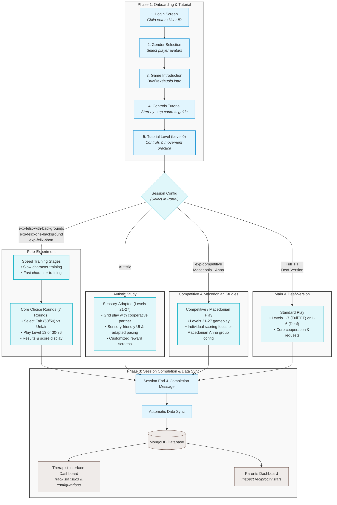

```mermaid
flowchart TD
    %% Define Styles
    classDef phase fill:#f9f9f9,stroke:#333,stroke-width:2px;
    classDef step fill:#e1f5fe,stroke:#0288d1,stroke-width:1px;
    classDef branch fill:#e0f7fa,stroke:#00acc1,stroke-width:1.5px;
    classDef data fill:#efebe9,stroke:#5d4037,stroke-width:1px;

    subgraph Onboarding [Phase 1: Onboarding & Tutorial]
        A["1. Login Screen<br/><i>Child enters User ID</i>"] --> B["2. Gender Selection<br/><i>Select player avatars</i>"]
        B --> C["3. Game Introduction<br/><i>Brief text/audio intro</i>"]
        C --> D["4. Controls Tutorial<br/><i>Step-by-step controls guide</i>"]
        D --> E["5. Tutorial Level (Level 0)<br/><i>Controls & movement practice</i>"]
    end

    subgraph FelixBranch [Felix Experiment]
        G1["Speed Training Stages<br/>• Slow character training<br/>• Fast character training"] --> G2["Core Choice Rounds (7 Rounds)<br/>• Select Fair (50/50) vs Unfair<br/>• Play Level 13 or 30-36<br/>• Results & score display"]
    end

    subgraph AutisticBranch [Autistic Study]
        H1["Sensory-Adapted (Levels 21-27)<br/>• Grid play with cooperative partner<br/>• Sensory-friendly UI & adapted pacing<br/>• Customized reward screens"]
    end

    subgraph CompBranch [Competitive & Macedonian Studies]
        I1["Competitive / Macedonian Play<br/>• Levels 21-27 gameplay<br/>• Individual scoring focus or<br/>Macedonian Anna group config"]
    end

    subgraph MainBranch [Main & Deaf-Version]
        J1["Standard Play<br/>• Levels 1-7 (FullTFT) or 1-6 (Deaf)<br/>• Core cooperation & requests"]
    end

    subgraph Completion [Phase 3: Session Completion & Data Sync]
        K["Session End & Completion Message"] --> L["Automatic Data Sync"]
        L --> M[("MongoDB Database")]
        
        %% Dashboards
        M --> N["Therapist Interface Dashboard<br/><i>Track statistics & configurations</i>"]
        M --> O["Parents Dashboard<br/><i>Inspect reciprocity stats</i>"]
    end

    %% Core Flow Connections (Declared outside subgraphs to prevent grouping layout bugs)
    E --> F{"Session Config<br/><i>(Select in Portal)</i>"}
    
    F -->|exp-felix-with-backgrounds<br/>exp-felix-one-background<br/>exp-felix-short| G1
    F -->|ָAutistic| H1
    F -->|exp-competitive<br/>Macedonia - Anna| I1
    F -->|FullTFT<br/>Deaf-Version| J1

    G2 & H1 & I1 & J1 --> K

    class Onboarding,FelixBranch,AutisticBranch,CompBranch,MainBranch,Completion phase;
    class A,B,C,D,E,K,L step;
    class F,G1,G2,H1,I1,J1 branch;
    class M,N,O data;
```