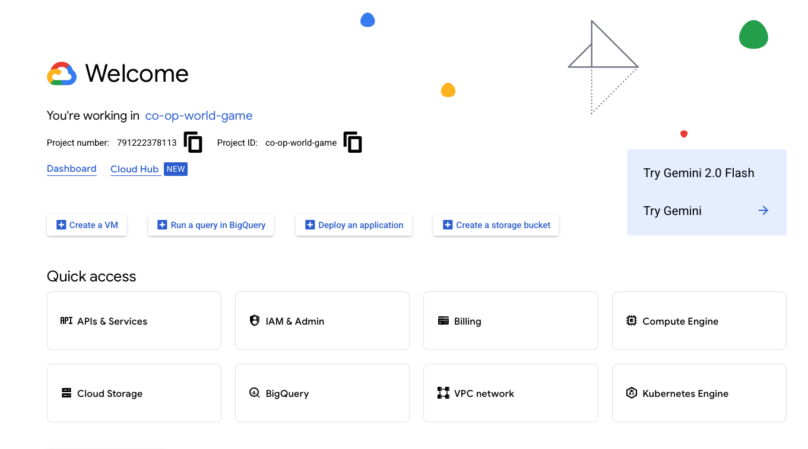
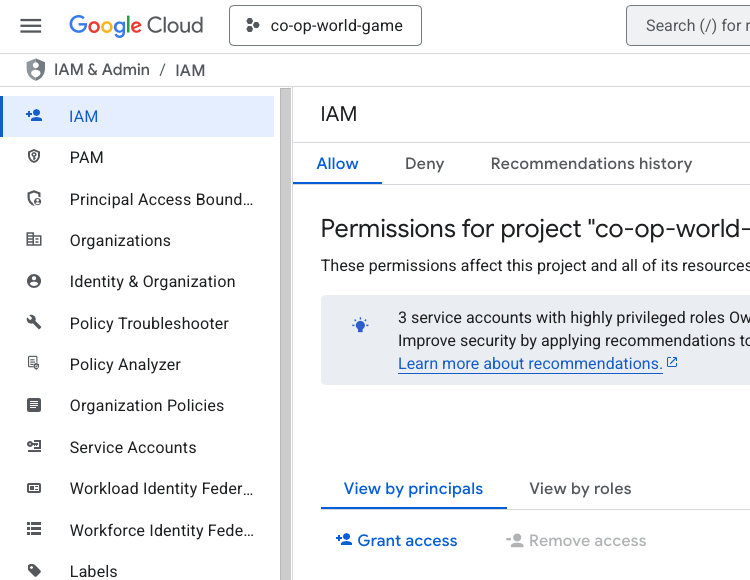
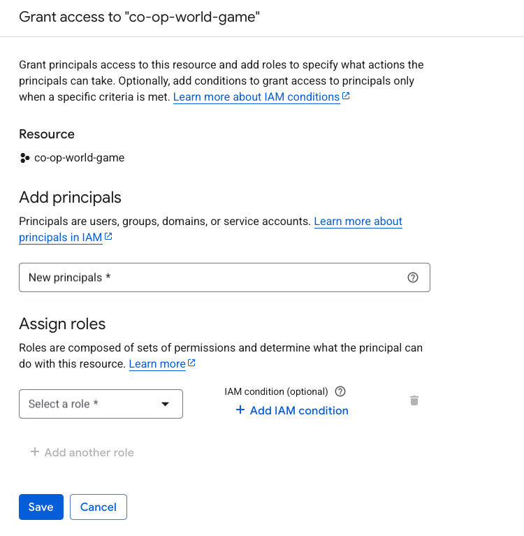

# Cloud Functions

To create a cloud function, you need the following permissions:

- Artifact Registry Administrator
- Cloud Build Editor
- Cloud Run Admin
- Service Account User
- Service Usage Consumer
- Storage Admin
- Viewer

To add the permissions to a service account, you need to add the service account to the project and then add the permissions to the service account from the IAM page.

In the IAM page, you can add the service account to the project and then add the permissions to the service account.

To add permissions to a new service account, you need to click on the service account and then click on the "Grant Access" button.

Then you need to add the service account to the project and then add the permissions to the service account as shown in the top.

