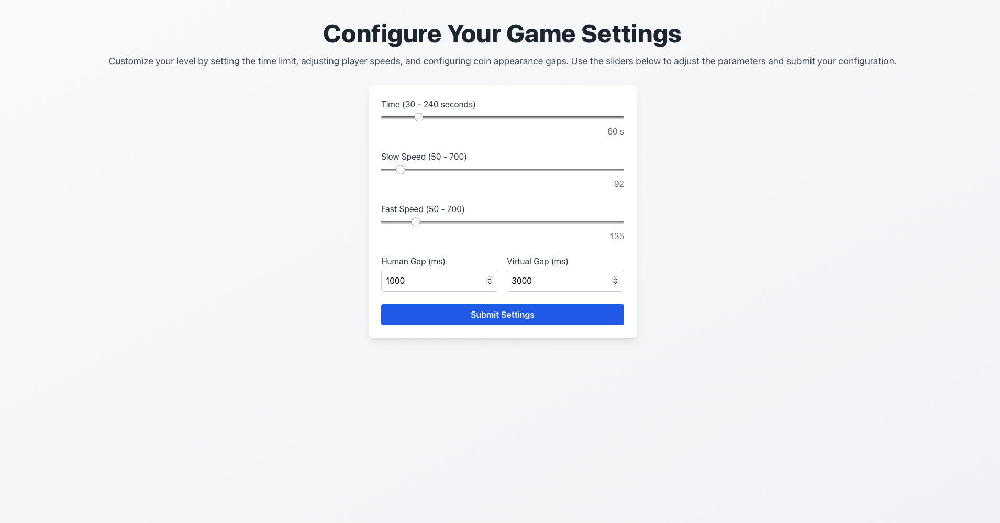

# Check Speed & Gap

This site created for Felix expiriment to check which speed of the virtual player and which gap between the coin collection to the creation of the next coin they want for the slow player and for the fast player. The site is changing the 16 level and to check the speed you can connect to the site using 1369 userid.

The site is built with React and Tailwind CSS.

The site repository is in this link:

[Check Speed & Gap Repo](https://github.com/CoOp-World/CheckDiffrentSpeed){:target="\_blank"}

The site is deployed in the following link:
[Check Speed & Gap](https://co-op-change-speed-and-gap-791222378113.us-central1.run.app){:target="\_blank"}

Basic preview of the site:

