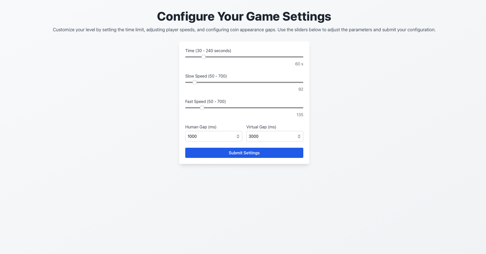

# Check Speed & Gap

This site created for Felix expiriment to check which speed of the virtual player and which gap between the coin collection to the creation of the next coin they want for the slow player and for the fast player. The site is changing the 16 level and to check the speed you can connect to the site using 1369 userid.

The site is built with React and Tailwind CSS.

The site repository is in this link:

[Check Speed & Gap Repo](https://github.com/CoOp-World/CheckDiffrentSpeed){:target="\_blank"}

The site is deployed in the following link:
[Check Speed & Gap](https://co-op-change-speed-and-gap-791222378113.us-central1.run.app){:target="\_blank"}

Basic preview of the site:

## Relevant Settings for Felix Version

The interface contains multiple form fields, but **only two are relevant for Felix's experimental version**:

### Slow Speed
- **Field Purpose**: Controls the movement speed of the slow virtual player option
- **Default Value**: ~300 velocity units
- **Usage**: When players choose the "slow" virtual partner in level 16, this speed setting is applied

### Fast Speed  
- **Field Purpose**: Controls the movement speed of the fast virtual player option
- **Default Value**: ~600 velocity units
- **Usage**: When players choose the "fast" virtual partner in level 16, this speed setting is applied

## Important Note

**All other fields and settings in the interface are not used by Felix's version** and can be ignored. Only the slow speed and fast speed controls affect the Felix experiment.

## How It Works

1. Configure the slow and fast speed values in the interface
2. The configured speeds determine how fast the chosen virtual player moves
3. This allows testing of cooperation dynamics with different virtual player speeds