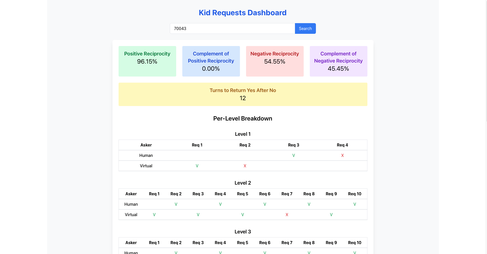

# Parents Dashboard

This site is created for the parents of the players to see the statistics of their children in the game. The site is built with React and Tailwind CSS.
The site repository is in this link:
[Parents Dashboard Repo](https://github.com/CoOp-World/Co-Op-Parents-Dashboard){:target="\_blank"}
The site is deployed in the following link:
[Parents Dashboard](https://co-op-parents-dashboard-791222378113.europe-central2.run.app/){:target="\_blank"}

Basic preview of the site:

The site allows parents to view their children's progress, achievements, and other relevant statistics in a user-friendly interface. It is designed to help parents stay informed about their children's gaming activities and performance in the Co-Op World game.
The dashboard includes features such as:

- **Positive Reciprocity and its complements**: The number of times that the kid said yes after the virtual player said yes / the number of times that the virtual player said yes.
- **Negative Reciprocity and its complements**: The number of times that the kid said no after the virtual player said no / the number of times that the virtual player said no.
- The number of turns it took the kid to return yes after the virtual player said no
- The full view of the game regarding the requests and responses of the kid and the virtual player.

### **Currently, the site is not working in the serverless function only, when the data comes properly from the server it will show it visually**
