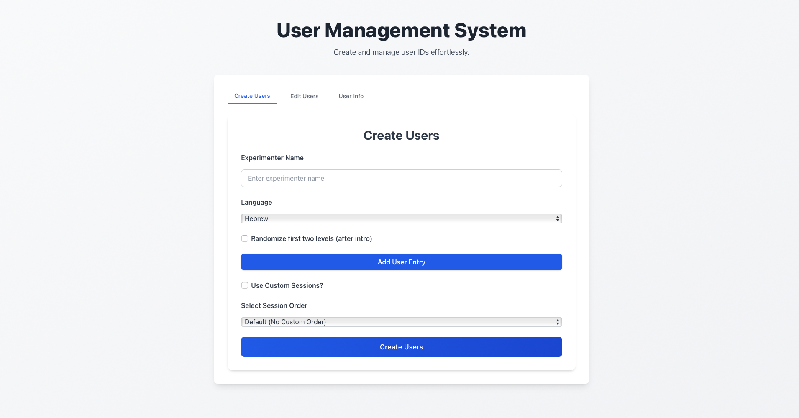
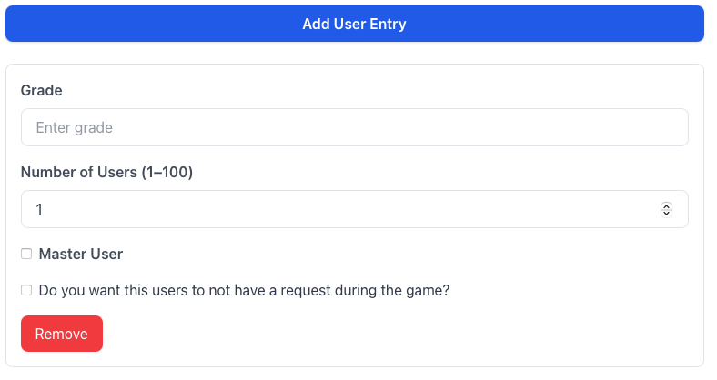
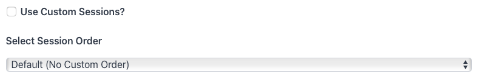
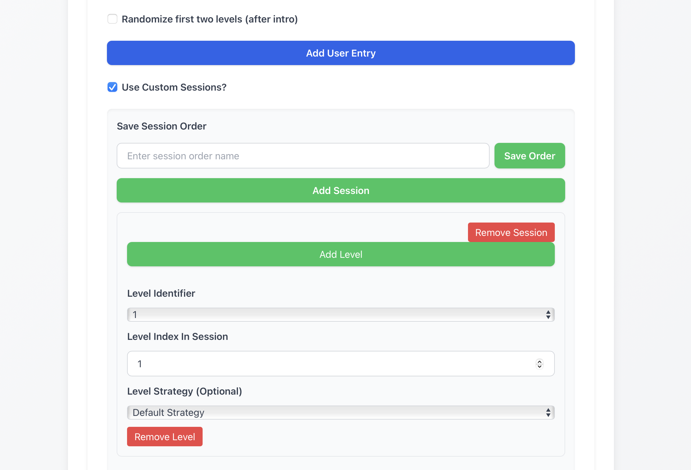
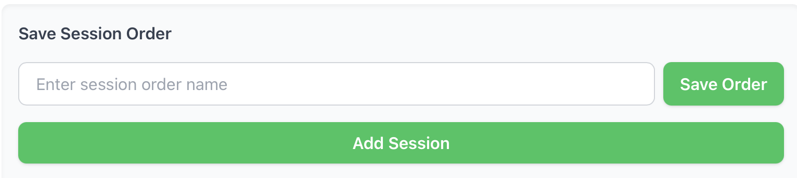
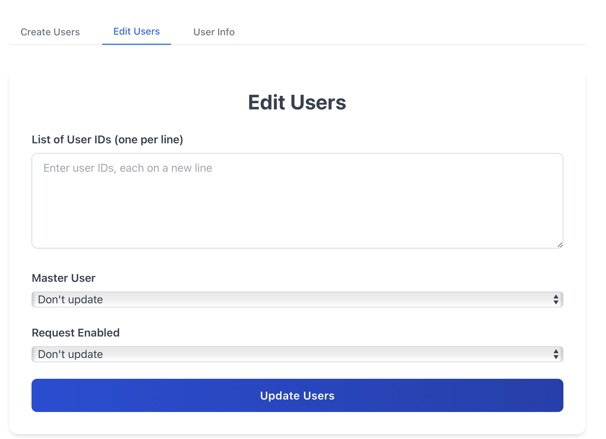
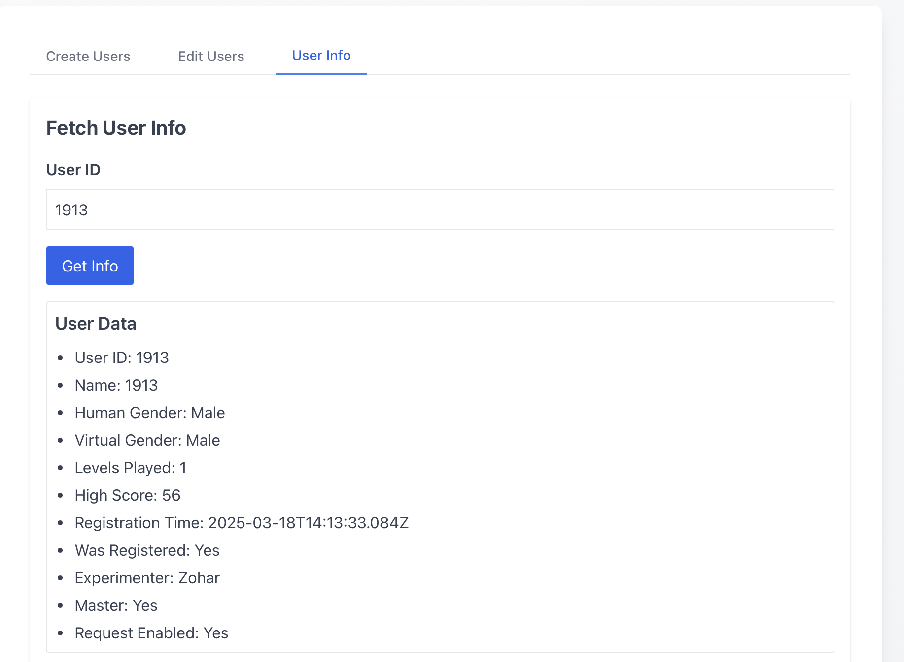

# 🧑‍💼 User Management Guide (Co-Op Platform)

This guide explains how to use the user management interface in the Co-Op platform, allowing therapists or admins to **create**, **edit**, **view**, and **manage** users effectively.

---

## 🚀 Overview

The user management interface includes forms and lists for creating, editing, viewing, and selecting users for gameplay sessions.

The repo link:
[Co-Op Platform User Management Repo](https://github.com/CoOp-World/Co-op-user-management){:target="\_blank"}

The user management system link:
[Co-Op Platform User Management](https://co-op-user-management-791222378113.europe-central2.run.app){:target="\_blank"}

---

## ➕ Creating a New User

First, you need to write the name of the experimenter (therapist) in the form and the language you speak in.
Then, you need to choose whether you want to randomize the 2 first levels or the 2 demo levels (Felix exp).

Finally, you need to choose user entry, each user entry have the same properties (Grade, is he will have request, is he master user that can do a level more than one time) and you can choose the number of users to create.

Now you can choose the sessions and levels you want to create for the user, you can choose the number of sessions and levels you want to create.
Or you can choose to choose a specific sessions and levels order that was saved before.

If you use custom sessions and levels, you need to add the session and then you can add the levels.

In each level you choose the level identifier, the index in session and if you want to change the levels default virtual player strategy.

After you finish creating the custom sessions and levels, you can save this order with a name for future use.

Finally, you can click on **"Create Users"** to submit the form.

Then the users will be created and you will see them in the user list. There you can copy them or download them to a file.

---

## 📝 Editing an Existing User

In the edit user tab, you can edit the user properties if the user has requests or is a master user.
In the List of User IDs (one per line), you can enter the user IDs you want to edit each one in a diffrent line.
You can choose for the users the master to don't change, yes or no.
Also you can choose the user requests to don't change, yes or no.
Then you need to click on **"Update Users"** to submit the form.

---

## 📋 Viewing Users

In the user info tab, you can view the users you created.You need to enter the user ID you want to view in the User ID field. And when you click on **"Get Info"**, you will see the user info.

