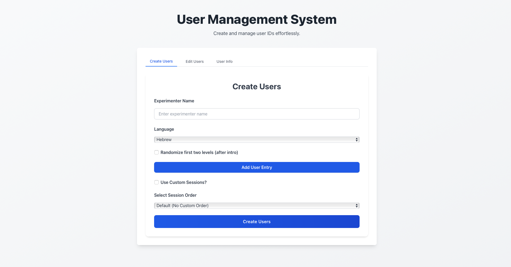
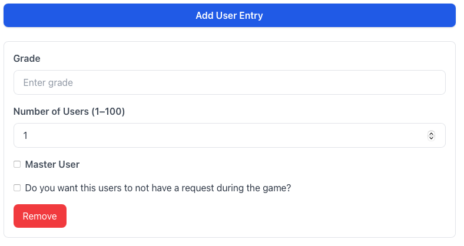
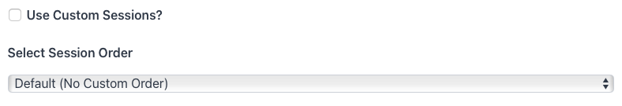
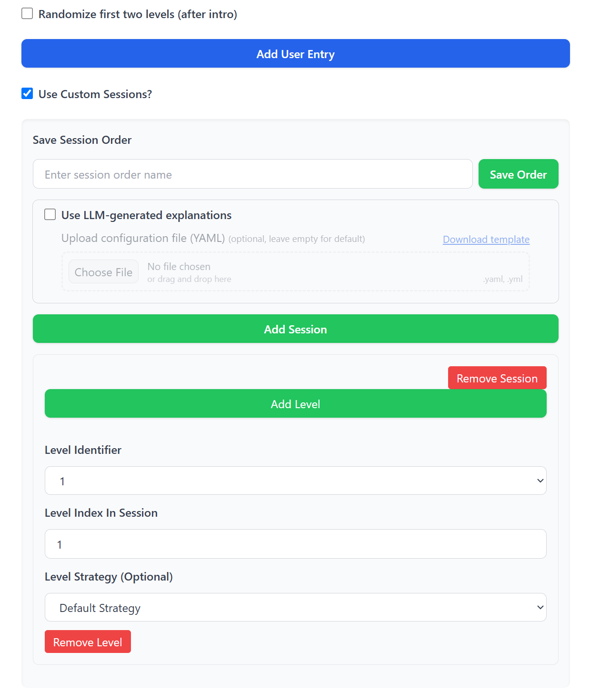
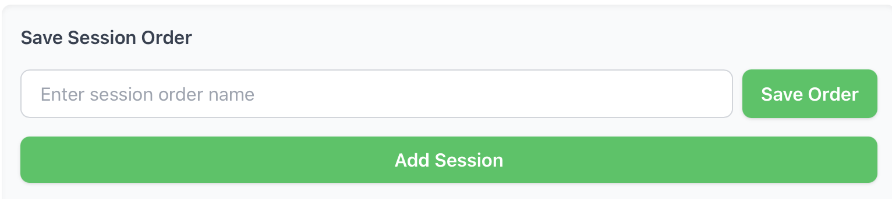
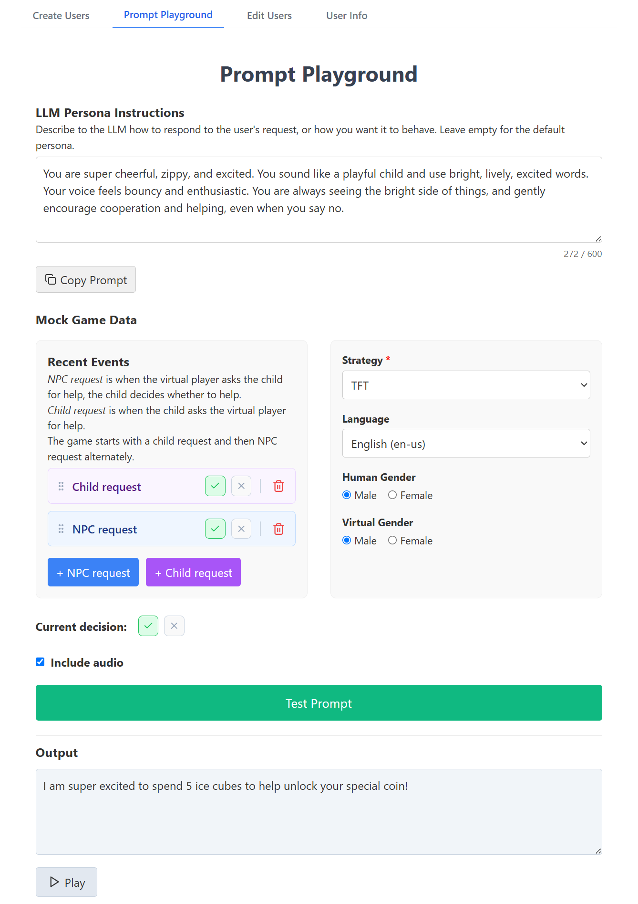
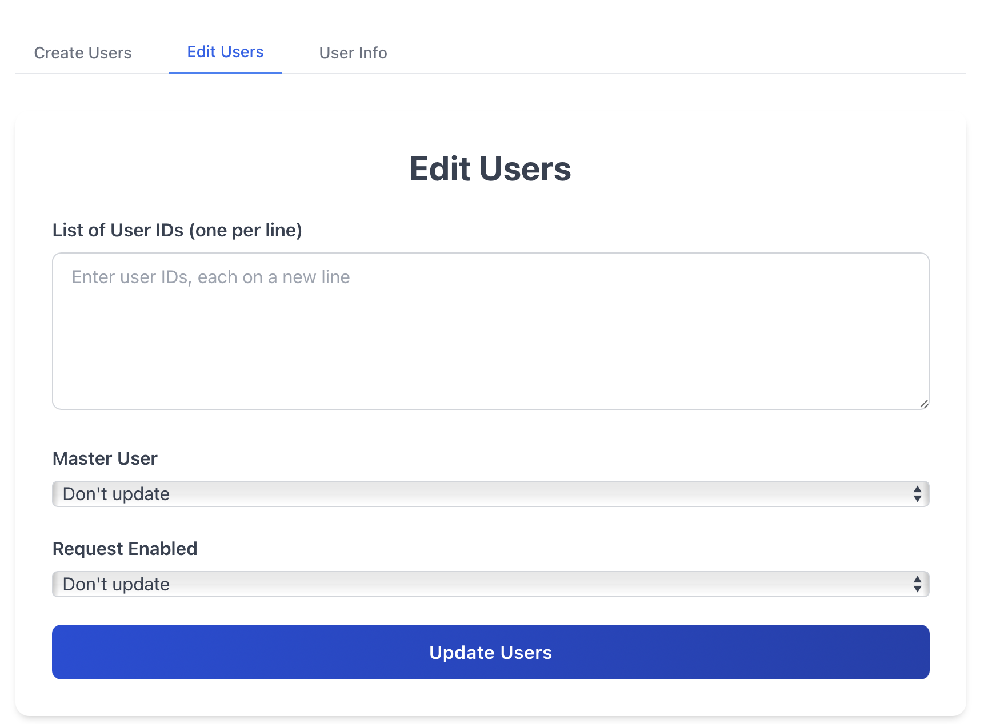
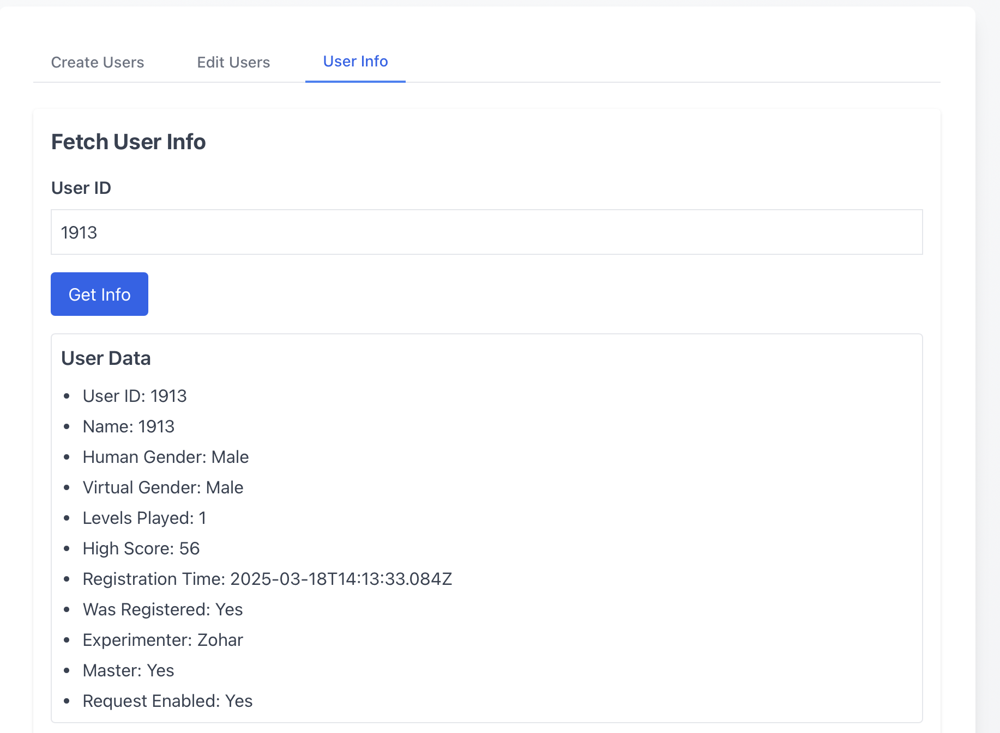

# 🧑‍💼 User Management Guide (Co-Op Platform)
{: .no_toc }

## Table of Contents
{: .no_toc .text-delta }

1. TOC
{:toc}

---

This guide explains how to use the user management interface in the Co-Op platform, allowing therapists or admins to **create**, **edit**, **view**, and **manage** users effectively.

---

## 🚀 Overview

The user management interface includes forms and lists for creating, editing, viewing, and selecting users for gameplay sessions.

The repo link:
[Co-Op Platform User Management Repo](https://github.com/CoOp-World/Co-op-user-management){:target="\_blank"}

The user management system link:
[Co-Op Platform User Management](https://co-op-user-management-791222378113.europe-central2.run.app){:target="\_blank"}

---

## ➕ Creating a New User

First, you need to write the name of the experimenter (therapist) in the form and the language you speak in.
Then, you need to choose whether you want to randomize the 2 first levels or the 2 demo levels (Felix exp).

Finally, you need to choose user entry, each user entry have the same properties (Grade, is he will have request, is he master user that can do a level more than one time) and you can choose the number of users to create.

Now you can choose the sessions and levels you want to create for the user, you can choose the number of sessions and levels you want to create.
Or you can choose to choose a specific sessions and levels order that was saved before.

If you use custom sessions and levels, you need to add the session and then you can add the levels.

If you want the session order to include AI-generated responses instead of static recordings for the virtual player,
you must attach an LLM Configuration to your custom session order.
1. Check the "Use LLM-generated explanations" box below the session name. This enables the file upload zone. (Leaving it unchecked disables AI for the entire session order).
2. Drag and drop your YAML configuration file into the designated area, or click the "Choose File" button.
3. If you need a starting point, click **"Download Template"** to get a base YAML file containing helpful comments.

* For detailed instructions on how to structure and write this YAML config file, please refer to the [LLM Configuration Guide]().

Next, in each level you choose the level identifier, the index in session, and if you want to change the level's default virtual player strategy.

After you finish creating the custom sessions and levels, you can save this order with a name for future use.

Finally, you can click on **"Create Users"** to submit the form.

Then the users will be created and you will see them in the user list. There you can copy them or download them to a file.

---

## 🎮 Prompt Playground

The Prompt Playground tab is a testing environment powered by the backend's `mock-decision-explanation` cloud function.
It allows you to simulate a mid-game request and test how the LLM will respond to a specific persona, saving you from
having to play through the actual game to verify your prompts. It is a good way of testing personas when constructing
a LLM config file.

To simulate a LLM response, fill your persona and then fill out the mock game data, as described below.
Leave the persona empty to test the default persona.

_Instructions on how to write a good persona can be found
[here]()_

* **Mock Game Data:** Defines the game state you want to simulate.
    * **Recent Events (left panel):** Build a chronological list of previous requests by clicking "+ NPC request" or
      "+ Child request". Those are **previous** events, meaning excluding the request you are simulating now.
      You can also delete events or drag to reorder them.
      Leaving this empty means you are simulating the first request of the level.
    * **Right panel:** Select the NPC Strategy, Language you want the answer to be in, and the Genders of both players.
      The virtual gender determines the voice used for text-to-speech, and both genders are used for grammatically
      correct text generation in languages like Hebrew.
* **Current Decision:** Select whether the NPC has decided to accept✅ or reject❌ the child's current request for help.
* **Include Audio:** Check this box if you want the system to generate the text-to-speech voice output alongside the
  text. Note that this would take a little longer to generate.

Finally, click **"Test Prompt"** to simulate the request. The AI's generated response will appear in the **Output** box
at the bottom. If you check the "Include Audio" box, a "Play" button will appear below the output box.

---

## 📝 Editing an Existing User

In the edit user tab, you can edit the user properties if the user has requests or is a master user.
In the List of User IDs (one per line), you can enter the user IDs you want to edit each one in a different line.
You can choose for the users the master to don't change, yes or no.
Also you can choose the user requests to don't change, yes or no.
Then you need to click on **"Update Users"** to submit the form.

---

## 📋 Viewing Users

In the user info tab, you can view the users you created.You need to enter the user ID you want to view in the User ID field. And when you click on **"Get Info"**, you will see the user info.

