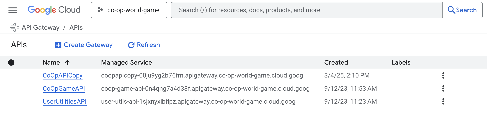
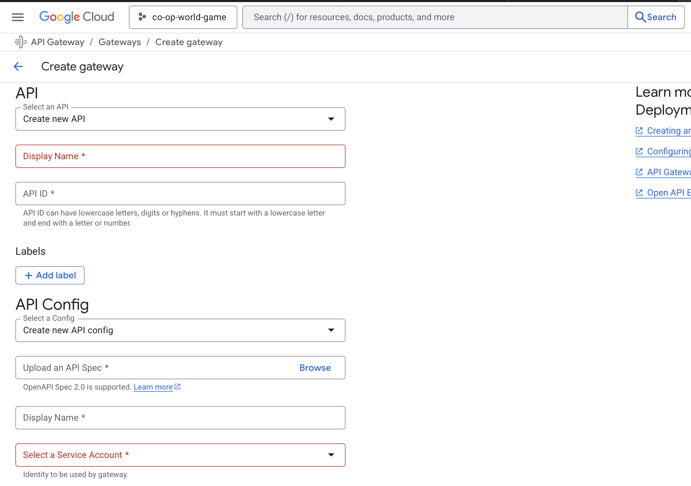
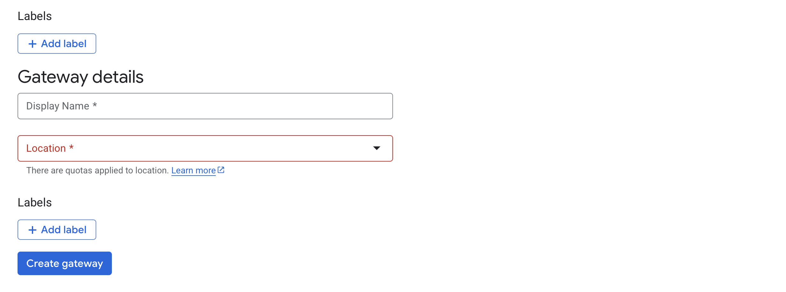

# API Gateway

In serverless architecture, each function has its own URL. The API Gateway binds multiple functions to a single URL, simplifying client access.

## How to Create a New API Gateway

1. Go to GCP API Gateway and click "Create Gateway".



2. Fill in the gateway form:
   - Select your API specification file
   - Choose the GitHub service account
   


3. Enter the gateway name, select the region, and click "Create gateway".



## How to Update the API Gateway

To update the API Gateway:

1. From the directory containing your updated API specification file, run:

```bash
gcloud api-gateway api-configs create "config-name" --api="api-name" --openapi-spec="openapi-spec-path" --project="project-name"
```

**Example:**

```bash
gcloud api-gateway api-configs create coop-game-config-v8 \
    --api=coopapicopy \
    --openapi-spec=api.yaml \
    --project=co-op-world-game
```

2. In the GCP console, navigate to the API Gateway and select the gateway you want to update.

3. Go to the "API Configs" tab and verify the new configuration appears.

4. In the "Gateway" tab, select your gateway and click "Edit".

5. Choose the new configuration and click "Update".

The gateway will update within a few moments.

## API Specification Example (YAML)

```yaml
swagger: "2.0"
info:
  version: "1.0"
  title: "CoOpAPICopy"

# The Gateway host
host: "co-op-api-copy-a3hddi81.ew.gateway.dev"
schemes:
  - "https"

# Important for Google API Gateway (Required if using CORS in serverless functions)
x-google-endpoints:
  - name: "co-op-api-copy-a3hddi81.ew.gateway.dev"
    allowCors: true

paths:
  /Games:
    post:
      summary: "Add game record"
      operationId: "addGameRecord"
      x-google-backend:
        address: "https://europe-central2-co-op-world-game.cloudfunctions.net/addGameRecord"
      responses:
        "200":
          description: "Game data saved successfully."
    options:
      summary: "CORS preflight for /Games"
      operationId: "corsGames"
      x-google-backend:
        address: "https://europe-central2-co-op-world-game.cloudfunctions.net/addGameRecord"
      responses:
        "200":
          description: "CORS accepted"

  /Levels:
    post:
      summary: "Add level record"
      operationId: "addLevelRecord"
      x-google-backend:
        address: "https://europe-central2-co-op-world-game.cloudfunctions.net/addLevelRecord"
      responses:
        "200":
          description: "Level data saved successfully."
    options:
      summary: "CORS preflight for /Levels"
      operationId: "corsLevels"
      x-google-backend:
        address: "https://europe-central2-co-op-world-game.cloudfunctions.net/addLevelRecord"
      responses:
        "200":
          description: "CORS accepted"
```
