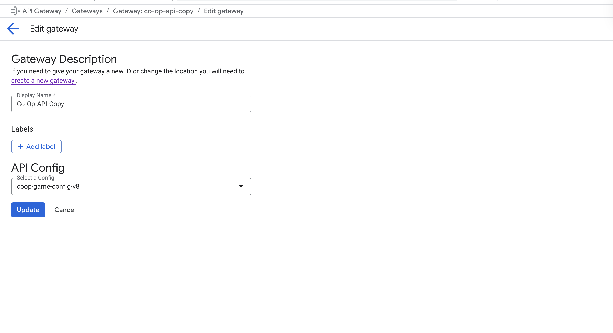

# API Gateway

In serverless architecture each function has its own url. So to bind the functions to a single url we use the API Gateway.

## How to create a new API Gateway

To create a new API Gateway you need to go to GCP API Gateway and then click on the "Create Gateway" button.


Now you need to fill the form of the API Gateway. And choose the api file. In the select a service account you need to select the gitub service account.


Now you need to fill the name again, choose the region and click on the "Create gateway" button.


## How to update the API Gateway

To update the API Gateway you need to go to the folder you have the new api file. And run the following command:

```bash
gcloud api-gateway api-configs create "config-name" --api="api-name" --openapi-spec="openapi-spec-path" --project="project-name"
```

Example:

```bash
gcloud api-gateway api-configs create coop-game-config-v8 \
    --api=coopapicopy \
    --openapi-spec=api.yaml \
    --project=co-op-world-game
```

Now you need to go to the API Gateway and click on the gateway you want to update.


Now you need go to the "API Configs" tab to see that the new config is created.


Now you need to go to the "Gateway" tab and click on the gateway you want to update.


Now click on edit.


Now you need to choose the config you want to use and click on the "Update" button.



And after some time you will see that the gateway is updated.

## Api example yaml file

```yaml
swagger: "2.0"
info:
  version: "1.0"
  title: "CoOpAPICopy"

# The Gateway host
host: "co-op-api-copy-a3hddi81.ew.gateway.dev"
schemes:
  - "https"

# Important for Google API Gateway (If you need to use cors in the serverless functions)
x-google-endpoints:
  - name: "co-op-api-copy-a3hddi81.ew.gateway.dev"
    allowCors: true

paths:
  /Games:
    post:
      summary: "Add game record"
      operationId: "addGameRecord"
      x-google-backend:
        address: "https://europe-central2-co-op-world-game.cloudfunctions.net/addGameRecord"
      responses:
        "200":
          description: "Game data saved successfully."
    options:
      summary: "CORS preflight for /Games"
      operationId: "corsGames"
      x-google-backend:
        address: "https://europe-central2-co-op-world-game.cloudfunctions.net/addGameRecord"
      responses:
        "200":
          description: "CORS accepted"

  /Levels:
    post:
      summary: "Add level record"
      operationId: "addLevelRecord"
      x-google-backend:
        address: "https://europe-central2-co-op-world-game.cloudfunctions.net/addLevelRecord"
      responses:
        "200":
          description: "Level data saved successfully."
    options:
      summary: "CORS preflight for /Levels"
      operationId: "corsLevels"
      x-google-backend:
        address: "https://europe-central2-co-op-world-game.cloudfunctions.net/addLevelRecord"
      responses:
        "200":
          description: "CORS accepted"
```
