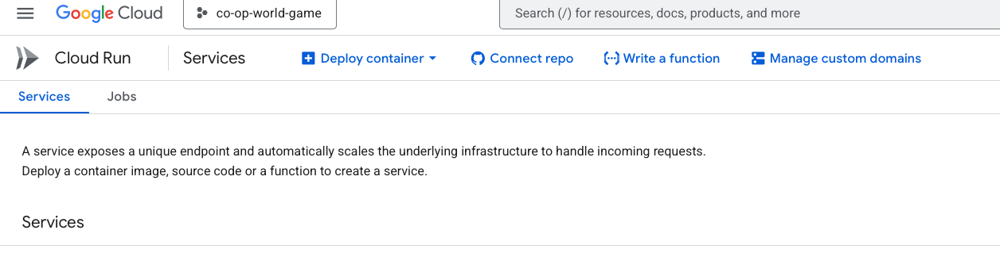
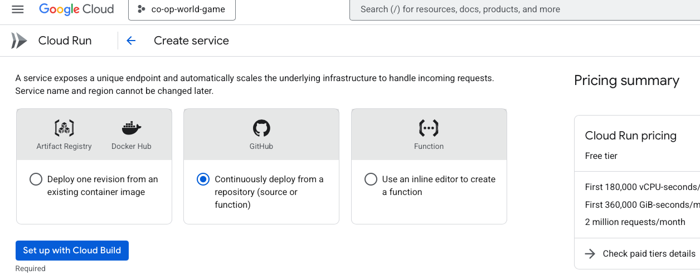
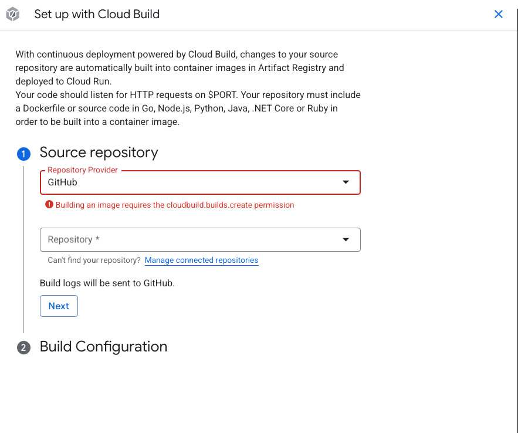
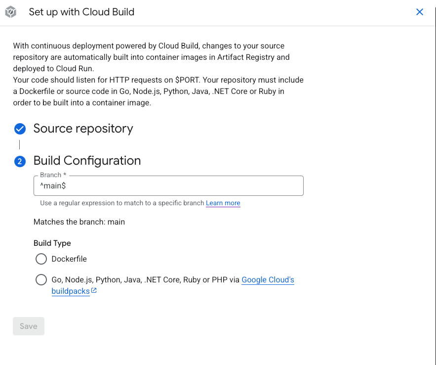
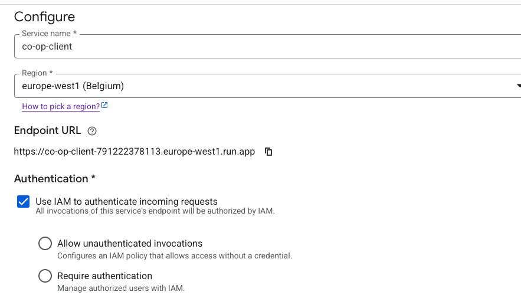
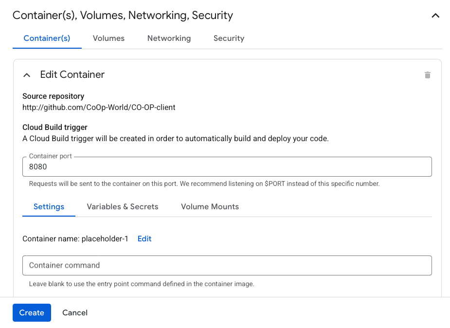

# Create Container

## Prerequisites

Ensure your repository contains the following files:

- `Dockerfile`
- `cloudbuild.yaml`
- `nginx.conf`

## Deployment Steps

### 1. Connect Repository to GCP Cloud Run

Go to GCP Cloud Run and click the "Connect repo" button.

### 2. Set Up Cloud Build

Click "Set up with Cloud Build".

### 3. Select Repository

Choose the repository you want to deploy. If you don't see your repository, click "Manage connected repositories" first. Then click "Next".

### 4. Configure Deployment

1. Select the branch to deploy
2. Choose the Dockerfile
3. Click "Save"

### 5. Choose Region and Settings

Select the region where you want to deploy the container and choose "Allow unauthenticated invocations".

### 6. Configure Port (if needed)

If you're using nginx with co-op-client, change the port to 80, then click "Create".

After a few moments, your container will be deployed and accessible via the provided URL.

## Automatic Updates

Every time you push a new commit to your selected branch, the container will automatically update.
