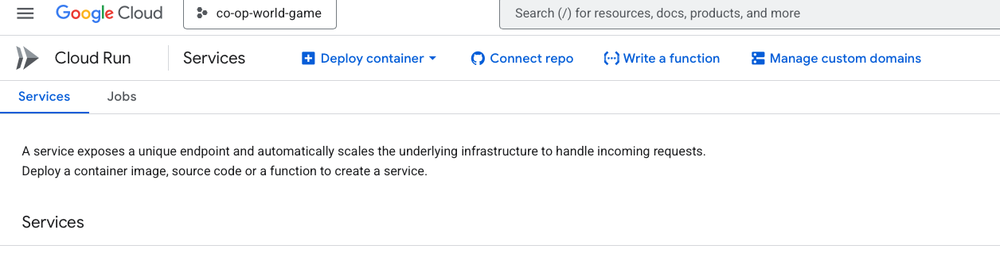
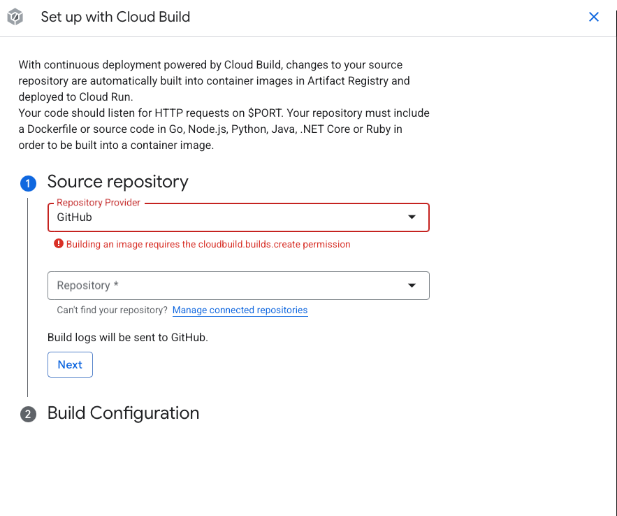
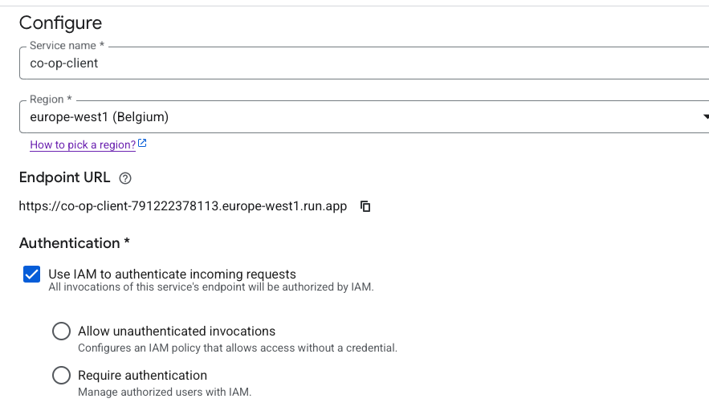

# Create Container

To create a container you need to have the following files in the repository:

- Dockerfile
- cloudbuild.yaml
- nginx.conf

To connect the gcp project to the github repository, you need to go to GCP cloud run and then click on the "Connect repo" button.

Click on the "Set up with Cloud Build" button.

Choose the repository you want to deploy. If you dont see the repository you need to click on the "Manage connected repositories" button. After you selected the repository you need to click on the "Next" button.

Now you choose the branch you want to deploy, And choose Dockerfile and click on the "Save" button.

Now you choose the region you want to deploy the repo to and choose Allow unauthenticated invocations.

Now you need to change the port (if you use the ngnix in the co-op-client) to port 80 then click on the "Create" button.

Then after some time you will see the repo deployed and you can access it from the url.
