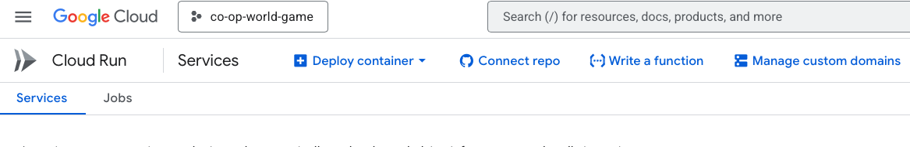
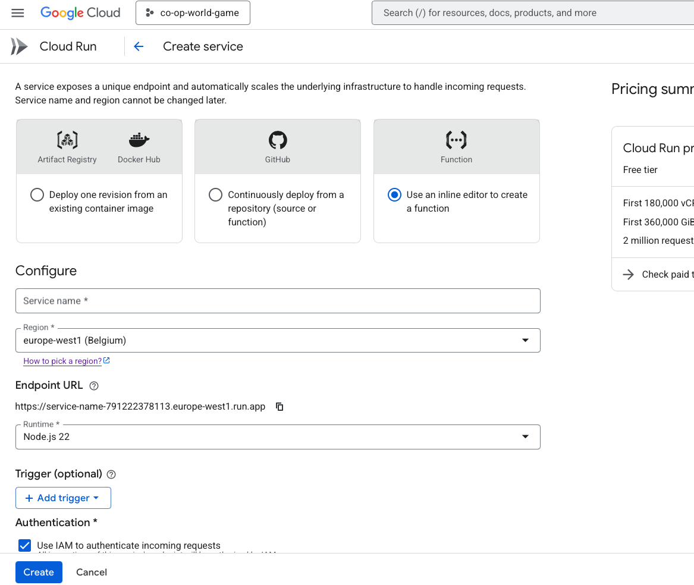
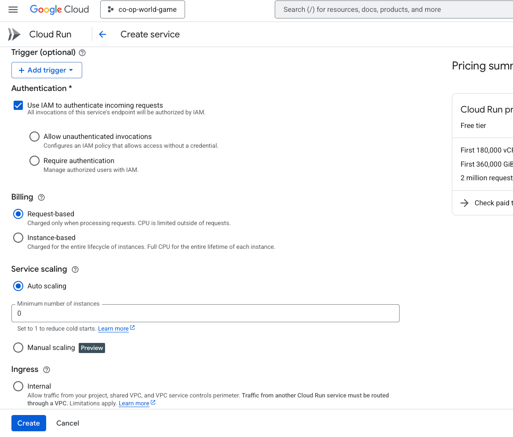
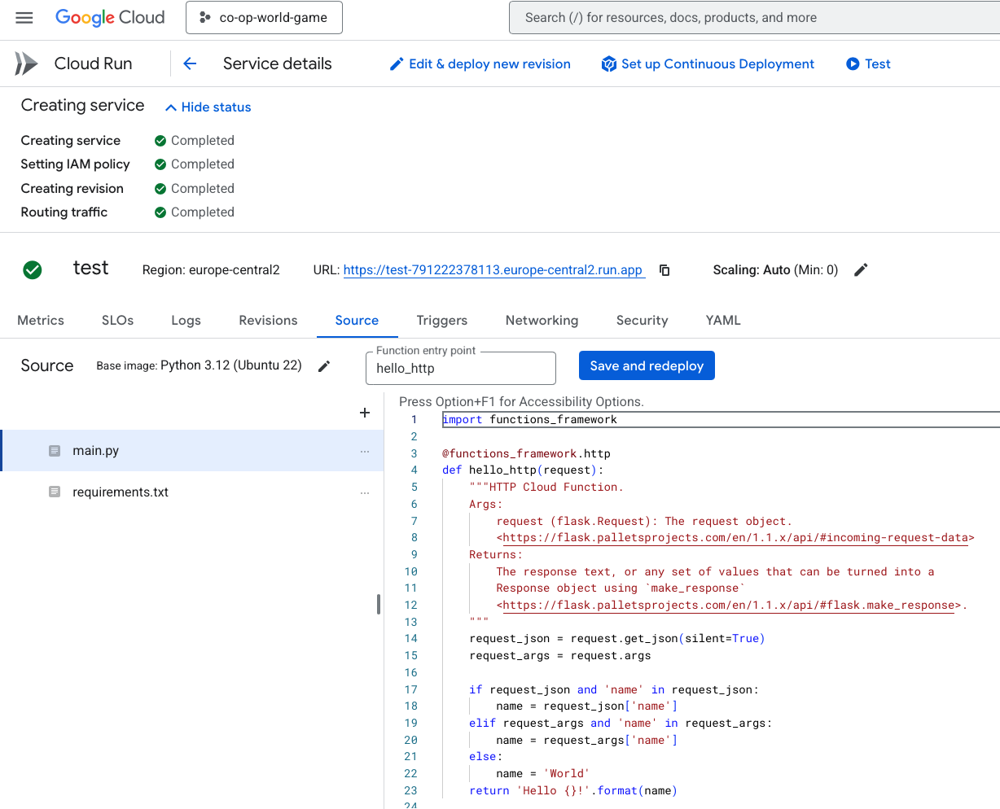

# Create Function

To create a new function you need to go to GCP cloud run and then click on the "Write a function" button.



Now you need to fill the form of the function. And choose the region you want to deploy the function to. And choose the runtime you want to use.



Now in the "Authentication" tab you need to choose the "Allow unauthenticated invocations" and click on the "Create" button.



Then you will see the function created.



# How to write the function it self

key points:

- The function is a serverless function. Which means that the function is running on demand.
- Every time the function is called it need to connect to the database (MongoDB).
- The function is written in python with Flask.
- Every kind of request get to the function. And in the function we need to handle the request and return the response.
- To get the request parameters use the request.args.get("param_name") and to get the request body use the request.get_json(silent=True).
- To connect to the database use the following code:

```python
def initialize_mongodb():
    try:
        # Environment variables
        MONGO_CONNECTION = os.environ.get('MONGO_CONNECTION')
        MONGO_DB_NAME = os.environ.get('MONGO_DB_NAME')
        MONGO_COLLECTION_NAME = os.environ.get('MONGO_COLLECTION_NAME')

        client = MongoClient(MONGO_CONNECTION, serverSelectionTimeoutMS=5000)
        client.server_info()
        db = client[MONGO_DB_NAME]
        collection = db[MONGO_COLLECTION_NAME]
        return client, collection
    except errors.ServerSelectionTimeoutError as err:
        return None, err

```

- The enviroment variables are in the Yaml tab to add them you need to edit the yaml file and add them after the ports.

```yaml
ports:
- name: http1
    containerPort: 8080
env:
- name: MONGO_CONNECTION
  value: mongodb+srv://...
```

- In the end make sure to deploy the function.

- If you use cors in the function you need to add the following code to the function:

```python
def create_cors_response(status_code=200, body=None):
    """Create a response with CORS headers."""
    headers = {
        'Access-Control-Allow-Origin': '*',  # Consider specifying the origin for better security
        'Access-Control-Allow-Methods': 'POST, OPTIONS',
        'Access-Control-Allow-Headers': 'Content-Type, Authorization',
        'Access-Control-Max-Age': '3600',
        # 'Access-Control-Allow-Credentials': 'true'  # Removed to comply with CORS policies
        'Content-Type': 'application/json'  # Ensure the content type is JSON
    }
    if body is None:
        body = {}
    return make_response((json.dumps(body, default=json_serial), status_code, headers))
```

**If you use cors you have to add the URL to the allowed origins in the API Gateway. This is the only way to allow the cors in the function if you dont use this in local you will get cors errors.**

## Example of a function

main.py:

```python
import os
import json
from pymongo import MongoClient, errors
from functions_framework import http
from google.cloud import pubsub_v1
from flask import make_response
import logging
from bson import ObjectId

def json_serial(obj):
    if isinstance(obj, ObjectId):
        return str(obj)
    raise TypeError(f'Object of type {obj.__class__.__name__} is not JSON serializable')

# Function to enqueue message to Topic
def enqueue_to_topic(cloud_function_identifier, request, error_received):
    # Initialize Pub/Sub Publisher with environment variables
    topic_id = os.environ.get('PUBSUB_TOPIC_ID')
    project_id = os.environ.get('GCP_PROJECT_ID')  # Get project ID from environment variable
    publisher = pubsub_v1.PublisherClient()
    topic_path = f"projects/{project_id}/topics/{topic_id}"

    message_data = {
        "cloudFunctionIdentifier": cloud_function_identifier,
        "request": {
            "headers": dict(request.headers),
            "body": request.get_data(as_text=True),
            "method": request.method,
            "url": request.url,
        },
        "errorReceived": str(error_received)
    }

    message_data_str = json.dumps(message_data, default=json_serial)
    publisher.publish(topic_path, message_data_str.encode("utf-8"))

def log_details(request, function_name, status_code, error=None):
    """Logs details of the Cloud Function execution."""
    try:
        request_body = request.get_json(silent=True)
        if request_body is None:
            request_body = request.data.decode('utf-8')
    except Exception as e:
        request_body = f"Error parsing request body: {e}"

    log_data = {
        "function_name": function_name,
        "request_method": request.method,
        "request_url": request.url,
        "request_body": request_body,
        "status_code": status_code,
        "error": str(error) if error else "None"
    }
    log_message = json.dumps(log_data, default=json_serial)

    if error:
        logging.error(log_message)
    else:
        logging.info(log_message)

# Initialize MongoDB client
def initialize_mongodb():
    try:
        # Environment variables
        MONGO_CONNECTION = os.environ.get('MONGO_CONNECTION')
        MONGO_DB_NAME = os.environ.get('MONGO_DB_NAME')
        MONGO_COLLECTION_NAME = os.environ.get('MONGO_COLLECTION_NAME')

        client = MongoClient(MONGO_CONNECTION, serverSelectionTimeoutMS=5000)
        client.server_info()
        db = client[MONGO_DB_NAME]
        collection = db[MONGO_COLLECTION_NAME]
        return client, collection
    except errors.ServerSelectionTimeoutError as err:
        return None, err

# Add game record to the database
def add_game_record(collection, game_data):
    try:
        insert_result = collection.insert_one(game_data)
        if insert_result.acknowledged:
            return {'message': 'Data saved successfully.'}, 200
        else:
            return {'error': 'Error writing to database'}, 500
    except Exception as err:
        return {'error': str(err)}, 500

def create_cors_response(status_code=200, body=None):
    """Create a response with CORS headers."""
    headers = {
        'Access-Control-Allow-Origin': '*',  # Consider specifying the origin for better security
        'Access-Control-Allow-Methods': 'POST, OPTIONS',
        'Access-Control-Allow-Headers': 'Content-Type, Authorization',
        'Access-Control-Max-Age': '3600',
        # 'Access-Control-Allow-Credentials': 'true'  # Removed to comply with CORS policies
        'Content-Type': 'application/json'  # Ensure the content type is JSON
    }
    if body is None:
        body = {}
    return make_response((json.dumps(body, default=json_serial), status_code, headers))

@http
def add_game_record_endpoint(request):
    function_name = "addGameRecord"

    if request.method == 'OPTIONS':
        return create_cors_response(204, {})

    if request.method != 'POST':
        log_details(request, function_name, 405, 'Method not allowed')
        return create_cors_response(405, {'error': 'Method not allowed'})

    client, err_or_collection = initialize_mongodb()

    if client is None:
        error_message = str(err_or_collection)
        enqueue_to_topic(function_name, request, error_message)
        log_details(request, function_name, 500, error_message)
        return create_cors_response(500, {'error': error_message})

    game_data = request.get_json(silent=True)

    if not game_data:
        error_message = "No game data provided."
        log_details(request, function_name, 400, error_message)
        return create_cors_response(400, {'error': error_message})

    message, err_or_status_code = add_game_record(err_or_collection, game_data)

    if err_or_status_code == 500:
        error_message = message.get('error', 'Unknown error')
        enqueue_to_topic(function_name, request, error_message)
        log_details(request, function_name, 500, error_message)
        return create_cors_response(500, {'error': error_message})

    log_details(request, function_name, err_or_status_code)
    return create_cors_response(err_or_status_code, message)
```

requirements.txt:

```
functions-framework==3.*
pymongo
google-cloud-pubsub
flask
```
