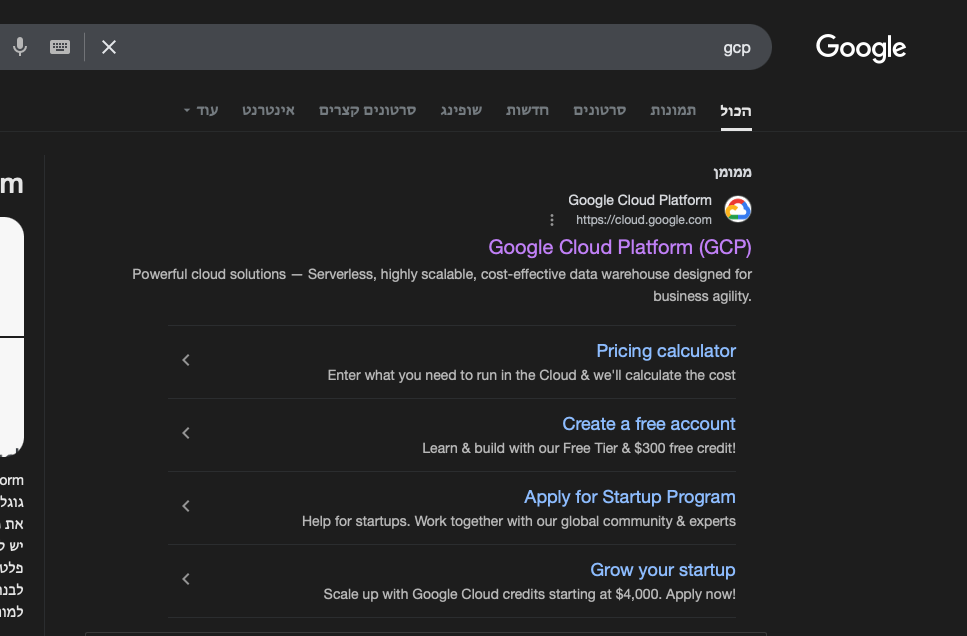
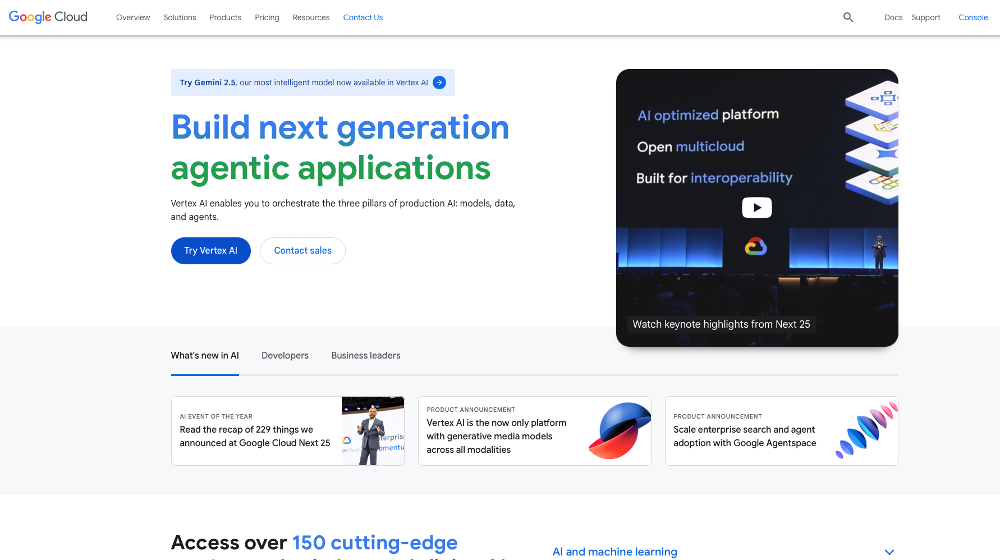
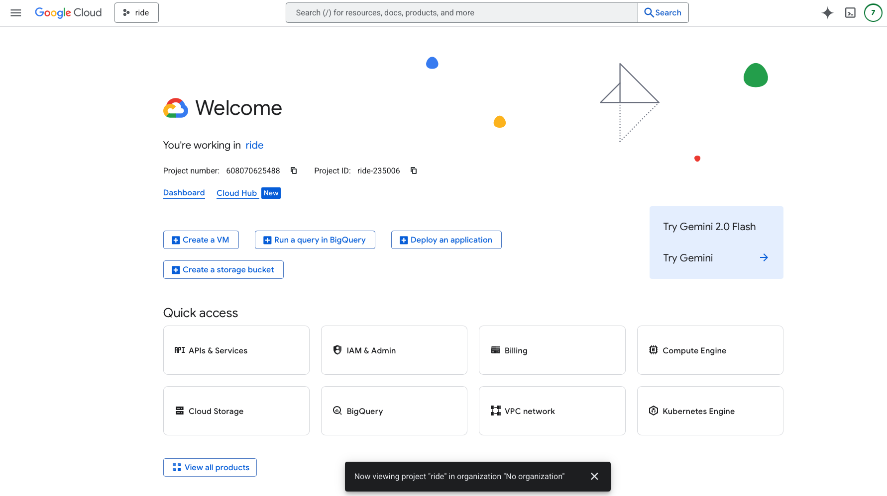
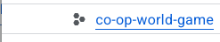
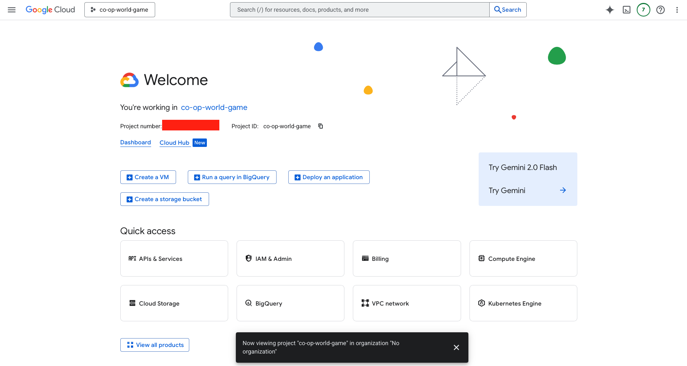

# GCP Backend Connect

To connect to gcp you need to go to your search engine and search for "GCP" and click on the "GCP" site.

Now you after you login you will see the following screen. You need to click on the "Console" button in the top right corner.

Now you will see the following screen. You need select the project you want to use in the top left corner.

Now you will see the following screen. You need to click on the "All" tab then search for the project co-op-world-game and click on it. If you don't see the project you need to contact the admin to add you to the project.

Now you will see the following screen. Which means that you are connected to the project.

