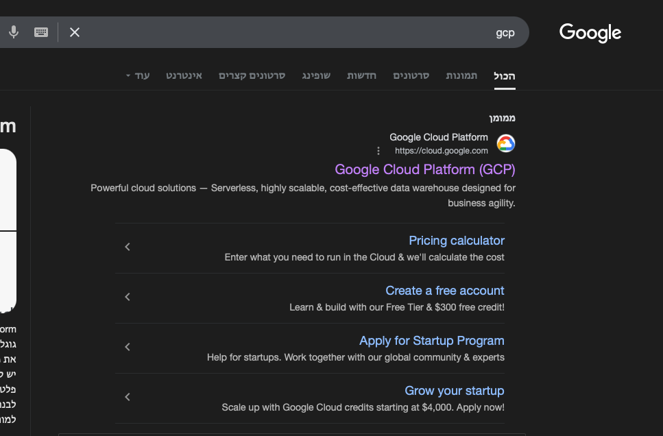
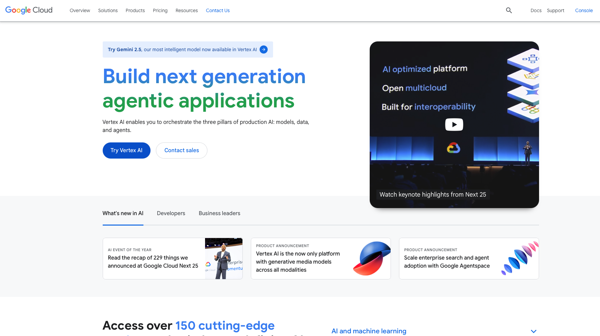
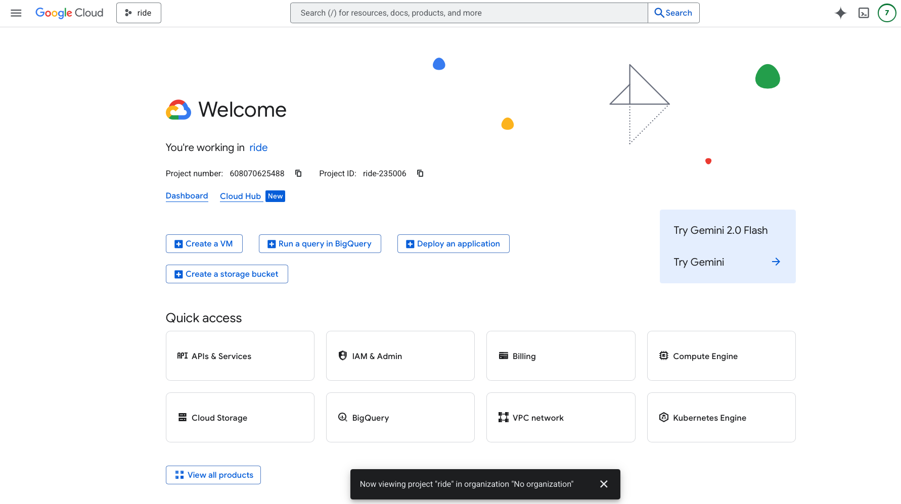
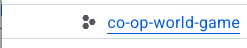
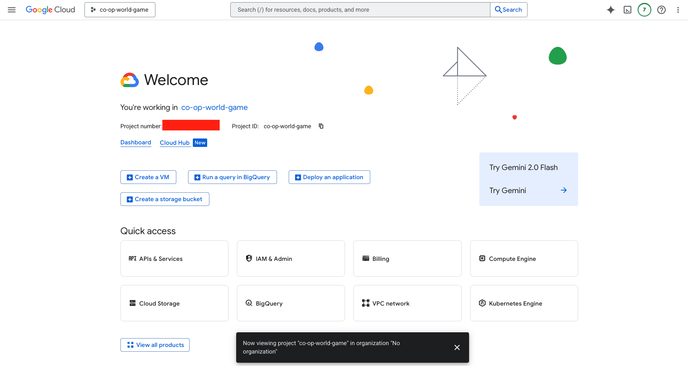

# GCP Backend Connect

To access GCP, go directly to the Google Cloud Console:

**URL**: [https://console.cloud.google.com](https://console.cloud.google.com)

## Step 1: Login

Log in with your Google account. You will see the GCP console home page.

## Step 2: Open the Console

Click the **Console** button in the top right corner to access the main dashboard.

## Step 3: Select Your Project

In the top left corner, select the project you want to work with.

## Step 4: Find the co-op-world-game Project

Click the **All** tab and search for "co-op-world-game". If you don't see this project, contact an admin to be added to it.

## Step 5: Confirm Connection

You are now connected to the project.

