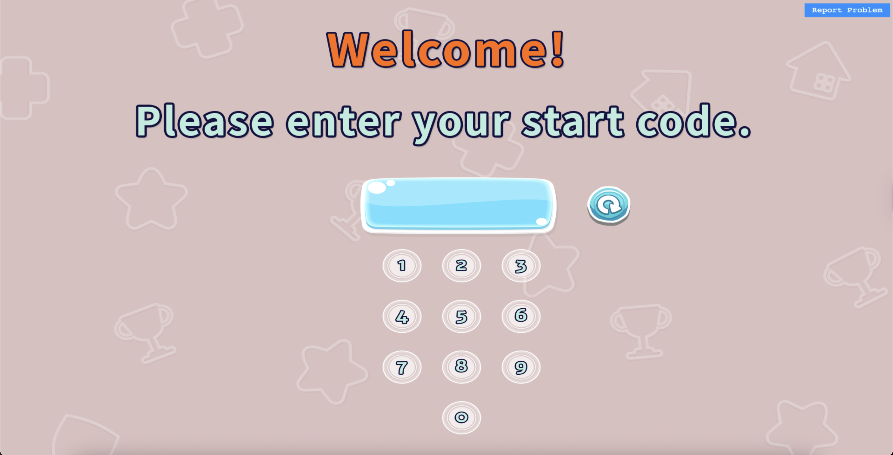
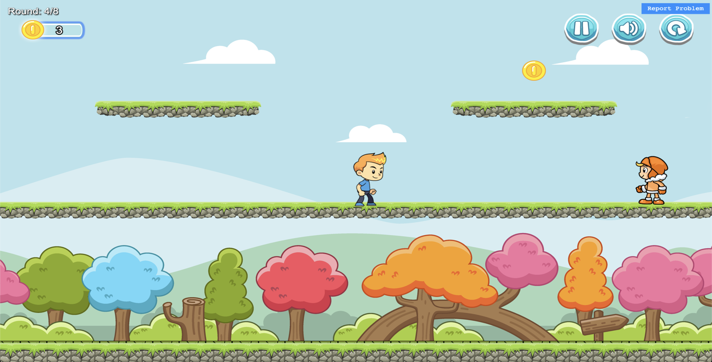

# Felix Version - Game Flow & Overview

Felix's experimental version of the Coop Game is designed to study children's decision-making patterns when choosing between virtual characters with different cooperation behaviors. The game follows a structured flow from introduction to character selection rounds.

## Access Information

- **Game URL**: [https://exp-felix-791222378113.us-central1.run.app](https://exp-felix-791222378113.us-central1.run.app){:target="_blank"}
- **Repository Branch**: `dev-Felix-exp`

## Complete Game Flow

### Phase 1: Introduction and Tutorial

#### Initial Setup
- User enters with their assigned User ID
- System loads user configuration and session data
- Master users see level progression counter (Level: X/Y) in top-left corner



#### Tutorial Level (Level 0)
- **Purpose**: Teach basic game controls and mechanics
- **Duration**: Introductory level to familiarize players with the interface
- **Controls Training**: 
  - Movement controls (arrow keys or WASD)
  - Interaction with coins and collectibles
  - Understanding cooperation mechanics
- **Virtual Player Introduction**: Players meet the virtual characters they'll work with

### Phase 2: Character Speed Training

#### Slow Character Practice
- **Purpose**: Players experience working with the slow-moving virtual character
- **Mechanics**: Virtual player moves at reduced speed
- **Learning Outcome**: Understanding how character speed affects coin collection and cooperation

#### Fast Character Practice  
- **Purpose**: Players experience working with the fast-moving virtual character
- **Mechanics**: Virtual player moves at increased speed
- **Learning Outcome**: Understanding how character speed affects coin collection strategies

### Phase 3: Main Experimental Rounds (7 Rounds)

This is the core of the study, designed to observe children's character selection patterns.

#### Round Structure
Each of the 7 rounds follows this pattern:

1. **Character Selection Screen**
   - Players choose between two virtual characters
   - Each character has different coin-sharing behaviors:
     - **Fair Character**: Splits coins equally with the player (50/50)
     - **Unfair Character**: Keeps more coins, gives less to the player (varies by level)
   - Visual representation shows how each character splits coins

2. **Gameplay Phase**
   - Player works with their chosen virtual character
   - Collect coins together during the time limit
   - Cooperation mechanics determine success
   - Coin splitting happens according to chosen character's behavior



3. **Results Display**
   - Shows coins collected during the round
   - Displays how coins were split between player and virtual character
   - Updates total score for the player


#### Character Behavior Patterns

**Fair Characters:**
- Always split coins equally (50/50)
- Consistent cooperative behavior
- Reliable partnership

**Unfair Characters:**
- Various splitting ratios (e.g., 70/30, 60/40, 80/20)
- Take larger share of collected coins
- May collect more total coins due to different strategies

#### Research Objective
The main study focuses on tracking:
- Which character types children prefer
- How preferences change over multiple rounds
- Whether children prioritize fairness or total coin collection
- Pattern recognition in decision-making

### Phase 4: Game Completion

#### High Score Display
- **Final Results**: Shows player's accumulated total score across all rounds
- **Achievement Recognition**: Celebrates player's performance
- **Data Recording**: All choices and scores are saved for research analysis

#### Session End
- **Study Completion**: Game session officially ends
- **Thank You Message**: Appreciation for participation
- **Data Submission**: Results automatically sent to research database

## Master User Features

### Enhanced Monitoring (Master Users Only)
- **Level Counter**: Real-time progression display in corner of screen
- **Session Tracking**: Accurate counting of completed rounds
- **Debug Information**: Additional technical details for researchers
- **Enhanced Analytics**: Access to detailed performance metrics

### Level Progression Display
```
Format: "Level: X/Y"
Example: "Level: 3/8" (showing round 3 of 8 total)
```

## Research Data Collection

### Tracked Metrics
- **Character Selection**: Which character chosen each round
- **Collection Performance**: Coins collected per round
- **Cooperation Patterns**: How well player works with each character type
- **Time Metrics**: Response times for character selection
- **Behavioral Trends**: Changes in preferences over rounds

### Data Structure
```json
{
  "user_id": "participant_id",
  "session_data": {
    "rounds": [
      {
        "round_number": 1,
        "character_selected": "fair",
        "coins_collected": 45,
        "coins_received": 23,
        "completion_time": 120
      }
    ],
    "final_score": 185,
    "study_completion": true
  }
}
```

## Experimental Design Goals

1. **Choice Pattern Analysis**: Understanding how children make decisions between fair and unfair options
2. **Preference Evolution**: Tracking changes in character preferences across rounds
3. **Fairness vs. Efficiency**: Studying trade-offs between equal sharing and total collection
4. **Learning Behavior**: Observing adaptation to different character behaviors
5. **Individual Differences**: Identifying personality-based decision patterns