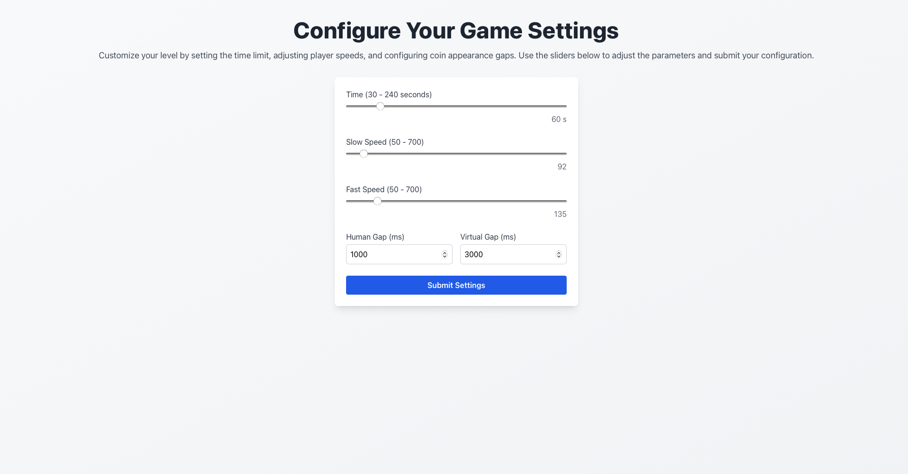

# Player Speed Control System

Felix's version includes a dedicated interface for adjusting virtual player movement speeds for experimental testing.

## Speed Control Interface

**URL**: [https://co-op-change-speed-and-gap-791222378113.us-central1.run.app](https://co-op-change-speed-and-gap-791222378113.us-central1.run.app)

## Relevant Settings for Felix Version

The interface contains multiple form fields, but **only two are relevant for Felix's experimental version**:

### Slow Speed
- **Field Purpose**: Controls the movement speed of the slow virtual player option
- **Default Value**: ~300 velocity units
- **Usage**: When players choose the "slow" virtual partner in level 16, this speed setting is applied

### Fast Speed  
- **Field Purpose**: Controls the movement speed of the fast virtual player option
- **Default Value**: ~600 velocity units
- **Usage**: When players choose the "fast" virtual partner in level 16, this speed setting is applied

## Important Note

**All other fields and settings in the interface are not used by Felix's version** and can be ignored. Only the slow speed and fast speed controls affect the Felix experiment.

## How It Works

1. Configure the slow and fast speed values in the interface
2. The configured speeds determine how fast the chosen virtual player moves
3. This allows testing of cooperation dynamics with different virtual player speeds