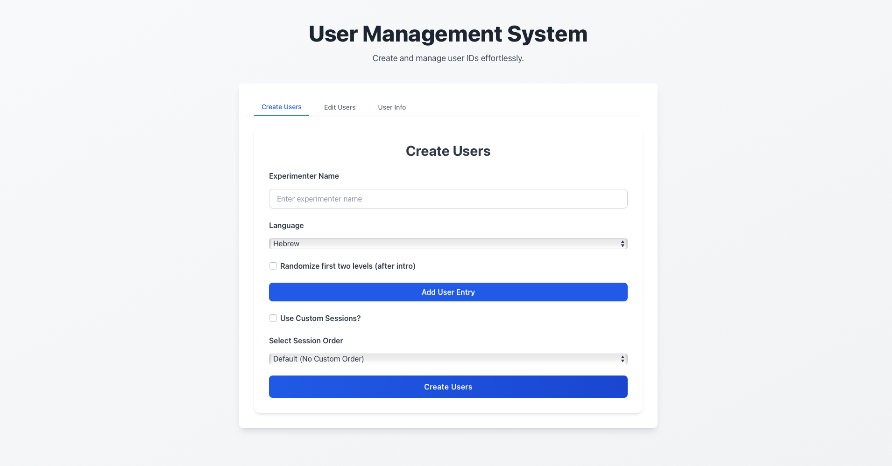

# User Management System

The User Management System is a React-based web application for creating, editing, and managing user accounts for the Coop Game experiments.

## User Management Interface

**URL**: [https://co-op-user-management-791222378113.europe-central2.run.app](https://co-op-user-management-791222378113.europe-central2.run.app){:target="_blank"}


The interface provides two main tabs:
- **Create Users**: Create new user accounts with custom settings
- **Edit Users**: Modify existing user properties

## Create Users Tab

### Basic Configuration Fields

#### Experimenter Name (Required)
- **Field Type**: Text input
- **Purpose**: Identifies who is conducting the experiment
- **Usage**: This name will be associated with all users created in this session

#### Language (Required)
- **Field Type**: Dropdown selection
- **Options**: 
  - Hebrew
  - English  
  - Macedonian
- **Purpose**: Sets the language for user interface elements in the game

#### Randomize First Two Levels
- **Field Type**: Checkbox
- **Purpose**: When checked, randomizes the order of the first two levels after the introduction
- **Default**: Unchecked

### User Entry Configuration

Click **"Add User Entry"** to create user groups. Each entry contains:

#### Grade
- **Field Type**: Text input
- **Purpose**: Identifies the grade/group/class of the users
- **Usage**: Used for categorizing and organizing users

#### Number of Users (1-100)
- **Field Type**: Number input
- **Range**: 1 to 100 users per entry
- **Purpose**: Specifies how many users to create with these settings
- **Validation**: Automatically constrains input to valid range

#### Master User
- **Field Type**: Checkbox
- **Purpose**: When checked, users created with this entry will have master privileges
- **Master User Features**:
  - See level progression counter during gameplay
  - Access to enhanced debugging information
  - Additional UI elements for monitoring

#### Request Setting - NOT RELEVANT FOR FELIX'S VERSION

### Session Configuration Options

#### Option 1: Select Session Order
- **Field Type**: Dropdown selection
- **Default Option**: "Default (No Custom Order)"
- **Available Options**: Previously saved session orders
- **Purpose**: Apply pre-configured level sequences to users

#### Option 2: Use Custom Sessions
- **Field Type**: Checkbox
- **Purpose**: When checked, enables creation of custom session sequences

### Custom Sessions Configuration

When "Use Custom Sessions?" is checked:

#### Save Session Order
- **Session Order Name**: Text input to name your custom session configuration
- **Save Order Button**: Saves the current custom session for future reuse

#### Add Session - BOT RELEVANT FOR FELIX'S VERSION
- **Purpose**: Creates a new session in the sequence
- **Sessions**: Numbered automatically (Session 1, Session 2, etc.)

#### Session Level Configuration
For each session, you can add multiple levels:

##### Level Identifier
- **Field Type**: Dropdown selection
- **Options**: Available level configurations from the system
- **Purpose**: Selects which game level to include

##### Level Index In Session
- **Field Type**: Number input
- **Validation**: Must start at 1 and be consecutive within each session
- **Purpose**: Determines the order of levels within the session
- **Important**: Cannot have gaps (1, 2, 3... not 1, 3, 5)

##### Level Strategy (Optional)
- **Field Type**: Dropdown selection
- **Options**:
  - Default Strategy (no specific strategy)
  - ALLC (Always Cooperate)
  - ALLD (Always Defect)
  - Alternate (Alternating cooperation/defection)
  - ProbabilisticTFT (Probabilistic Tit-for-Tat)
  - Random (Random strategy)
  - TFT (Tit-for-Tat)
- **Purpose**: Defines virtual player behavior strategy for this level

### User Creation Process

1. Fill in experimenter name and select language
2. Configure randomization if needed
3. Add user entries with appropriate settings
4. Choose session configuration (existing order or custom)
5. If custom sessions: configure sessions and levels
6. Click **"Create Users"** to generate user accounts

## Edit Users Tab

### User Selection
- **Field Type**: Multi-line textarea
- **Input Format**: One User ID per line
- **Purpose**: Specify which existing users to modify

### Master User Setting
- **Field Type**: Dropdown selection
- **Options**:
  - "Don't update" (leave current setting unchanged)
  - "Yes" (enable master privileges)
  - "No" (disable master privileges)

### Request Enabled Setting - NOT RELEVANT FOR FELIX'S VERSION
- **Field Type**: Dropdown selection
- **Options**:
  - "Don't update" (leave current setting unchanged)
  - "Yes" (enable requests during gameplay)
  - "No" (disable requests during gameplay)

### Update Process
1. Enter user IDs (one per line) in the textarea
2. Select desired settings for Master User and/or Request Enabled
3. Click **"Update Users"** to apply changes
4. System displays success/error message

## User List Display

After creating users, a table displays all generated users with:

### Table Columns
- **User ID**: Unique identifier for each user
- **Grade**: The grade/group assigned during creation
- **Master**: Yes/No indicating master user status
- **Request**: Yes/No indicating if requests are enabled

### Export Options
- **Copy All**: Copies all User IDs to clipboard (one per line)
- **Download Excel**: Downloads Excel file with user data including blank fields for gender and hearing_status

## Important Notes

### Request Setting Logic
The request checkbox in user creation has **inverted logic**:
- ✅ **Checked** = Users will **NOT** receive requests during gameplay
- ❌ **Unchecked** = Users **WILL** receive requests during gameplay

### Session Index Validation
- Level indices within sessions must start at 1
- Indices must be consecutive (no gaps)
- System validates and shows error messages for invalid sequences

### User Limits
- Maximum 100 users per user entry
- Multiple user entries can be created for larger batches
- Each entry can have different settings (grade, master status, etc.)

### Session Order Management
- Custom session orders can be saved and reused
- Saved orders appear in the dropdown for future user creation
- Session orders define the sequence and strategy of levels users will play

## Technical Integration

### User Data Structure
Created users have the following properties:
```json
{
  "user_id": "generated_id",
  "grade": "user_specified_grade", 
  "master": true/false,
  "request_enable": true/false,
  "experimenter": "experimenter_name",
  "language": "selected_language",
  "randomize": true/false
}
```

### Session Configuration Structure
```json
{
  "name": "session_order_name",
  "levels": [
    {
      "level_num": 0,
      "sessions": [
        {
          "session_num": 1,
          "index_in_session": 1,
          "level_strategy": "TFT"
        }
      ]
    }
  ]
}
```