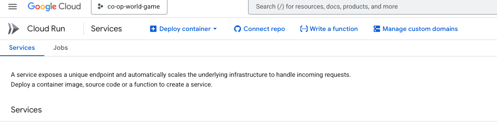
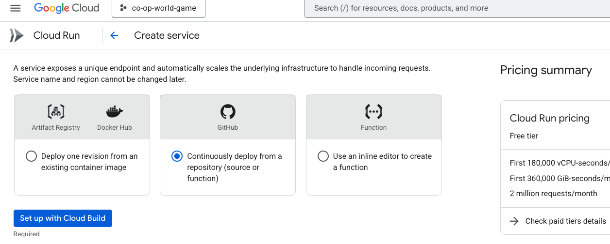
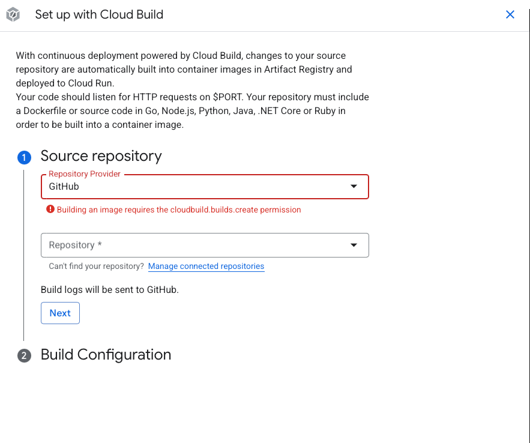
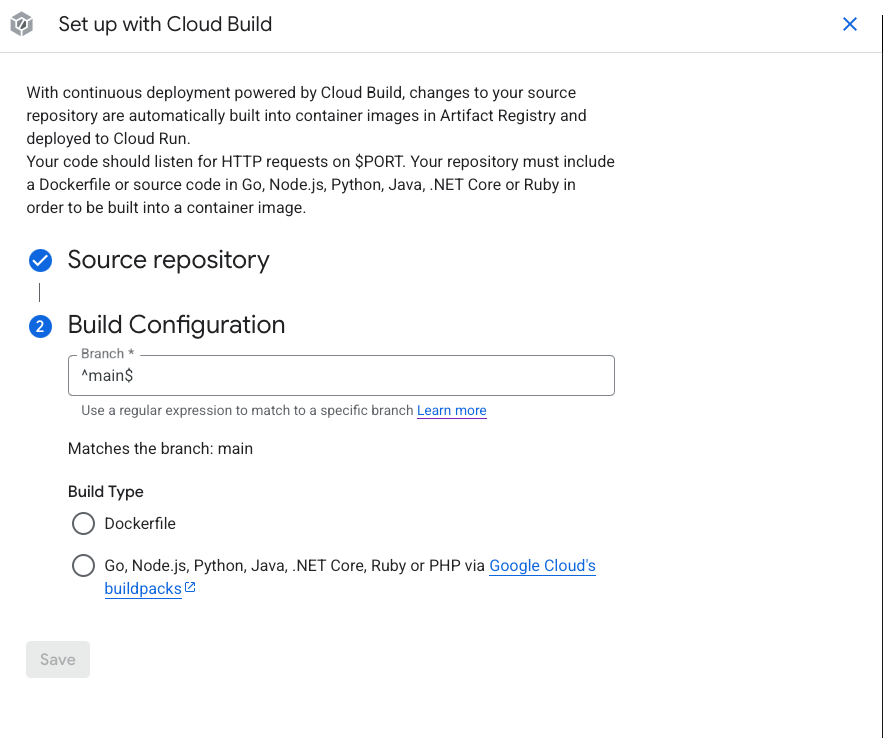
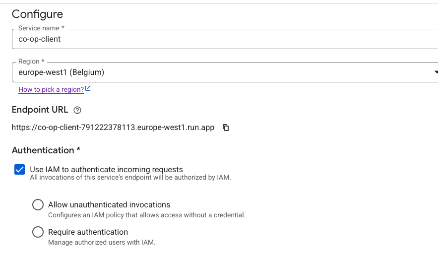
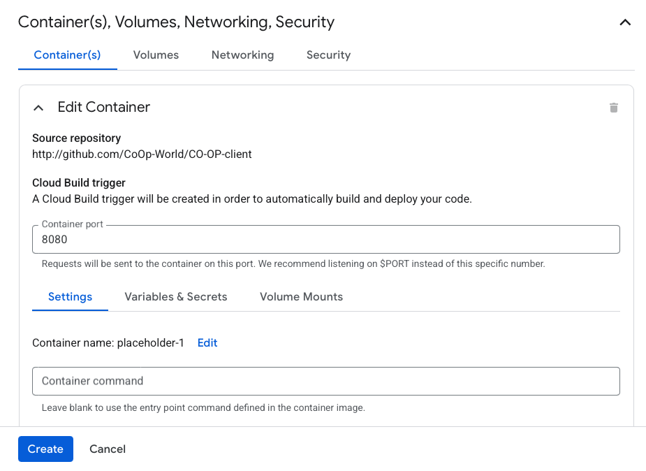

# Versions

To the game there are diffrent versions of the game and development versions.

| Website Name            | Link                                                                                                                                                   | Description                                                                              | Levels          | User IDs   |
| ----------------------- | ------------------------------------------------------------------------------------------------------------------------------------------------------ | ---------------------------------------------------------------------------------------- | --------------- | ---------- |
| co-op-client            | [Link](https://co-op-client-791222378113.europe-central2.run.app){:target="\_blank"}                                                                   | Deaf version of the game                                                                 | 0-10            | any        |
| co-op-client-dev        | [Link](https://co-op-client-dev-791222378113.me-west1.run.app){:target="\_blank"}                                                                      | Dev version of the game                                                                  | 0-10            | any        |
| co-op-parents-dashboard | [Link](https://co-op-parents-dashboard-791222378113.europe-central2.run.app){:target="\_blank"}                                                        | Game parents dashboard that gets the user ID and returns the statistics                  | -               | -          |
| co-op-user-management   | [Link](https://co-op-user-management-791222378113.europe-central2.run.app){:target="\_blank"}                                                          | Interface to create users edit some properties and get information about the user        | -               | -          |
| co-op-website           | [Link](https://co-op-website-791222378113.europe-central2.run.app){:target="\_blank"} or [coopworld.net](https://www.coopworld.net){:target="\_blank"} | The website of co-op world                                                               | -               | -          |
| exp-autistic            | [Link](https://exp-autistic-791222378113.europe-central2.run.app){:target="\_blank"}                                                                   | Autistic version of the game                                                             | 0-10            | any        |
| exp-competitive         | [Link](https://exp-competitive-791222378113.europe-central2.run.app){:target="\_blank"}                                                                | Competitive version of the game                                                          | 0, 17-19, 21-27 | 6224, 7614 |
| exp-felix               | [Link](https://exp-felix-791222378113.us-central1.run.app){:target="\_blank"}                                                                          | Felix's version of the game                                                              | 0, 11-13        | 1913, 8918 |
| felix-test-gap-speed    | [Link](https://co-op-change-speed-and-gap-791222378113.us-central1.run.app){:target="\_blank"}                                                         | Interface for Felix to change the gap between coins and the speed of the virtual players | 16              | 1369       |
| g3-dev                  | [Link](https://g3-dev-791222378113.europe-central2.run.app){:target="\_blank"}                                                                         | Dev of group 3                                                                           | 14-15           | 3184, 4072 |
| g1-dev                  | [Link](https://g1-dev-791222378113.europe-central2.run.app){:target="\_blank"}                                                                         | Dev of group 1                                                                           | 20              | 7743       |

## How to create a new version

To create a new version, you need to create a new branch from "dev" branch in the repository and then deploy the game to the new version this brach should be named like "prod-version-name" this name will be used to deploy the game to the new version. And create a new branch from "prod-version-name" branch and name it "dev-version-name" this name will be used for developing the new version only.
Every time you want to deploy the game to the new version, you need to merge the "dev-version-name" branch into the "prod-version-name" branch and then deploy the game to the new version.
**Always work only in the "dev-version-name" branch and never in the "prod-version-name" branch**

Now you need to connect the gcp project to the github repository.
Make sure that you have the following files in the repository:

- cloudbuild.yaml
- Dockerfile
- nginx.conf

### Connect the gcp project to the github repository (In general)

To connect the gcp project to the github repository, you need to go to GCP cloud run and then click on the "Connect repo" button.

Click on the "Set up with Cloud Build" button.

Choose the repository you want to deploy. If you dont see the repository you need to click on the "Manage connected repositories" button. After you selected the repository you need to click on the "Next" button.

Now you choose the branch you want to deploy, And choose Dockerfile and click on the "Save" button.

Now you choose the region you want to deploy the game to and choose Allow unauthenticated invocations.

Now you need to change the port (if you use the ngnix in the co-op-client) to port 80 then click on the "Create" button.

Then after some time you will see the game deployed and you can access it from the url.
